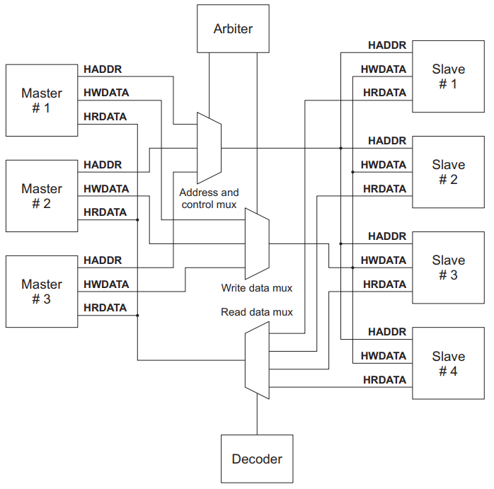
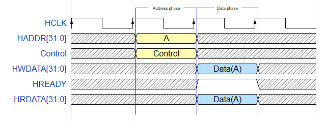
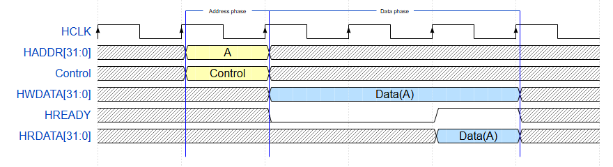
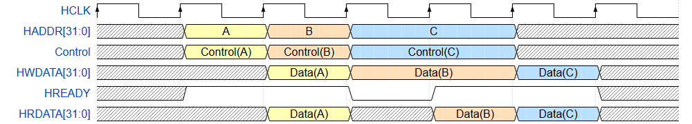
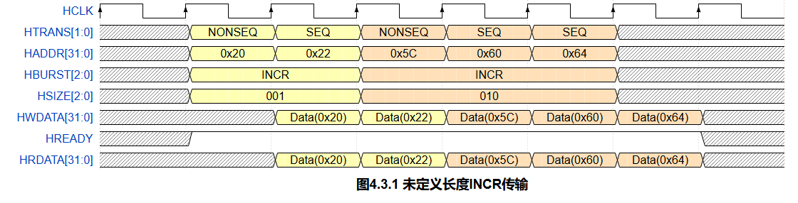
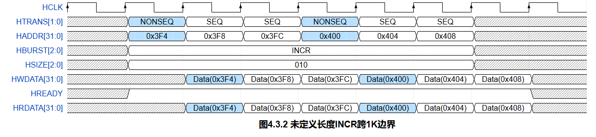
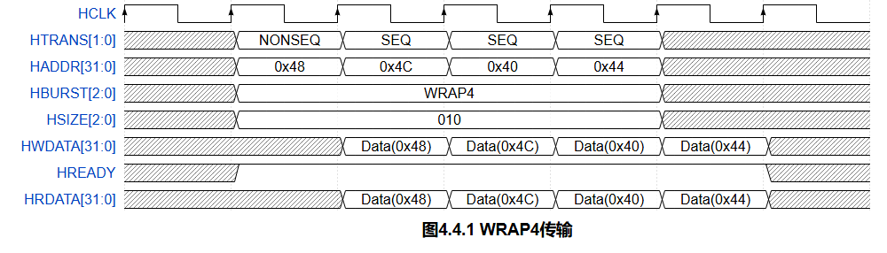

# AHB 协议学习笔记

本文根据仓库中的 `AHB协议学习笔记.html` 整理，介绍 AHB 总线的组成、常用信号、基本传输、流水线传输以及 Burst 传输。

## 专题笔记

- [Master、Slave、Arbiter 与 Decoder 详细讲解](AHB协议学习笔记-Master、Slave、Arbiter与Decoder.md)
- [AHB 在 APB 的基础上增加了什么？](AHB在APB基础上增加了什么.md)

## 目录

- [AHB 组成部分](#ahb-组成部分)
- [AHB 信号](#ahb-信号)
- [基本传输](#基本传输)
- [Pipeline 传输](#pipeline-传输)
- [Burst 传输](#burst-传输)
- [未定义长度 INCR 传输](#未定义长度-incr-传输)
- [WRAP 传输](#wrap-传输)
- [总结](#总结)

## AHB 组成部分

AHB 系统主要由 Master、Slave、Arbiter 和 Decoder 组成：

- **Master（主设备）**：发起读写操作，例如 CPU、DMA。某一时刻只允许一个 Master 控制总线。
- **Slave（从设备）**：响应读写操作，例如 SRAM、外设或 AHB-to-APB Bridge。系统通过地址映射选择目标 Slave。
- **Arbiter（仲裁器）**：当多个 Master 同时请求总线时，决定由哪个 Master 获得控制权。AMBA AHB 协议不规定具体仲裁算法。
- **Decoder（译码器）**：根据 Master 给出的地址进行译码，产生对应的 `HSELx`，选择目标 Slave。



*图 1：AHB 总线架构中的 Master、Slave、Arbiter、Decoder 与数据多路选择器。*

可以用两句话区分 Arbiter 和 Decoder：

> Arbiter 是选 Master 的，Decoder 是选 Slave 的。

## AHB 信号

| 信号 | 来源 | 去向 | 说明 |
| --- | --- | --- | --- |
| `HCLK` | Clock Source | 各模块 | 总线时钟 |
| `HRESETn` | Reset Controller | 各模块 | 低电平有效的总线复位 |
| `HADDR[31:0]` | Master | Decoder、Slave、Arbiter | 32 位系统地址总线 |
| `HTRANS[1:0]` | Master | Slave | 当前传输类型：`IDLE`、`BUSY`、`NONSEQ`、`SEQ` |
| `HWRITE` | Master | Slave | `0` 表示读，`1` 表示写 |
| `HSIZE[2:0]` | Master | Slave | 传输宽度：`000`=8 bit、`001`=16 bit、`010`=32 bit、`011`=64 bit，依此类推 |
| `HBURST[2:0]` | Master | Slave、Arbiter | Burst 类型，例如 `SINGLE`、`INCR`、`WRAP4` |
| `HPROT[3:0]` | Master | Slave | 传输保护属性，供支持保护机制的 Slave 使用 |
| `HWDATA[31:0]` | Master | Slave | 写数据总线 |
| `HBUSREQx` | Master | Arbiter | Master x 请求使用总线 |
| `HLOCKx` | Master | Arbiter | Master x 请求锁定访问；锁定期间不应将总线授予其他 Master |
| `HRDATA[31:0]` | Slave | Master | 读数据总线 |
| `HREADY` | Slave | Master、Arbiter | 高电平表示传输完成；低电平用于延长传输周期 |
| `HRESP[1:0]` | Slave | Master、Arbiter | 传输响应：`OKAY`、`ERROR`、`RETRY`、`SPLIT` |
| `HSPLITx[15:0]` | Slave | Arbiter | 指示哪些 Master 可以重新尝试被拆分的传输 |
| `HSELx` | Decoder | Slave | Slave x 的片选信号 |
| `HGRANTx` | Arbiter | Master | 指示 Master x 当前获得最高优先级；`HREADY` 与 `HGRANTx` 同时为高时取得总线访问权 |
| `HMASTER[3:0]` | Arbiter | 支持 SPLIT 的 Slave | 标识当前发起传输的 Master |
| `HMASTLOCK` | Arbiter | 支持 SPLIT 的 Slave | 指示当前 Master 正在进行锁定传输 |

## 基本传输

一次 AHB 传输包含两个阶段：

1. **Address phase（地址阶段）**：地址和控制信号有效，固定占用一个时钟周期。
2. **Data phase（数据阶段）**：传送写数据或返回读数据；Slave 可以通过拉低 `HREADY` 插入等待周期。

AHB 采用流水线方式工作。当前传输进入数据阶段时，下一次传输可以同时进入地址阶段。

### 无等待周期的简单传输

当 Slave 能立即完成访问时，`HREADY` 保持为高，数据阶段不插入额外等待周期。



*图 2：无等待周期的简单传输。地址阶段结束后，传输在下一个数据阶段完成。*

### 等待两个周期的简单传输

Slave 可以拉低 `HREADY` 延长数据阶段。等待期间需要注意：

- 写传输中，Master 必须保持 `HWDATA` 稳定。
- 读传输中，Slave 在等待周期内不必提供有效的 `HRDATA`，但必须在传输完成时给出有效数据。



*图 3：Slave 拉低 `HREADY`，为数据阶段插入两个等待周期。*

## Pipeline 传输

AHB 将不同传输的地址阶段和数据阶段重叠。例如传输 A 处于数据阶段时，传输 B 的地址和控制信息已经可以出现在总线上，从而提高总线吞吐率。



*图 4：A、B、C 三次传输的地址阶段与数据阶段流水重叠。*

图中 `HADDR` 和控制信号对应当前地址阶段，而 `HWDATA`、`HRDATA` 对应前一次已经进入数据阶段的传输。分析时序时必须按阶段对齐，不能把同一周期的地址和数据误认为同一笔传输。

## Burst 传输

### 传输类型 HTRANS

| `HTRANS[1:0]` | 类型 | 说明 |
| --- | --- | --- |
| `00` | `IDLE` | Master 占用总线，但当前没有有效传输 |
| `01` | `BUSY` | Master 在 Burst 中暂时无法继续；地址和控制信息应反映下一次传输 |
| `10` | `NONSEQ` | 单次传输，或一次 Burst 的首拍；地址与上一次传输无关 |
| `11` | `SEQ` | Burst 的后续拍；地址与上一拍相关，控制信息保持一致 |

### Burst 类型 HBURST

| `HBURST[2:0]` | 类型 | 说明 |
| --- | --- | --- |
| `000` | `SINGLE` | 单次传输 |
| `001` | `INCR` | 未定义长度的递增 Burst |
| `010` | `WRAP4` | 4-beat 回绕 Burst |
| `011` | `INCR4` | 4-beat 递增 Burst |
| `100` | `WRAP8` | 8-beat 回绕 Burst |
| `101` | `INCR8` | 8-beat 递增 Burst |
| `110` | `WRAP16` | 16-beat 回绕 Burst |
| `111` | `INCR16` | 16-beat 递增 Burst |

## 未定义长度 INCR 传输

INCR Burst 每拍的地址增量由 `HSIZE` 决定：

```text
每拍字节数 = 2^HSIZE
下一拍地址 = 当前地址 + 每拍字节数
```

例如，`HSIZE=001` 表示每拍 2 字节，`HSIZE=010` 表示每拍 4 字节。图 5 中前两拍使用 2 字节传输，随后以新的 `NONSEQ` 开始 4 字节传输。



*图 5：未定义长度 INCR 传输，传输宽度变化时以 `NONSEQ` 开始新的 Burst。*

### 1 KB 边界限制

AHB Burst 不能跨越 1 KB 地址边界。这项限制可防止一个 Burst 从一个 Slave 的地址空间跨入另一个 Slave，也在 Burst 长度和实现效率之间取得折中。

如果递增地址将越过 1 KB 边界，Master 必须结束当前 Burst，并在边界处用 `NONSEQ` 重新发起传输。下面的 32 位传输从 `0x3F4` 递增到 `0x3FC`；到达 `0x400` 时重新使用 `NONSEQ`。



*图 6：未定义长度 INCR 到达 1 KB 边界后，在 `0x400` 处以 `NONSEQ` 开始新的 Burst。*

## WRAP 传输

WRAP Burst 到达回绕边界后，地址回到当前对齐地址块的起点。回绕块大小由每拍字节数和 Burst 拍数共同决定：

```text
回绕块大小 = 每拍字节数 × Burst 拍数
回绕基地址 = floor(起始地址 / 回绕块大小) × 回绕块大小
```

以 `HSIZE=010`（每拍 4 字节）、起始地址 `0x48` 为例：

- `WRAP4` 的回绕块大小为 `4 × 4 = 16` 字节，地址依次为 `0x48 → 0x4C → 0x40 → 0x44`。
- `WRAP8` 的回绕块大小为 `4 × 8 = 32` 字节，地址依次为 `0x48 → 0x4C → 0x50 → 0x54 → 0x58 → 0x5C → 0x40 → 0x44`。



*图 7：`HSIZE=010`、起始地址为 `0x48` 时的 WRAP4 传输。*

## 总结

- Slave 短时间内无法响应时，可以拉低 `HREADY` 插入等待周期。
- 在支持完整 AHB 响应的系统中，Slave 长时间无法响应时可以返回 `SPLIT` 或 `RETRY`。
- Master 在 Burst 中暂时不能继续传输时，可以插入 `BUSY`。
- 只有一个 Master 的系统可以采用 AHB-Lite，不需要 Arbiter，也不支持 `RETRY` 和 `SPLIT` 响应。
- 对 Slave 而言，输入的 `HREADY` 反映总线当前状态，输出的 `HREADY` 反映自身是否完成传输。
- 对 Master 而言，`HREADY` 为低表示当前数据阶段尚未完成，地址和控制流水线必须相应停顿。

## 资料来源

- 本文内容整理自仓库中的 `AHB协议学习笔记.html`。
- 原文链接：[AHB 协议学习笔记](https://dxsm.github.io/p/ahb-protocal.html)
- 原文采用 [CC BY-NC-SA 3.0](https://creativecommons.org/licenses/by-nc-sa/3.0/) 许可协议。
