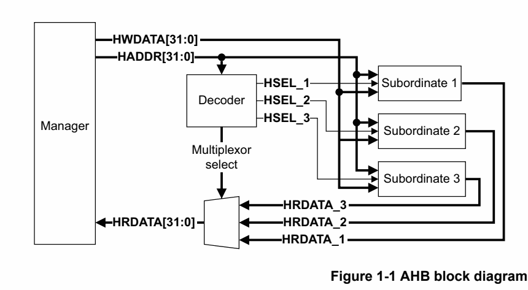
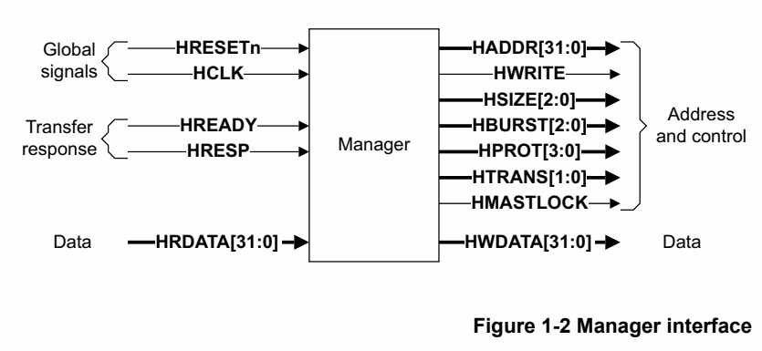
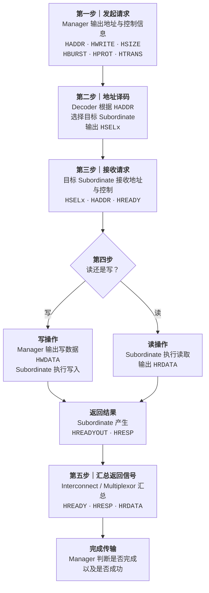
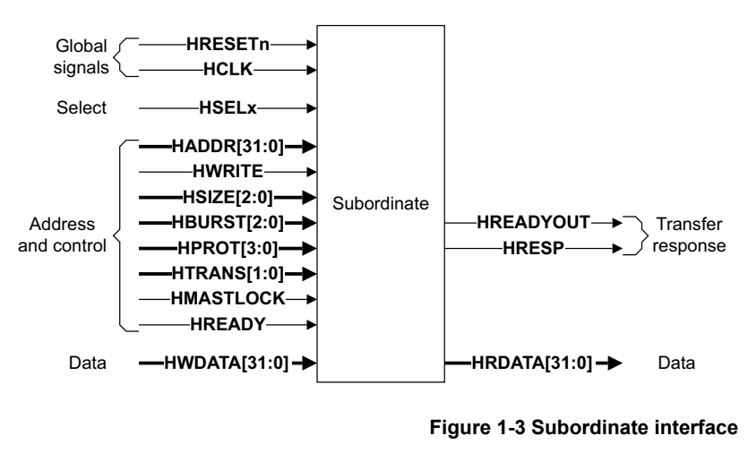

# AMBA AHB Protocol Specification IHI 0033C：第一章精读

> 原始资料：[ARM_AMBA_AHB_Protocol_Specification_IHI0033C.pdf](ARM_AMBA_AHB_Protocol_Specification_IHI0033C.pdf)  
> 精读范围：Chapter 1 Introduction，PDF 第 13-18 页（文档页码 1-13～1-18）  
> 文档版本：Issue C，ID090921，2021 年 9 月 15 日发布

这份笔记面向第一次系统学习 AHB 的读者。本文统一使用 Issue C 的术语 `Manager（原 Master）`、`Subordinate（原 Slave）` 和 `Interconnect（互连）`。第一章的任务不是记住所有信号编码，而是先建立一个稳定的总体模型：**谁发起传输、谁响应传输、地址如何选中目标、返回数据如何回到发起者，以及一次传输为什么会被分成地址阶段和数据阶段。**

> **颜色约定：** 蓝色表示关键协议名和信号，橙色表示等待、限制和易错条件，绿色表示正确的数据方向和结论。

> **信息标记：** 正文默认是对第一章规范原意的中文转述；“理解提示”用于补充直观解释；“工程推断”用于标出根据规范得出的实现或验证层面结论。直接引用和关键规范结论注明章节或页码。

## 目录

- [1. 学完本章应该掌握什么](#1-学完本章应该掌握什么)
- [2. AHB 是什么](#2-ahb-是什么)
- [3. AHB 系统的组成](#3-ahb-系统的组成)
- [4. 单 Manager 与多 Manager](#4-单-manager-与多-manager)
- [5. AHB-Lite、AHB5 与 Issue C](#5-ahb-liteahb5-与-issue-c)
- [6. 一次 AHB 传输怎样工作](#6-一次-ahb-传输怎样工作)
- [7. 三张接口图怎么读](#7-三张接口图怎么读)
- [8. 容易混淆的概念](#8-容易混淆的概念)
- [9. 术语表](#9-术语表)
- [10. 本章学习口诀](#10-本章学习口诀)
- [11. 自测题](#11-自测题)
- [12. 本章边界与后续阅读](#12-本章边界与后续阅读)
- [13. 资料来源](#13-资料来源)

## 1. 学完本章应该掌握什么

读完第一章后，应当能够回答：

1. AHB 为什么适合高性能、可综合的片上系统设计？
2. Manager、Subordinate 和 Interconnect 分别负责什么？
3. Decoder 与 Multiplexor 的选择方向有什么不同？
4. 一次传输的地址阶段和数据阶段各做什么？
5. 为什么地址阶段不能延长，而数据阶段可以加入等待周期？
6. `HREADY` 和 `HRESP` 分别回答什么问题？
7. AHB-Lite、AHB5 和本文档 Issue C 是什么关系？

## 2. AHB 是什么

AMBA AHB 是一种适合**高性能、可综合设计**的总线接口协议。它定义 Manager、Interconnect 和 Subordinate 等组件之间如何通信。（IHI 0033C，1.1 节，第 1-14 页）

第一章列出的主要能力有（IHI 0033C，1.1 节，第 1-14 页）：

- Burst transfers：支持突发传输；
- Single clock-edge operation：所有传输围绕单一时钟边沿工作；
- Non-tristate implementation：不依赖片内三态总线；
- Configurable data bus widths：数据总线宽度可配置；
- Configurable address bus widths：地址总线宽度可配置。

常见的 AHB Subordinate 包括片内存储器、外部存储器接口和高带宽外设。低带宽外设虽然也可以直接作为 AHB Subordinate，但通常放在 APB 上，再通过 **AHB-to-APB Bridge** 接入 AHB。（IHI 0033C，1.1 节，第 1-14 页）

> <strong>理解提示：</strong> AHB 规定的是组件之间的接口和传输规则，不等于一块固定结构的“总线模块”。实际系统可以根据 Manager 和 Subordinate 的数量选择不同的 Interconnect 实现。

## 3. AHB 系统的组成

### 3.1 总体数据流

*图 1：原规范 Figure 1-1，AHB 单 Manager 系统框图。来源：IHI 0033C，第 1-14 页。Copyright © 2001, 2006, 2010, 2015, 2021 Arm Limited or its affiliates. All rights reserved.*

图中可以沿着一次访问的方向理解：

1. Manager 给出地址 <code>HADDR</code>、写数据 <code>HWDATA</code> 和控制信息。
2. Decoder 观察地址，产生相应的 <code>HSELx</code>，选中目标 Subordinate。
3. 被选中的 Subordinate 执行访问并产生读数据及响应。
4. Multiplexor 根据 Decoder 的选择，把正确 Subordinate 的返回信息送回 Manager。

一句话概括：

> **Decoder 负责选“谁接收请求”，Multiplexor 负责选“谁的返回值送回去”。**

### 3.2 Manager

Manager 提供地址和控制信息，发起读操作或写操作。它决定“访问哪里、读还是写、传输多宽、是否属于 Burst”等请求属性，并在写操作时提供写数据。（IHI 0033C，1.1.1 节，第 1-14 页）

旧资料常把 Manager 称为 **Master**。Issue C 统一采用 Manager，但二者在理解角色时可以对应起来。

### 3.3 Subordinate

Subordinate 响应 Manager 发起的传输。它通过 Decoder 产生的 `HSELx` 判断当前传输是否发给自己，并向 Interconnect 返回两类结果。（IHI 0033C，1.1.2 节及 Figure 1-3，第 1-14～1-15 页）

- 通过 <code>HREADYOUT</code> 报告数据阶段已经完成，还是需要延长；
- 通过 <code>HRESP</code> 报告传输成功，还是失败。

这两个结果先送回 Interconnect，再由 Interconnect 选择并汇总后返回 Manager。

旧资料常把 Subordinate 称为 **Slave**。Issue C 使用 Subordinate。

### 3.4 Interconnect

Interconnect 连接 Manager 与 Subordinate。（IHI 0033C，1.1.3 节，第 1-14 页）

- 单 Manager、多个 Subordinate 的系统需要 Decoder 和 Subordinate-to-Manager Multiplexor。
- 多 Manager 系统还需要仲裁，并把不同 Manager 的地址、控制和写数据路由到正确的 Subordinate。

规范没有在第一章规定多 Manager Interconnect 必须采用哪种仲裁算法，也没有展开 single-layer 或 multi-layer 的具体实现。

### 3.5 Decoder

Decoder 对每次传输的地址进行译码，为目标 Subordinate 产生选择信号，并为返回方向的 Multiplexor 提供选择控制。

当系统有两个或更多 Subordinate 时，需要一个集中式 Decoder。

### 3.6 Multiplexor

Multiplexor 从多个 Subordinate 的读数据和响应中选择当前有效的一组，送回 Manager。

当系统有两个或更多 Subordinate 时，需要一个集中式 Subordinate-to-Manager Multiplexor。

## 4. 单 Manager 与多 Manager

| 系统形态 | 必需功能 | 第一章强调的重点 |
| --- | --- | --- |
| 单 Manager | 地址译码、选择目标 Subordinate、复用返回数据与响应 | Figure 1-1 展示的基本结构 |
| 多 Manager | 在上述功能之外增加仲裁，以及请求路径的路由 | Interconnect 负责仲裁，并将获准 Manager 的请求路由到目标 Subordinate |

不要把“AHB 支持多 Manager”和“每个 Subordinate 同时接受多个 Manager”混为一谈。多个 Manager 的竞争和路由由 Interconnect 处理，Subordinate 看到的是经过选择后的有效传输。

> <strong>工程推断：</strong> Figure 1-1 展示的是单 Manager 系统，因此没有单独画出名为 Interconnect 的方框。在这个例子中，可以把 Decoder、Multiplexor 及其连接逻辑整体理解为基本的 Interconnect。规范在 1.1.3 节介绍其职责，并在 4.1-4.4 节进一步说明地址译码、返回路径复用以及带 AHB 接口的 Interconnect；多 Manager 的 single-layer 或 multi-layer 内部实现不属于本规范的详细说明范围。
>
> <strong>理解提示：</strong> Figure 1-1 只画出了主要地址、数据总线和典型的数据路由，并没有画出全部 AHB 信号。因此不能仅凭这张图推导完整 RTL 端口表。

## 5. AHB-Lite、AHB5 与 Issue C

| 规范修订 | 第一章给出的含义 |
| --- | --- |
| Issue A | 描述 AHB-Lite 接口 |
| Issue B | 引入 AHB5；AHB5 基于 AHB-Lite，并增加能力 |
| Issue C | 增加信号宽度属性、写选通、User signaling 更新和接口奇偶校验保护 |

Issue C 新增或更新的主题包括（IHI 0033C，1.2 节 Revision history，第 1-16～1-17 页）：

- Signal width properties；
- Write strobes；
- User signaling update；
- Interface protection using parity。

在这份规范中，未特别区分时，**AHB** 同时指 AHB-Lite 和 AHB5；未特别声明时，所讨论的信号对二者通用。

> <strong>重要提醒：</strong> Figure 1-2 和 Figure 1-3 没有画出 AHB5 增加的信号，不能把图中的端口集合当作完整的 AHB5 接口定义。完整信号表应查看第二章和附录 A。

## 6. 一次 AHB 传输怎样工作

### 6.1 Manager 先描述请求

Manager 通过地址和控制信号描述一次传输，至少表达：

- 目标地址；
- 读或写方向；
- 传输宽度；
- 是否属于 Burst。

传输可以是：

- Single：单次传输；
- Incrementing burst：地址递增且不回绕的突发传输；
- Wrapping burst：在规定地址边界回绕的突发传输。

第一章只列出这三类，不解释 <code>HBURST</code>、<code>HTRANS</code> 的具体编码。

### 6.2 地址阶段与数据阶段

每次传输由两个阶段组成（IHI 0033C，1.3 节，第 1-18 页）：

| 阶段 | 持续时间 | 主要任务 | 延长方式 |
| --- | --- | --- | --- |
| Address phase | 1 个地址与控制周期 | Manager 给出地址及控制信息，Subordinate 采样 | 不能 |
| Data phase | 1 个或多个周期 | 传送写数据或返回读数据和响应 | 可以；Subordinate 输出 <code>HREADYOUT=LOW</code>，由 Interconnect 汇总为系统侧 <code>HREADY=LOW</code> |

地址阶段不能被 Subordinate 延长，因此所有 Subordinate 都必须具备在规定时间采样地址与控制信息的能力。（IHI 0033C，1.3 节，第 1-18 页）

数据阶段至少占一个周期。如果 Subordinate 尚未准备好，它将 <code>HREADYOUT</code> 保持为 LOW；Interconnect 汇总后把系统侧 <code>HREADY</code> 置为 LOW，插入等待状态。当 <code>HREADY=HIGH</code> 时，表示当前数据阶段可以完成。（IHI 0033C，1.3 节，第 1-18 页；连接关系见 4.1～4.3 节）

### 6.3 数据方向

- <code>HWDATA</code>：写数据从 Manager 流向 Subordinate；
- <code>HRDATA</code>：读数据从 Subordinate 流向 Manager。

地址与控制描述的是一笔传输，读写数据则在这笔传输的数据阶段移动。后续章节会进一步说明 AHB 的流水线关系。

### 6.4 `HREADY` 与 `HRESP`

- <code>HREADYOUT</code>：由目标 Subordinate 驱动，报告自己的数据阶段是否完成；它只对 Interconnect 的返回路径有效。
- <code>HREADY</code>：由 Interconnect 根据当前传输选择并汇总 <code>HREADYOUT</code>，送给 Manager 和系统侧 Subordinate，回答：**这笔传输现在完成了吗？**
- <code>HRESP</code>：由目标 Subordinate 提供并经 Interconnect 返回，回答：**这笔传输成功还是失败？**

不要用 <code>HRESP</code> 表示“还没准备好”，也不要用 <code>HREADY</code> 表示“访问成功”。 完成状态和结果状态是两个不同维度。

> <strong>理解提示：</strong> Subordinate 接口图中可见 <code>HREADYOUT</code>，系统返回路径中可见 <code>HREADY</code>。可以先把它们理解为“Subordinate 给出的就绪结果”和“Interconnect 选择后送回系统的就绪结果”；精确连接规则在第四章展开。

## 7. 三张接口图怎么读

### 7.1 Manager 接口

*图 2：原规范 Figure 1-2，Manager 接口。来源：IHI 0033C，第 1-15 页。图中未包含 AHB5 新增信号。Copyright © 2001, 2006, 2010, 2015, 2021 Arm Limited or its affiliates. All rights reserved.*

从箭头方向可以这样读 Manager 接口：

这张图可以按一次传输的流程来读：

1. **第一步：Manager 发出请求。** Manager 从右侧输出 `HADDR`、`HWRITE`、`HSIZE`、`HBURST`、`HPROT`、`HTRANS` 和 `HMASTLOCK`，共同描述目标地址、读写方向、传输大小、Burst 属性和保护属性。
2. **第二步：系统执行访问。** Interconnect 或目标 Subordinate 根据这些地址与控制信息确定这笔传输的处理对象。`HCLK` 提供时序，`HRESETn` 提供复位。
3. **第三步：传送数据。** 如果是写操作，Manager 从右侧输出 `HWDATA`；如果是读操作，Subordinate 将结果通过左侧的 `HRDATA` 返回 Manager。
4. **第四步：返回传输结果。** <code>HREADY</code> 告诉 Manager 当前传输是否完成，<code>HRESP</code> 告诉 Manager 传输成功还是失败。若 <code>HREADY=LOW</code>，数据阶段还需要继续等待。

因此，图中的核心方向是：**右侧发起请求，系统完成访问，左侧返回读数据和传输结果。**

### 7.1.1 三个关键控制信号

这三个信号都属于 Manager 发出的地址与控制信息。它们描述“这笔传输是什么”，而不是传输本身携带的数据。

| 信号 | 作用 | 初步理解 |
| --- | --- | --- |
| `HSIZE[2:0]` | 指示一次传输的数据大小 | 例如字节、半字、字等；常见编码为 `000`=1 byte、`001`=2 bytes、`010`=4 bytes。完整编码和对齐要求见 Chapter 3。 |
| `HPROT[3:0]` | 提供访问保护属性 | 用于描述访问类型，例如指令/数据、特权/非特权等。AHB5 可扩展更多内存类型属性，具体含义见 Chapter 3。 |
| `HTRANS[1:0]` | 指示当前传输的类型 | `IDLE` 表示无传输，`BUSY` 表示在 Burst 中插入一个忙周期，`NONSEQ` 表示单次传输或 Burst 的第一拍，`SEQ` 表示 Burst 的后续拍。具体编码和等待期间的变化规则见 Chapter 3。 |

可以把它们记成：

- `HSIZE`：**传多大**；
- `HPROT`：**以什么访问属性传**；
- `HTRANS`：**当前是不是有效传输、处在 Burst 的哪一拍**。

这三个信号在地址阶段与 `HADDR` 一起描述请求。不要把 `HTRANS=NONSEQ` 理解成“数据已经传完”，它只说明当前地址控制信息对应一笔新的传输。

观察重点是：**请求由 Manager 发出，完成状态、结果和读数据返回 Manager。**

### 7.2 Subordinate 接口

*图 3：原规范 Figure 1-3，Subordinate 接口。来源：IHI 0033C，第 1-15 页。图中未包含 AHB5 新增信号。Copyright © 2001, 2006, 2010, 2015, 2021 Arm Limited or its affiliates. All rights reserved.*

从 Subordinate 视角看：

- <code>HSELx</code>、地址、控制和 <code>HWDATA</code> 都是输入；
- 输入侧的 <code>HREADY</code> 是 Interconnect 汇总后的系统级完成指示，让 Subordinate 知道当前数据阶段是否还在等待；
- <code>HRDATA</code>、<code>HREADYOUT</code> 和 <code>HRESP</code> 是输出，分别返回读数据、数据阶段完成状态和传输结果；
- <code>HREADYOUT</code> 先送回 Interconnect，Interconnect 再根据当前选择生成系统侧 <code>HREADY</code>。

观察重点是：**Subordinate 只有在被选中时才响应目标传输，并负责给出数据阶段的完成状态与结果。**

## 8. 容易混淆的概念

### 8.1 Decoder 与 Arbiter

- Decoder：根据地址选 Subordinate。
- Arbiter：在多个 Manager 竞争时决定谁获得访问机会。

第一章的单 Manager 框图不需要 Arbiter，因为没有多个 Manager 竞争。

### 8.2 Decoder 与 Multiplexor

- Decoder 工作在请求选择方向，产生 <code>HSELx</code>。
- Multiplexor 工作在返回选择方向，把目标 Subordinate 的数据和响应送回 Manager。

### 8.3 `HREADY` 与 `HRESP`

- <code>HREADYOUT=LOW</code>：目标 Subordinate 尚未完成数据阶段，请求继续等待。
- <code>HREADY=LOW</code>：Interconnect 汇总后的系统级结果，表示数据阶段还要继续等待。
- <code>HRESP</code>：说明传输最终是成功还是失败。

### 8.4 Address phase 与 Data phase

- 地址阶段固定为一个周期，不能由 Subordinate 延长。
- 数据阶段可以有等待状态，因此可能持续多个周期。

### 8.5 AHB 与 APB

- AHB 面向高性能、高带宽组件。
- 低带宽外设通常放到 APB。
- AHB-to-APB Bridge 在 AHB 一侧表现为一个 Subordinate。

### 8.6 图中的 32 位不是唯一配置

规范为了说明方便使用 32 位数据总线。AHB 允许其他数据总线宽度，Issue C 也允许可配置的地址总线宽度。图中的 <code>[31:0]</code> 是示例配置，不是所有系统都必须固定为 32 位。

## 9. 术语表

| 官方术语 | 常见旧称/中文 | 本章中的作用 |
| --- | --- | --- |
| Manager | Master、主设备、管理器 | 发起读写传输 |
| Subordinate | Slave、从设备、受控设备 | 响应传输并返回数据或响应 |
| Interconnect | 总线互连 | 连接、仲裁并路由 Manager 与 Subordinate |
| Decoder | 地址译码器 | 根据地址产生 `HSELx` |
| Multiplexor | Multiplexer、MUX、多路选择器 | 选择返回数据和响应 |
| Address phase | 地址阶段 | 传递地址和控制信息 |
| Data phase | 数据阶段 | 传递读写数据并完成响应 |
| <code>HREADYOUT</code> | Subordinate 就绪输出 | Subordinate 向 Interconnect 报告数据阶段是否完成 |
| <code>HREADY</code> | 系统级就绪信号 | Interconnect 汇总后送给 Manager 和 Subordinate，指示传输是否完成 |
| <code>HRESP</code> | 响应信号 | Subordinate 提供并经 Interconnect 返回，指示传输成功或失败 |
| Wait state | 等待状态 | 延长数据阶段 |
| Burst | 突发传输 | 连续完成一组相关传输 |

## 10. 本章学习口诀

> Manager 发请求，Subordinate 作响应；  
> Decoder 选目标，MUX 选返回；  
> 地址阶段一周期，数据阶段可等待；  
> <code>HREADY</code> 管完成，<code>HRESP</code> 管成败。

## 11. 自测题

先独立回答，再展开参考答案。

1. 为什么单 Manager、多 Subordinate 系统仍然需要 Decoder？

> 因为 Manager 给出的地址必须映射到一个目标 Subordinate。Decoder 根据地址产生对应的 `HSELx`，确保只有正确的 Subordinate 响应。

2. 为什么还需要 Multiplexor，不能把所有 Subordinate 的 HRDATA 直接并在一起？

> 一次传输通常只选中一个 Subordinate，但未选中的 Subordinate 并不保证把 `HRDATA` 输出为零或置为高阻态。AHB 采用非三态实现，如果把多个 `HRDATA` 输出直接并在一起，就可能形成多驱动冲突，无法保证 Manager 采到的值正确。Multiplexor 根据 Decoder 的选择，只把当前目标 Subordinate 的返回值送给 Manager。

> 理论上，如果额外规定所有未选中的 Subordinate 都输出零，也可以用按位 OR 汇总，但这不是 AHB 的协议要求，而且本质上仍然是在做返回路径选择；因此不能把“只工作一个 Subordinate”理解成“多个输出可以直接并线”。

3. Subordinate 需要更多时间时，应延长哪个阶段？

> 延长数据阶段。Subordinate 输出 <code>HREADYOUT=LOW</code>，由 Interconnect 汇总成系统侧 <code>HREADY=LOW</code>，插入等待状态；地址阶段不能被延长。

4. HREADY 为 HIGH 是否意味着传输一定成功？

> 不一定。<code>HREADY</code> 表示传输可以完成，成功或失败由 <code>HRESP</code> 指示。

5. 为什么 Subordinate 也接收 <code>HREADY</code>？

> `HREADY` 是 Interconnect 汇总后的系统级传输完成指示，不只是 Manager 使用的信号。Subordinate 需要通过输入的 `HREADY` 知道当前数据阶段是否已经完成：当 `HREADY=LOW` 时，当前传输仍在等待，地址和控制流水线不能推进；当 `HREADY=HIGH` 时，当前数据阶段可以结束并进入下一笔传输。更详细的信号连接和时序说明见[为什么 Subordinate 也接收 `HREADY`](为什么Subordinate也接收HREADY.md)。

6. AHB-to-APB Bridge 在 AHB 一侧扮演什么角色？

> 它在 AHB 一侧是一个 Subordinate，接收 AHB 传输，再把访问转换到 APB。

## 12. 本章边界与后续阅读

第一章只负责建立总体结构和传输模型。以下细节不能只凭本章完成设计：

- 每个信号的完整定义和可选性：阅读 Chapter 2 和 Appendix A；
- `HTRANS`、`HBURST`、`HSIZE`、等待传输及详细时序：阅读 Chapter 3；
- Decoder、Multiplexor、`HREADYOUT` 到 `HREADY` 的连接：阅读 Chapter 4；
- `HRESP` 的响应时序：阅读 Chapter 5；
- 数据宽度和大小端：阅读 Chapter 6；
- AHB5 的 Exclusive、User signaling 和 parity：阅读 Chapter 10-12。

学完本章后，最合适的下一步是阅读第二章的信号表，再进入第三章分析基本传输时序。

## 13. 资料来源

- [AMBA AHB Protocol Specification, Arm IHI 0033C](ARM_AMBA_AHB_Protocol_Specification_IHI0033C.pdf)，Issue C，ID090921，2021 年 9 月 15 日；本文精读 Chapter 1 Introduction，PDF 第 13-18 页（文档页码 1-13～1-18）。
- 本文对 `HREADYOUT`、`HREADY`、Decoder 和 Multiplexor 连接关系的补充说明参考同一规范 Chapter 4，并已在对应段落标明超出第一章的阅读边界。

---

本文是对 Arm IHI 0033C 第一章的中文学习整理，不替代官方规范。实现或验证 AHB 兼容设计时，应以原始 PDF 的规范性描述为准。
