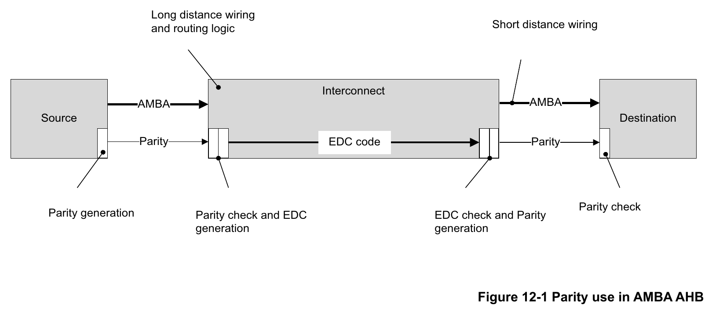
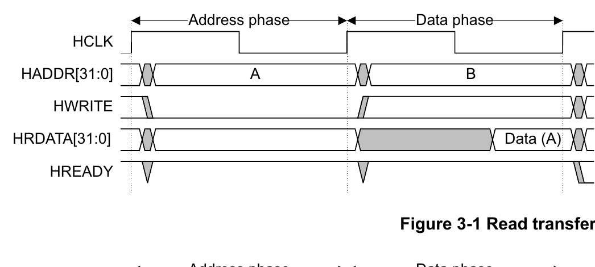
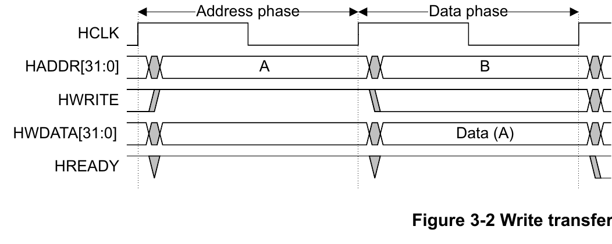
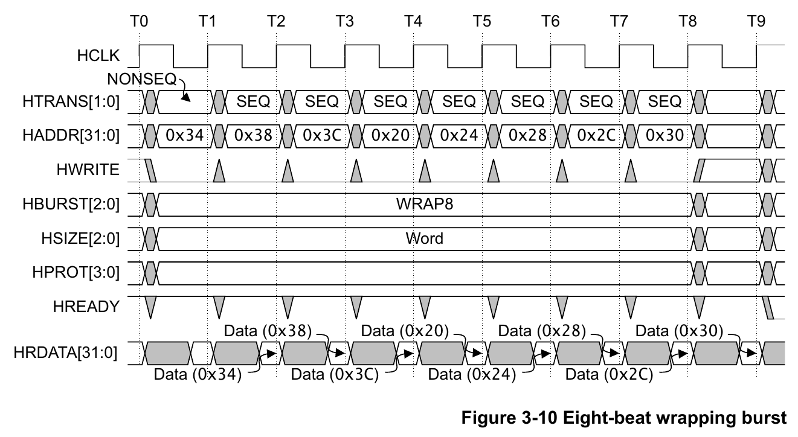
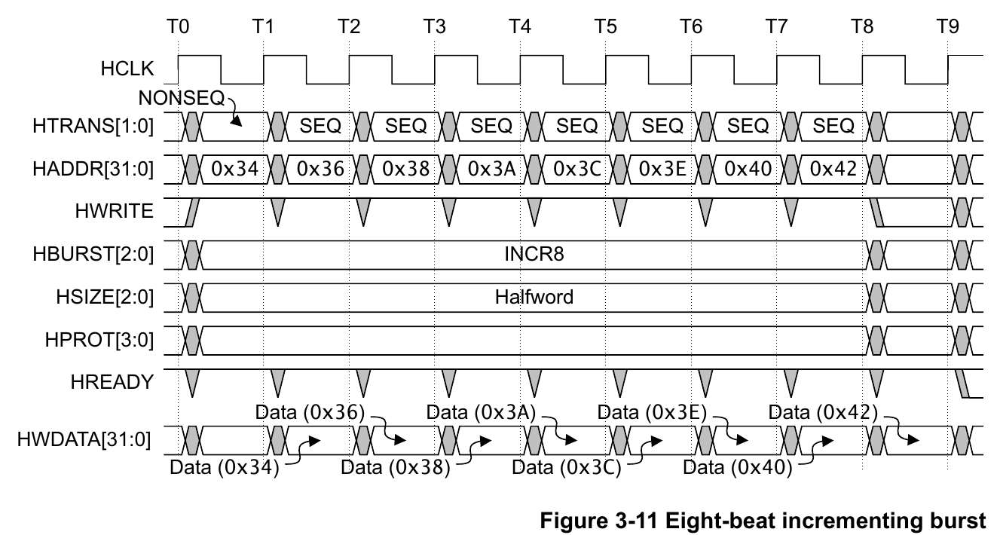
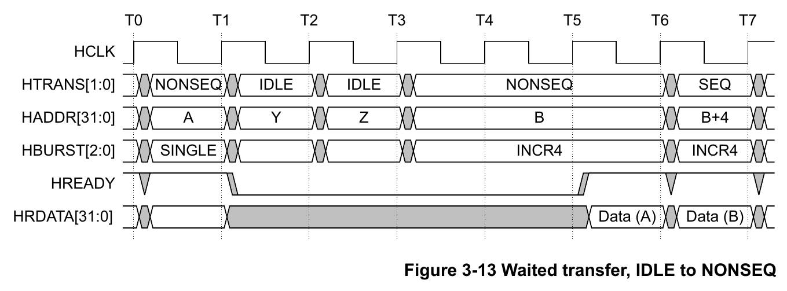
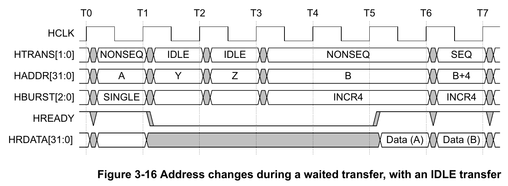
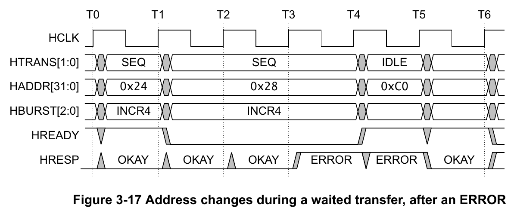

# AMBA AHB Protocol Specification：官方架构图与时序图

本文集中整理 [AMBA AHB Protocol Specification IHI 0033C](ARM_AMBA_AHB_Protocol_Specification_IHI0033C.pdf) 中的官方架构图、接口图、连接图和时序图，便于按图快速理解 AHB 的组成、数据路径、流水线和握手机制。

本文共收录 **27 幅官方 Figure**：9 幅架构、接口或连接图，以及 18 幅传输时序图。Figure 6-1 是混合端序数据布局图，不属于本图册的两类范围；仓库中的自绘互连图、信号地图、复位学习图和问题截图也不在本文收录范围内。

> **阅读约定：** 图中的 `HADDR[31:0]`、`HWDATA[31:0]`、`HRDATA[31:0]` 以及 32/64 位接口均是对应 Figure 的示例宽度，不代表所有 AHB 系统都固定使用该宽度。Figure 1-2 和 Figure 1-3 没有包含 AHB5 新增信号，不能作为完整端口清单。

## 图号索引

### 架构、接口与连接图

| Figure | 官方标题 | 主题 | 规范页码 |
| --- | --- | --- | --- |
| [Figure 1-1](#figure-1-1) | AHB block diagram | 单 Manager AHB 系统 | 1-14 |
| [Figure 1-2](#figure-1-2) | Manager interface | Manager 接口方向 | 1-15 |
| [Figure 1-3](#figure-1-3) | Subordinate interface | Subordinate 接口方向 | 1-15 |
| [Figure 4-1](#figure-4-1) | Subordinate select signals | 地址译码与 `HSELx` | 4-55 |
| [Figure 4-2](#figure-4-2) | Multiplexor interconnection | 返回路径复用 | 4-56 |
| [Figure 4-3](#figure-4-3) | Interconnect with AHB interfaces | 通用 AHB Interconnect | 4-57 |
| [Figure 6-2](#figure-6-2) | Narrow Subordinate on a wide bus | 32 位 Subordinate 接 64 位总线 | 6-69 |
| [Figure 6-3](#figure-6-3) | Wide Subordinate on a narrow bus | 64 位 Subordinate 接 32 位总线 | 6-70 |
| [Figure 12-1](#figure-12-1) | Parity use in AMBA AHB | 端到端奇偶校验保护 | 12-92 |

### 传输时序图

| Figure | 官方标题 | 主题 | 规范页码 |
| --- | --- | --- | --- |
| [Figure 3-1](#figure-3-1) | Read transfer | 无等待读传输 | 3-28 |
| [Figure 3-2](#figure-3-2) | Write transfer | 无等待写传输 | 3-28 |
| [Figure 3-3](#figure-3-3) | Read transfer with two wait states | 两个等待状态的读传输 | 3-29 |
| [Figure 3-4](#figure-3-4) | Write transfer with one wait state | 一个等待状态的写传输 | 3-29 |
| [Figure 3-5](#figure-3-5) | Multiple transfers | 多笔流水线传输 | 3-29 |
| [Figure 3-6](#figure-3-6) | Transfer type examples | `NONSEQ`、`BUSY` 与 `SEQ` | 3-31 |
| [Figure 3-7](#figure-3-7) | Locked transfer | 锁定读写序列 | 3-32 |
| [Figure 3-8](#figure-3-8) | Four-beat wrapping burst | `WRAP4` 写 Burst | 3-37 |
| [Figure 3-9](#figure-3-9) | Four-beat incrementing burst | `INCR4` 读 Burst | 3-38 |
| [Figure 3-10](#figure-3-10) | Eight-beat wrapping burst | `WRAP8` 读 Burst | 3-38 |
| [Figure 3-11](#figure-3-11) | Eight-beat incrementing burst | `INCR8` 写 Burst | 3-39 |
| [Figure 3-12](#figure-3-12) | Undefined length bursts | 未定义长度 `INCR` | 3-39 |
| [Figure 3-13](#figure-3-13) | Waited transfer, IDLE to NONSEQ | 等待期间从 `IDLE` 改为 `NONSEQ` | 3-40 |
| [Figure 3-14](#figure-3-14) | Waited transfer, BUSY to SEQ for a fixed-length burst | 固定长度 Burst 等待规则 | 3-41 |
| [Figure 3-15](#figure-3-15) | Waited transfer, BUSY to NONSEQ for an undefined length burst | 未定义长度 Burst 等待规则 | 3-42 |
| [Figure 3-16](#figure-3-16) | Address changes during a waited transfer, with an IDLE transfer | `IDLE` 时改变地址 | 3-43 |
| [Figure 3-17](#figure-3-17) | Address changes during a waited transfer, after an ERROR | `ERROR` 后改变地址 | 3-44 |
| [Figure 5-1](#figure-5-1) | ERROR response | 两周期 `ERROR` 响应 | 5-61 |

## 1. 架构、接口与连接图

### 1.1 Figure 1-1：AHB 单 Manager 系统框图

*官方图：Figure 1-1, AHB block diagram。来源：IHI 0033C，第 1-14 页。Copyright © 2001, 2006, 2010, 2015, 2021 Arm Limited or its affiliates. All rights reserved.*

**图解：**

1. Manager 向系统发出地址、控制信息和写数据；地址和写数据通路可以广播到多个 Subordinate。
2. Decoder 根据 `HADDR` 产生对应的 `HSELx`，使目标 Subordinate 知道当前地址阶段是否属于自己。
3. 被选中的 Subordinate 完成访问并产生读数据与响应；多个 Subordinate 的返回值由 Multiplexor 选择后送回 Manager。
4. 请求方向的 Decoder 和返回方向的 Multiplexor 共同构成最基本的 Interconnect 功能。图中只画了主要地址与数据通路，没有列出全部 AHB 信号。

> <strong>结论：</strong>单 Manager AHB 系统的核心数据流是“Manager 发起 - Decoder 选择 - Subordinate 响应 - Multiplexor 返回”。

**延伸阅读：** [第一章介绍精读](ARM_AMBA_AHB_Protocol_Specification_IHI0033C-第一章介绍.md)

### 1.2 Figure 1-2：Manager 接口

*官方图：Figure 1-2, Manager interface。来源：IHI 0033C，第 1-15 页。图中未包含 AHB5 新增信号。Copyright © 2001, 2006, 2010, 2015, 2021 Arm Limited or its affiliates. All rights reserved.*

**图解：**

1. Manager 输出 `HADDR`、`HTRANS`、`HWRITE`、`HSIZE`、`HBURST`、`HPROT` 等地址与控制信息，并在写传输的数据阶段输出 `HWDATA`。
2. Manager 输入 `HRDATA`、`HRESP` 和 `HREADY`，分别接收读数据、传输结果和系统级完成状态。
3. `HCLK` 和 `HRESETn` 为接口提供统一时钟与复位基准；所有传输都在 `HCLK` 上升沿推进。
4. 箭头方向体现 Manager 的职责：它决定访问内容和传输顺序，但不能单方面宣布数据阶段完成。

> <strong>结论：</strong>Manager 负责发出请求与写数据，并通过返回的 <code>HREADY</code>、<code>HRESP</code> 和 <code>HRDATA</code> 判断传输是否完成及其结果。

**延伸阅读：** [第一章介绍精读](ARM_AMBA_AHB_Protocol_Specification_IHI0033C-第一章介绍.md)

### 1.3 Figure 1-3：Subordinate 接口

*官方图：Figure 1-3, Subordinate interface。来源：IHI 0033C，第 1-15 页。图中未包含 AHB5 新增信号。Copyright © 2001, 2006, 2010, 2015, 2021 Arm Limited or its affiliates. All rights reserved.*

**图解：**

1. Subordinate 输入 `HSELx`、地址、控制信息和 `HWDATA`；只有目标选择有效时，它才处理相应传输。
2. 输入侧 `HREADY` 是 Interconnect 形成的系统级完成状态，用来判断当前数据阶段是否结束以及地址阶段能否推进。
3. Subordinate 输出 `HRDATA`、`HRESP` 和 `HREADYOUT`，分别给出读数据、响应类型和本地完成状态。
4. `HREADY` 与 `HREADYOUT` 方向相反、作用层级不同：前者描述系统当前进度，后者是本 Subordinate 对当前数据阶段的完成反馈。

> <strong>结论：</strong>Subordinate 根据选择、地址与控制执行访问，并用 <code>HREADYOUT</code>、<code>HRESP</code> 和 <code>HRDATA</code> 返回本地结果。

**延伸阅读：** [第一章介绍精读](ARM_AMBA_AHB_Protocol_Specification_IHI0033C-第一章介绍.md)

### 1.4 Figure 4-1：Subordinate 选择信号

*官方图：Figure 4-1, Subordinate select signals。来源：IHI 0033C，第 4-55 页。Copyright © 2001, 2006, 2010, 2015, 2021 Arm Limited or its affiliates. All rights reserved.*

**图解：**

1. `HADDR` 同时送往 Decoder 和各 Subordinate，使每个目标接口都能看到当前地址。
2. Decoder 按地址映射产生 `HSEL_S1`、`HSEL_S2`、`HSEL_S3`，每根选择线只连接对应的 Subordinate。
3. 地址广播并不表示所有 Subordinate 都接受传输；真正的目标由 `HSELx` 与有效的 `HTRANS` 共同确定。
4. 图中的 `HADDR[31:0]` 是示例宽度，地址译码区域仍应遵守 AHB 的最小 1KB 对齐要求。

> <strong>结论：</strong>Decoder 把共享地址转换成独立的 <code>HSELx</code>，从请求方向确定唯一目标 Subordinate。

**延伸阅读：** [第四章总线互连精读](ARM_AMBA_AHB_Protocol_Specification_IHI0033C-第四章总线互连.md)

### 1.5 Figure 4-2：返回路径 Multiplexor

*官方图：Figure 4-2, Multiplexor interconnection。来源：IHI 0033C，第 4-56 页。Copyright © 2001, 2006, 2010, 2015, 2021 Arm Limited or its affiliates. All rights reserved.*

**图解：**

1. 每个 Subordinate 都有独立的 `HRDATA_x`、`HRESP_x` 和 `HREADYOUT_x` 返回信号。
2. Multiplexor 从这些局部返回中选择当前数据阶段对应的一组，形成 Manager 看到的 `HRDATA`、`HRESP` 和系统级 `HREADY`。
3. 选择依据必须与当前数据阶段对齐，不能直接使用同周期下一笔地址阶段的 `HSELx`；发生等待时，返回选择必须保持不变。
4. 系统级 `HREADY` 同时反馈给 Manager 和所有 Subordinate，使整个流水线对当前数据阶段是否完成保持一致认识。

> <strong>结论：</strong>Decoder 选择地址阶段目标，Multiplexor 选择数据阶段返回，两侧选择必须相差一个流水线阶段并在等待期间保持。

**延伸阅读：** [第四章总线互连精读](ARM_AMBA_AHB_Protocol_Specification_IHI0033C-第四章总线互连.md)

### 1.6 Figure 4-3：带 AHB 接口的 Interconnect

*官方图：Figure 4-3, Interconnect with AHB interfaces。来源：IHI 0033C，第 4-57 页。此图只突出关键握手与选择信号，没有画出完整地址、控制、数据和响应通路。Copyright © 2001, 2006, 2010, 2015, 2021 Arm Limited or its affiliates. All rights reserved.*

**图解：**

1. 图左的两个 AHB Manager 把 `HTRANS` 和其他请求信息送入通用 Interconnect。
2. Interconnect 在 Manager 侧表现为 Subordinate 接口，在 Subordinate 侧表现为 Manager 接口，并负责内部仲裁、路由和返回选择。
3. Interconnect 对目标 Subordinate 产生 `HSEL`，目标通过 `HREADYOUT` 报告本地完成状态。
4. Interconnect 再把选中的完成状态作为 `HREADY` 分别反馈到相关接口，因此图中同时存在方向不同的 `HREADY` 与 `HREADYOUT`。

> <strong>结论：</strong>通用 Interconnect 在两侧终止并重新发起 AHB 握手，把多 Manager 请求路由到正确的 Subordinate，再把对应返回送回发起方。

**延伸阅读：** [第四章总线互连精读](ARM_AMBA_AHB_Protocol_Specification_IHI0033C-第四章总线互连.md)

### 1.7 Figure 6-2：窄 Subordinate 连接宽总线

*官方图：Figure 6-2, Narrow Subordinate on a wide bus。来源：IHI 0033C，第 6-69 页。Copyright © 2001, 2006, 2010, 2015, 2021 Arm Limited or its affiliates. All rights reserved.*

**图解：**

1. 地址和控制信号直接进入 32 位 Subordinate；寄存后的 `HADDR[2]` 与当前数据阶段对齐。
2. 写方向由 `HADDR[2]` 控制 Multiplexor，从 64 位 `HWDATA` 的上半部或下半部选出正确的 32 位。
3. 读方向把 Subordinate 的 32 位 `HRDATA` 同时复制到 64 位返回总线的上下两半，Manager 再按地址使用相应 byte lane。
4. 这种连接只完成数据通路适配，并不会让 32 位 Subordinate 获得原本不支持的 64 位单拍访问能力。

> <strong>结论：</strong>窄 Subordinate 接宽总线时，写数据需要按地址选择半部，读数据可以复制到各半部，且选择信号必须与数据阶段对齐。

**延伸阅读：** [第六章数据总线精读](ARM_AMBA_AHB_Protocol_Specification_IHI0033C-第六章数据总线.md)

### 1.8 Figure 6-3：宽 Subordinate 连接窄总线

*官方图：Figure 6-3, Wide Subordinate on a narrow bus。来源：IHI 0033C，第 6-70 页。Copyright © 2001, 2006, 2010, 2015, 2021 Arm Limited or its affiliates. All rights reserved.*

**图解：**

1. 地址和控制信号直接进入 64 位 Subordinate，寄存后的 `HADDR[2]` 表示当前数据阶段访问哪一个 32 位半部。
2. 写方向把 32 位 `HWDATA` 复制到 Subordinate 写数据端口的上下两半，由地址和传输宽度决定实际写入部分。
3. 读方向把 Subordinate 的 `HRDATA[31:0]` 与 `HRDATA[63:32]` 送入 Multiplexor，再用对齐后的 `HADDR[2]` 选出 32 位返回值。
4. 地址选择必须在 `HREADY=1` 时随新地址阶段更新，在 `HREADY=0` 时随当前数据阶段保持。

> <strong>结论：</strong>宽 Subordinate 接窄总线时，写数据复制、读数据选择；决定半部的地址位必须按 AHB 流水线寄存。

**延伸阅读：** [第六章数据总线精读](ARM_AMBA_AHB_Protocol_Specification_IHI0033C-第六章数据总线.md)

### 1.9 Figure 12-1：AMBA AHB 中的奇偶校验保护

*官方图：Figure 12-1, Parity use in AMBA AHB。来源：IHI 0033C，第 12-92 页。Copyright © 2001, 2006, 2010, 2015, 2021 Arm Limited or its affiliates. All rights reserved.*

**图解：**

1. Source 在接口边界生成与 AMBA 信号对应的 Parity，先保护从 Source 到 Interconnect 的连接。
2. Interconnect 入口检查 Parity，并为内部长距离布线与路由逻辑生成 EDC code，以覆盖更容易受错误传播影响的内部路径。
3. Interconnect 出口检查内部 EDC，再为到 Destination 的短距离 AMBA 连接重新生成 Parity。
4. Destination 在最终接口边界检查 Parity，使保护从源端、互连内部一直覆盖到目的端。

> <strong>结论：</strong>Parity 保护组件间的 AHB 接口，EDC 保护 Interconnect 内部长距离路径，两者在边界处检查并重新生成，形成端到端错误检测链。

**延伸阅读：** [官方规范 Chapter 12](ARM_AMBA_AHB_Protocol_Specification_IHI0033C.pdf)

## 2. 传输时序图

### 2.1 Figure 3-1：无等待读传输

*官方图：Figure 3-1, Read transfer。来源：IHI 0033C，第 3-28 页。Copyright © 2001, 2006, 2010, 2015, 2021 Arm Limited or its affiliates. All rights reserved.*

**图解：**

1. Manager 在第一个地址阶段给出地址 A，并令 `HWRITE=0` 表示读传输。
2. 下一个上升沿接受 A 后，A 进入数据阶段；同一周期地址总线已经可以给出下一笔地址 B。
3. Subordinate 在 A 的数据阶段驱动 `HRDATA=Data(A)`，并在 `HREADY=1` 的完成边沿由 Manager 采样。
4. 图中没有等待状态，因此地址阶段和数据阶段各占一个周期，但二者属于不同流水线阶段。

> <strong>结论：</strong>无等待读传输在地址 A 被接受后的下一数据阶段返回 Data(A)，此时地址总线可以同时承载下一笔地址 B。

**延伸阅读：** [第三章传输精读](ARM_AMBA_AHB_Protocol_Specification_IHI0033C-第三章传输.md)

### 2.2 Figure 3-2：无等待写传输

*官方图：Figure 3-2, Write transfer。来源：IHI 0033C，第 3-28 页。Copyright © 2001, 2006, 2010, 2015, 2021 Arm Limited or its affiliates. All rights reserved.*

**图解：**

1. Manager 在地址 A 有效时令 `HWRITE=1`，声明 A 是写传输。
2. A 被接受后的下一周期进入数据阶段，Manager 在 `HWDATA` 上给出 `Data(A)`。
3. 同一数据阶段中，`HADDR` 已经切换到下一笔地址 B；`Data(A)` 仍然属于前一周期接受的 A。
4. `HREADY=1` 表示 Subordinate 在本周期完成接收，不需要延长 `HWDATA`。

> <strong>结论：</strong>无等待写传输的写数据比地址晚一个流水线阶段，不能把同周期出现的地址 B 与 Data(A) 配成同一笔传输。

**延伸阅读：** [第三章传输精读](ARM_AMBA_AHB_Protocol_Specification_IHI0033C-第三章传输.md)

### 2.3 Figure 3-3：带两个等待状态的读传输

*官方图：Figure 3-3, Read transfer with two wait states。来源：IHI 0033C，第 3-29 页。Copyright © 2001, 2006, 2010, 2015, 2021 Arm Limited or its affiliates. All rights reserved.*

**图解：**

1. 地址 A 和 `HWRITE=0` 在地址阶段被接受后，A 进入读数据阶段；地址线上已经出现下一笔 B。
2. `HREADY` 连续两个周期为 0，A 的数据阶段因此被延长，下一笔地址 B 也被迫保持。
3. 灰色 `HRDATA` 表示等待期间读数据不要求有效，Subordinate 可以继续准备返回值。
4. 在 `HREADY` 恢复为 1 的完成边沿之前，`HRDATA` 必须稳定为 `Data(A)`，Manager 在该边沿采样。

> <strong>结论：</strong>读等待期间 <code>HRDATA</code> 可以无效，但必须在 <code>HREADY=1</code> 的完成边沿前给出有效 Data(A)，同时下一地址阶段保持不动。

**延伸阅读：** [第三章传输精读](ARM_AMBA_AHB_Protocol_Specification_IHI0033C-第三章传输.md)

### 2.4 Figure 3-4：带一个等待状态的写传输

*官方图：Figure 3-4, Write transfer with one wait state。来源：IHI 0033C，第 3-29 页。Copyright © 2001, 2006, 2010, 2015, 2021 Arm Limited or its affiliates. All rights reserved.*

**图解：**

1. 地址 A 与 `HWRITE=1` 被接受后，A 进入写数据阶段，Manager 给出 `HWDATA=Data(A)`。
2. Subordinate 令 `HREADY=0` 插入一个等待状态，A 的数据阶段被额外延长一个周期。
3. 等待期间 `Data(A)` 必须保持稳定，不能像读数据那样使用无效值；下一笔地址 B 也保持不变。
4. `HREADY` 恢复为 1 时，Subordinate 在完成边沿接收 `Data(A)`，A 才正式结束。

> <strong>结论：</strong>写数据从数据阶段开始一直保持有效，直到 <code>HREADY=1</code> 的完成边沿，任何等待周期都不能改变它。

**延伸阅读：** [第三章传输精读](ARM_AMBA_AHB_Protocol_Specification_IHI0033C-第三章传输.md)

### 2.5 Figure 3-5：多笔流水线传输

*官方图：Figure 3-5, Multiple transfers。来源：IHI 0033C，第 3-29 页。Copyright © 2001, 2006, 2010, 2015, 2021 Arm Limited or its affiliates. All rights reserved.*

**图解：**

1. T0-T1 是写传输 A 的地址阶段；T1-T2 中 A 进入数据阶段并给出 `Data(A)`，同时读传输 B 进入地址阶段。
2. T2-T3 中 B 已进入数据阶段，但 `HREADY=0`，所以 B 的读数据尚未完成。
3. 同期下一笔写传输 C 的地址和控制已经出现，却因为前一数据阶段等待而在 T2-T4 保持。
4. T3-T4 中 `Data(B)` 有效且 `HREADY=1`，B 完成；随后 C 才能进入数据阶段并在 `HWDATA` 上使用 `Data(C)`。

> <strong>结论：</strong>前一笔数据阶段的等待会冻结下一笔地址阶段；同周期的地址、读数据和写数据必须按各自所属传输对齐。

**延伸阅读：** [第三章传输精读](ARM_AMBA_AHB_Protocol_Specification_IHI0033C-第三章传输.md)

### 2.6 Figure 3-6：传输类型示例

*官方图：Figure 3-6, Transfer type examples。来源：IHI 0033C，第 3-31 页。Copyright © 2001, 2006, 2010, 2015, 2021 Arm Limited or its affiliates. All rights reserved.*

**图解：**

1. T0-T1 以 `NONSEQ` 和地址 `0x20` 开始一个未定义长度 `INCR` Burst。
2. T1-T2 使用 `BUSY`，表示 Manager 暂时不能给出下一拍；该周期不产生新数据传输，但第一拍 `Data(0x20)` 仍可返回。
3. T2-T3 以 `SEQ` 和地址 `0x24` 恢复原 Burst，后续地址继续到 `0x28`、`0x2C`。
4. `0x28` 的数据阶段又遇到 `HREADY=0`，这是 Subordinate 等待，与 Manager 主动插入的 `BUSY` 是两个独立事件。

> <strong>结论：</strong><code>BUSY</code> 是 Manager 暂停 Burst 的地址阶段类型，<code>HREADY=0</code> 是 Subordinate 延长数据阶段的完成控制，二者不能混为一谈。

**延伸阅读：** [第三章传输精读](ARM_AMBA_AHB_Protocol_Specification_IHI0033C-第三章传输.md)

### 2.7 Figure 3-7：锁定传输

*官方图：Figure 3-7, Locked transfer。来源：IHI 0033C，第 3-32 页。Copyright © 2001, 2006, 2010, 2015, 2021 Arm Limited or its affiliates. All rights reserved.*

**图解：**

1. 第一笔 `NONSEQ` 访问地址 A，`HWRITE=0`，完成读取 `Data(A)`。
2. 紧接着第二笔 `NONSEQ` 仍访问 A，但 `HWRITE=1`，在下一数据阶段写回 `Data(A)`。
3. `HMASTLOCK` 在这组读改写序列的地址阶段保持为 1，要求具有访问竞争的系统不要在序列中间切换 Manager。
4. 锁定序列结束后 `HMASTLOCK` 拉低，随后出现 `IDLE`；锁定状态的生效与解除都要结合 `HREADY` 的接受边沿判断。

> <strong>结论：</strong><code>HMASTLOCK</code> 把相关读写请求标记为不可被其他 Manager 打断的序列，但不会改变地址阶段与数据阶段的流水线关系。

**延伸阅读：** [第三章传输精读](ARM_AMBA_AHB_Protocol_Specification_IHI0033C-第三章传输.md)

### 2.8 Figure 3-8：四拍回绕 Burst

*官方图：Figure 3-8, Four-beat wrapping burst。来源：IHI 0033C，第 3-37 页。Copyright © 2001, 2006, 2010, 2015, 2021 Arm Limited or its affiliates. All rights reserved.*

**图解：**

1. `HBURST=WRAP4`、`HSIZE=Word` 表示四拍、每拍 4 字节，回绕区域大小为 16 字节。
2. Burst 从 `0x38` 的 `NONSEQ` 开始，下一拍地址 `0x3C` 在首拍等待期间保持。
3. `0x3C` 已到 16 字节块末端，后续 `SEQ` 地址回绕到该块起点 `0x30`，最后访问 `0x34`。
4. `HWDATA` 比对应地址晚一个数据阶段，图中的 Data 标注必须分别对齐 `0x38`、`0x3C`、`0x30`、`0x34`。

> <strong>结论：</strong>Word WRAP4 从 <code>0x38</code> 开始时按 <code>0x38 -> 0x3C -> 0x30 -> 0x34</code> 访问，并在 16 字节边界内回绕。

**延伸阅读：** [第三章传输精读](ARM_AMBA_AHB_Protocol_Specification_IHI0033C-第三章传输.md)

### 2.9 Figure 3-9：四拍递增 Burst

*官方图：Figure 3-9, Four-beat incrementing burst。来源：IHI 0033C，第 3-38 页。Copyright © 2001, 2006, 2010, 2015, 2021 Arm Limited or its affiliates. All rights reserved.*

**图解：**

1. `HBURST=INCR4`、`HSIZE=Word` 表示固定四拍、每拍地址增加 4 字节。
2. 首拍地址为 `0x38`，其数据阶段遇到一个等待状态，因此下一地址 `0x3C` 暂时保持。
3. 等待结束后，后续地址继续为 `0x40`、`0x44`，不会在 16 字节边界回绕。
4. 每个 `HRDATA` 返回都比对应地址晚一个数据阶段，并分别在 `HREADY=1` 的边沿完成。

> <strong>结论：</strong>INCR4 只限定四拍和固定增量，不执行 WRAP4 的边界回绕，因此 <code>0x3C</code> 后继续访问 <code>0x40</code>。

**延伸阅读：** [第三章传输精读](ARM_AMBA_AHB_Protocol_Specification_IHI0033C-第三章传输.md)

### 2.10 Figure 3-10：八拍回绕 Burst

*官方图：Figure 3-10, Eight-beat wrapping burst。来源：IHI 0033C，第 3-38 页。Copyright © 2001, 2006, 2010, 2015, 2021 Arm Limited or its affiliates. All rights reserved.*

**图解：**

1. `HBURST=WRAP8`、`HSIZE=Word` 表示八拍、每拍 4 字节，回绕区域大小为 32 字节。
2. Burst 从 `0x34` 开始，依次访问 `0x38`、`0x3C`；到达块末端后回绕到基地址 `0x20`。
3. 回绕后继续访问 `0x24`、`0x28`、`0x2C`、`0x30`，总计八个有效地址阶段。
4. `HREADY` 始终为 1，因此地址每周期推进，读数据按流水线顺序在下一数据阶段返回。

> <strong>结论：</strong>Word WRAP8 从 <code>0x34</code> 开始时始终留在 <code>0x20-0x3F</code> 的 32 字节回绕区域内。

**延伸阅读：** [第三章传输精读](ARM_AMBA_AHB_Protocol_Specification_IHI0033C-第三章传输.md)

### 2.11 Figure 3-11：八拍递增 Burst

*官方图：Figure 3-11, Eight-beat incrementing burst。来源：IHI 0033C，第 3-39 页。Copyright © 2001, 2006, 2010, 2015, 2021 Arm Limited or its affiliates. All rights reserved.*

**图解：**

1. `HBURST=INCR8`、`HSIZE=Halfword` 表示八拍、每拍 2 字节。
2. 地址从 `0x34` 开始，依次增加到 `0x36`、`0x38`、`0x3A`、`0x3C`、`0x3E`、`0x40`、`0x42`。
3. 递增 Burst 不在 16 字节边界回绕，因此地址可以从 `0x3E` 正常进入 `0x40`。
4. `HWDATA` 在每个对应地址被接受后的下一数据阶段出现，`HREADY=1` 使八拍连续完成。

> <strong>结论：</strong>Halfword INCR8 每拍增加 2 字节并持续递增，是否跨越较小边界不改变地址序列，但整个 Burst 仍不得跨越 1KB 边界。

**延伸阅读：** [第三章传输精读](ARM_AMBA_AHB_Protocol_Specification_IHI0033C-第三章传输.md)

### 2.12 Figure 3-12：未定义长度 Burst

*官方图：Figure 3-12, Undefined length bursts。来源：IHI 0033C，第 3-39 页。Copyright © 2001, 2006, 2010, 2015, 2021 Arm Limited or its affiliates. All rights reserved.*

**图解：**

1. 第一组 `INCR` 是两拍 Halfword 写，从 `0x20` 的 `NONSEQ` 开始，再以 `SEQ` 访问 `0x22`。
2. T2 以新的 `NONSEQ` 开始第二组 `INCR`，方向改为读、宽度改为 Word，起始地址为 `0x5C`。
3. 第二组地址按 4 字节递增为 `0x5C`、`0x60`、`0x64`；`0x60` 对应的数据阶段遇到等待，相关地址与返回节奏随之延长。
4. `INCR` 不预先声明总拍数，Manager 通过结束原序列并发出新的 `NONSEQ` 来划分两个 Burst。

> <strong>结论：</strong>未定义长度 <code>INCR</code> 由 <code>NONSEQ</code> 开始、由后续传输类型结束；每拍地址增量始终由该 Burst 的 <code>HSIZE</code> 决定。

**延伸阅读：** [第三章传输精读](ARM_AMBA_AHB_Protocol_Specification_IHI0033C-第三章传输.md)

### 2.13 Figure 3-13：等待期间从 IDLE 改为 NONSEQ

*官方图：Figure 3-13, Waited transfer, IDLE to NONSEQ。来源：IHI 0033C，第 3-40 页。Copyright © 2001, 2006, 2010, 2015, 2021 Arm Limited or its affiliates. All rights reserved.*

**图解：**

1. T0-T1 发起地址 A 的 `SINGLE` 传输；随后 Manager 给出两个 `IDLE` 地址阶段 Y 和 Z。
2. A 的数据阶段从 T1 开始等待，`HREADY` 在 T1-T5 为 0；`IDLE` 不产生传输，因此其地址和类型允许变化。
3. T3-T4，Manager 把 `HTRANS` 改为 `NONSEQ`，准备从地址 B 开始 `INCR4`。
4. 一旦选择了有效的 `NONSEQ`，B、`NONSEQ` 和相关控制必须保持到 T5-T6 的 `HREADY=1` 接受边沿；之后才推进到 `SEQ` 地址 B+4。

> <strong>结论：</strong>等待期间可以把 <code>IDLE</code> 改为 <code>NONSEQ</code>，但改成有效传输后必须保持整组地址与控制直到 <code>HREADY=1</code>。

**延伸阅读：** [第三章传输精读](ARM_AMBA_AHB_Protocol_Specification_IHI0033C-第三章传输.md)

### 2.14 Figure 3-14：固定长度 Burst 中从 BUSY 改为 SEQ

*官方图：Figure 3-14, Waited transfer, BUSY to SEQ for a fixed-length burst。来源：IHI 0033C，第 3-41 页。Copyright © 2001, 2006, 2010, 2015, 2021 Arm Limited or its affiliates. All rights reserved.*

**图解：**

1. 图开始时 `0x24` 是固定长度 `INCR4` 的一个 `SEQ` 地址阶段；随后 Manager 以 `BUSY` 和下一地址 `0x28` 暂停。
2. `HREADY=0` 表示前一数据阶段仍未完成，`BUSY` 本身不会产生新的数据阶段。
3. 固定长度 Burst 不能少掉已声明的有效拍，因此 Manager 可以在等待期间把 `BUSY` 改为 `SEQ`，继续准备地址 `0x28`。
4. 改为 `SEQ` 后必须保持到 `HREADY=1`；`0x24` 完成后，`0x28` 才被接受并在下一周期返回数据。

> <strong>结论：</strong>固定长度 Burst 的 <code>BUSY</code> 在等待期间只能转为继续原 Burst 的 <code>SEQ</code>，选定后必须保持到完成握手。

**延伸阅读：** [第三章传输精读](ARM_AMBA_AHB_Protocol_Specification_IHI0033C-第三章传输.md)

### 2.15 Figure 3-15：未定义长度 Burst 中从 BUSY 改为 NONSEQ

*官方图：Figure 3-15, Waited transfer, BUSY to NONSEQ for an undefined length burst。来源：IHI 0033C，第 3-42 页。Copyright © 2001, 2006, 2010, 2015, 2021 Arm Limited or its affiliates. All rights reserved.*

**图解：**

1. 原来的未定义长度 `INCR` 正在访问 `0x64`，Manager 随后以 `BUSY` 和地址 `0x68` 暂停。
2. 在前一数据阶段 `HREADY=0` 的等待期间，Manager 把 `HTRANS` 改为 `NONSEQ`，并把地址改为 `0x10`、`HBURST` 改为 `INCR4`。
3. 这一变化结束原来的未定义长度 `INCR`，同时准备一个新的固定长度 Burst；新地址和控制必须保持到 `HREADY=1`。
4. 原传输 `0x64` 完成后，新 Burst 的 `0x10` 被接受，下一拍再以 `SEQ` 访问 `0x14`。

> <strong>结论：</strong>未定义长度 <code>INCR</code> 的 <code>BUSY</code> 可以在等待期间转成 <code>NONSEQ</code>，从而结束旧 Burst 并准备一个新 Burst。

**延伸阅读：** [第三章传输精读](ARM_AMBA_AHB_Protocol_Specification_IHI0033C-第三章传输.md)

### 2.16 Figure 3-16：IDLE 期间改变地址

*官方图：Figure 3-16, Address changes during a waited transfer, with an IDLE transfer。来源：IHI 0033C，第 3-43 页。Copyright © 2001, 2006, 2010, 2015, 2021 Arm Limited or its affiliates. All rights reserved.*

**图解：**

1. 地址 A 的 `SINGLE` 传输进入数据阶段后遇到长等待，`HREADY` 从 T1 持续为 0。
2. T1-T2 与 T2-T3 都是 `IDLE`，地址可以从 Y 改为 Z，因为这些地址不会被当作有效传输接受。
3. T3-T4 改为 `NONSEQ` 并给出新 Burst 的地址 B 后，地址不能再变化，必须一直保持到 A 完成。
4. T5-T6 的 `HREADY=1` 同时完成 A 并接受 B；下一周期才可以推进到 `SEQ` 地址 B+4。

> <strong>结论：</strong><code>IDLE</code> 地址在等待期间可以变化，但一旦切换为有效的 <code>NONSEQ</code>，地址 B 就必须保持到接受边沿。

**延伸阅读：** [第三章传输精读](ARM_AMBA_AHB_Protocol_Specification_IHI0033C-第三章传输.md)

### 2.17 Figure 3-17：ERROR 后改变地址

*官方图：Figure 3-17, Address changes during a waited transfer, after an ERROR。来源：IHI 0033C，第 3-44 页。Copyright © 2001, 2006, 2010, 2015, 2021 Arm Limited or its affiliates. All rights reserved.*

**图解：**

1. Burst 先后给出 `SEQ` 地址 `0x24` 和 `0x28`；`0x28` 对应的数据阶段被 `HREADY=0` 延长。
2. T3-T4 进入 `ERROR` 响应的第一个周期，`HRESP=ERROR` 且 `HREADY=0`，通知 Manager 当前传输将以错误结束。
3. T4-T5 的第二个 `ERROR` 周期中，Manager 可以把下一地址阶段改为 `IDLE` 并把地址改成 `0xC0`，即使此时前一完成状态刚从低电平恢复。
4. 错误传输完成后，系统回到 `OKAY`；图中的 `0xC0` 处于 `IDLE`，不会产生实际数据传输。

> <strong>结论：</strong>两周期 <code>ERROR</code> 的第一个周期给 Manager 留出取消下一流水线请求的窗口，因此可以在错误完成前把下一阶段改为 <code>IDLE</code> 并改变地址。

**延伸阅读：** [第三章传输精读](ARM_AMBA_AHB_Protocol_Specification_IHI0033C-第三章传输.md)、[第五章响应信号精读](ARM_AMBA_AHB_Protocol_Specification_IHI0033C-第五章Subordinate响应信号.md)

### 2.18 Figure 5-1：两周期 ERROR 响应

*官方图：Figure 5-1, ERROR response。来源：IHI 0033C，第 5-61 页。图中的 `HREADY` 是 Manager 可见的系统级完成状态。Copyright © 2001, 2006, 2010, 2015, 2021 Arm Limited or its affiliates. All rights reserved.*

**图解：**

1. T0-T1 发起写传输 A；T1 起 A 进入数据阶段，地址线上同时出现下一笔访问意图 B。
2. T1-T2 是普通等待周期，`HREADY=0`、`HRESP=OKAY`，Manager 继续保持 `HWDATA=Data(A)`。
3. T2-T3 是 `ERROR` 的第一周期：`HRESP=ERROR`、`HREADY=0`，错误尚未完成，但 Manager 已经得到提前通知。
4. T3-T4 是第二周期：`HRESP=ERROR`、`HREADY=1`，A 在该边沿以错误完成；Manager 同时把下一笔 B 的 `HTRANS` 改成 `IDLE` 以取消它。
5. T4 之后恢复 `HRESP=OKAY`；两周期编码确保流水线中的下一笔请求不会被误当作正常有效访问继续执行。

> <strong>结论：</strong>AHB 的 <code>ERROR</code> 必须用“首周期 <code>HREADY=0</code>、次周期 <code>HREADY=1</code>”完成，让 Manager 有一个周期取消流水线中的下一笔请求。

**延伸阅读：** [第五章响应信号精读](ARM_AMBA_AHB_Protocol_Specification_IHI0033C-第五章Subordinate响应信号.md)

## 资料来源与边界

- 全部图片均引自 [AMBA AHB Protocol Specification IHI 0033C](ARM_AMBA_AHB_Protocol_Specification_IHI0033C.pdf)。
- 本图册使用规范的 Figure 编号和文档页码；中文图解是对图中连接、信号和时序关系的整理，不替代规范正文中的完整约束。
- Figure 1-2 和 Figure 1-3 未包含 AHB5 新增信号；需要完整信号清单时，请阅读[第二章信号描述精读](ARM_AMBA_AHB_Protocol_Specification_IHI0033C-第二章信号描述.md)。
- Copyright © 2001, 2006, 2010, 2015, 2021 Arm Limited or its affiliates. All rights reserved.
