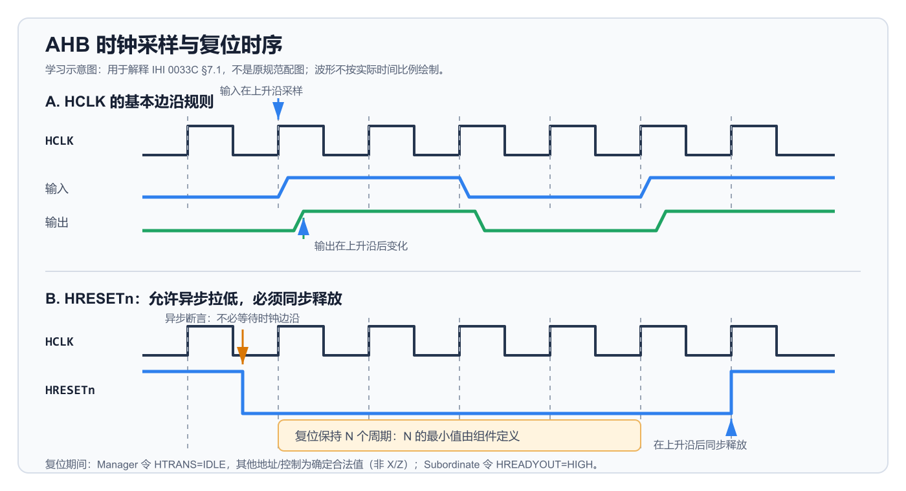

# AMBA AHB Protocol Specification IHI 0033C：第七章 Clock and Reset 时钟与复位精读

> 原始资料：[AMBA AHB Protocol Specification IHI 0033C](ARM_AMBA_AHB_Protocol_Specification_IHI0033C.pdf)  
> 精读范围：Chapter 7 Clock and Reset，PDF 第 71～72 页（文档页码 7-71～7-72）  
> 文档版本：Issue C，ID090921  
> 发布日期：2021 年 9 月 15 日  
> 前置阅读：[第六章 Data Buses 数据总线精读](ARM_AMBA_AHB_Protocol_Specification_IHI0033C-第六章数据总线.md)

本文面向第一次系统学习 AHB 的读者，统一使用 Issue C 的术语：`Manager`（原 `Master`）、`Subordinate`（原 `Slave`）和 `Interconnect`（互连）。第七章原文只有一个正文页，核心问题却很重要：接口在哪个时刻观察信号、规范中的“稳定”是否等于完全无毛刺，以及系统应如何进入和退出复位。

> **颜色说明：** 绿色文字表示可直接用于设计与验证的结论；橙色文字表示容易误读的限制。
>
> **信息类型：** 正文用于忠实转述 Chapter 7 的要求；“理解提示”用于连接前文章节；“工程推断”用于说明实现或验证时如何应用这些规则。

<details>
<summary><strong>1. <code>HCLK</code> 决定何时采样和改变信号</strong></summary>

AHB 接口中的每个组件都使用单一时钟 `HCLK`。规范给出了两个互相配合的边沿规则：

1. 所有输入信号都在 `HCLK` 的上升沿采样。
2. 所有输出信号的变化都必须发生在 `HCLK` 上升沿之后。

这意味着分析 AHB 时序时，应把上升沿看作状态交接点。发送方在上升沿之后更新输出，接收方在后续上升沿采样这些输入。规范没有要求在下降沿完成任何协议动作。

> <span style="color:#63d297"><strong>结论：</strong>AHB 是上升沿同步协议；判断一次传输是否推进、信号是否被接受，都以 <code>HCLK</code> 上升沿为准。</span>

### 等待状态中的“保持稳定”

前文多次提到：当 `HREADY=0` 延长传输时，某些地址、控制或数据信号必须保持稳定。Chapter 7 对“稳定”的默认含义作了更精确的限定：

- 如果一个信号在延长的传输中被要求保持稳定，那么它在不同 `HCLK` 上升沿被采样时必须得到相同的值。
- 这个要求并不自动保证信号在两个上升沿之间完全不发生毛刺。
- 典型的综合实现中，输出 Multiplexor 的控制信号可能在等待期间变化；即使最终选出的逻辑值没有变化，组合路径仍可能短暂产生毛刺，然后回到原值。

因此，协议默认关注的是**采样边沿上的值是否一致**。至于接口能否在整个时钟周期内保持无毛刺，属于实现定义（`IMPLEMENTATION DEFINED`）。

> <span style="color:#ffb454"><strong>易错点：</strong>“等待期间保持稳定”不能直接改写为“两个上升沿之间绝对不允许出现毛刺”。后一个保证只有在接口明确声明相应属性时才成立。</span>

### `Stable_Between_Clock` 属性

AHB5 定义了 `Stable_Between_Clock` 属性，用来声明接口是否对“应保持稳定的信号”提供周期内无毛刺保证。

| 属性取值 | 对应保证 |
| --- | --- |
| `True` | 凡协议要求保持稳定的信号，在相邻上升沿之间也必须保持稳定且无毛刺 |
| `False` | 信号可以在上升沿之间出现毛刺，但在规定的采样边沿仍必须满足协议稳定性要求 |
| 未定义 | 与 `False` 一样，不能假定接口具有周期内无毛刺保证 |

`Stable_Between_Clock=True` 的保证只覆盖**协议本来就要求保持稳定的信号**，不能扩大解释成所有输出在任何时刻都不变化。

> **工程推断：** 常规同步接收逻辑通常只在上升沿采样，可以按协议的边沿稳定性检查接口。如果信号还要送到异步逻辑、时钟门控、跨时钟域电路或对毛刺敏感的组合控制，则不能仅凭 AHB 合规性认定安全；应检查 `Stable_Between_Clock` 属性或增加寄存、同步和毛刺过滤措施。

> <span style="color:#63d297"><strong>结论：</strong><code>Stable_Between_Clock=True</code> 才额外保证相关信号在上升沿之间也无毛刺；属性为 <code>False</code> 或未定义时，只能依赖上升沿采样语义。</span>

</details>

<details>
<summary><strong>2. <code>HRESETn</code> 如何断言和释放</strong></summary>

`HRESETn` 是 AHB 协议中唯一的低有效信号，也是所有总线组件的主要复位信号：

- `HRESETn=0`：复位处于断言状态。
- `HRESETn=1`：复位已经释放。

规范允许 `HRESETn` **异步断言**，因此复位请求不必等待 `HCLK` 上升沿就可以拉低。复位释放则必须**同步发生在 `HCLK` 上升沿之后**，从而使各组件从受控的时钟边沿恢复运行。

> **专题阅读：** [为什么复位要“异步断言、同步释放”](为什么要异步断言同步释放复位.md)，结合 recovery/removal、亚稳态、复位同步器和多个开源硬件项目说明工程原因。



*图 1：根据 IHI 0033C §7.1 绘制的学习示意图，不是原规范配图。上半部分表示输入在 `HCLK` 上升沿采样、输出在上升沿后变化；下半部分表示 `HRESETn` 可以在周期中异步拉低，但应在上升沿后同步释放。图中的 N 不代表协议规定的固定周期数。*

按图中的时间顺序看：

1. `HRESETn` 可以在两个 `HCLK` 上升沿之间拉低，所有总线组件开始进入复位。
2. `HRESETn` 必须保持低电平足够长，使每个组件完全复位，并使输出达到规定的复位值。
3. 经过足够的复位周期后，`HRESETn` 在 `HCLK` 上升沿之后同步回到高电平。
4. 解除复位后，Manager 才能从 `IDLE` 转为有效传输；具体从哪个后续周期开始工作取决于组件实现及其复位要求。

> <span style="color:#63d297"><strong>结论：</strong>AHB 允许复位快速异步进入，但要求复位同步退出；复位控制器必须同时满足组件规定的最小断言周期。</span>

### 最小复位周期不是协议常数

每个组件必须定义 `HRESETn` 至少需要保持断言多少个周期，才能保证组件已经完全复位且输出到达要求的复位值。Chapter 7 没有给出全系统统一的固定周期数。

> **工程推断：** 系统级复位控制器必须满足所连接组件中最严格的最小周期要求。如果组件 A 要求至少 2 个周期、组件 B 要求至少 4 个周期，那么共享复位至少应覆盖 4 个符合要求的周期；还应同时满足时钟稳定和复位同步器本身的设计约束。

> <span style="color:#ffb454"><strong>易错点：</strong>“可以异步断言”不等于“可以异步释放”，也不等于只要产生一个很窄的低脉冲就一定能完成复位。</span>

</details>

<details>
<summary><strong>3. 复位期间 Manager 与 Subordinate 必须输出什么</strong></summary>

复位期间，总线仍不能出现无法解释的协议值。Chapter 7 分别规定了 Manager 和 Subordinate 的输出要求。

### Manager：`HTRANS` 必须为 `IDLE`，其余地址和控制信号不能是 `X/Z`

复位期间，Manager 必须满足两项独立要求：

1. `HTRANS[1:0]` 必须为 `IDLE`，即 `2'b00`。
2. `HADDR`、`HWRITE`、`HSIZE`、`HBURST`、`HPROT`、`HMASTLOCK` 等地址和控制输出必须是确定的合法值，不能出现 `X`、`Z` 或非法编码。

除 `HTRANS` 外，Chapter 7 没有规定其他地址和控制信号必须取哪个具体复位值，也没有要求它们全部清零。设计可以自行选择合法常量。例如，下面是一组常见且合法的实现选择：

```systemverilog
HADDR     = '0;
HTRANS    = 2'b00;  // IDLE，协议指定的复位值
HWRITE    = 1'b0;
HSIZE     = 3'b000;
HBURST    = 3'b000;
HPROT     = 4'b0000;
HMASTLOCK = 1'b0;
```

这组信号全部清零只是实现选择，不能写成协议强制要求。判断地址阶段是否包含有效传输时，要检查 `HTRANS`：只有 `NONSEQ` 或 `SEQ` 的 `HTRANS[1]=1`，`IDLE` 的 `HTRANS[1]=0`。因此，复位期间即使 `HADDR`、`HWRITE` 和 `HSIZE` 等信号带有确定的合法值，它们也不会构成一笔需要执行的传输。

> <span style="color:#63d297"><strong>结论：</strong>这里的“有效电平”只表示单个地址或控制信号是确定的合法值，不表示这些信号共同构成一笔有效传输；<code>HTRANS=IDLE</code> 明确禁止启动传输。</span>

### Subordinate：保持 `HREADYOUT=HIGH`

所有 Subordinate 在复位期间必须令 `HREADYOUT` 为高。这样，复位状态不会被解释成某个 Subordinate 正在通过 `HREADYOUT=LOW` 无限延长数据阶段。

Chapter 7 没有为复位期间的 `HRDATA` 指定必须返回的统一数据值，也没有在此处增加一笔有效传输，因此不应把 `HREADYOUT=HIGH` 误解成“复位期间完成了一笔真实访问”。

| 角色 | 复位期间的明确要求 | 不应额外推导的结论 |
| --- | --- | --- |
| Manager | 地址和控制信号为确定的合法值，不能是 `X/Z` 或非法编码；`HTRANS=IDLE` | 地址和所有控制位必须全为 0；或者这些信号构成一笔有效传输 |
| Subordinate | `HREADYOUT=HIGH` | 正在完成一笔有效传输，或 `HRDATA` 必须包含有效业务数据 |

> <span style="color:#63d297"><strong>结论：</strong>复位期间 Manager 输出确定的合法地址和控制值，并用 <code>HTRANS=IDLE</code> 明确表示无有效请求；Subordinate 用 <code>HREADYOUT=HIGH</code> 避免把总线保持在等待状态。</span>

</details>

<details>
<summary><strong>4. 设计与验证检查清单</strong></summary>

### RTL 设计侧

- 所有 AHB 输入在 `HCLK` 上升沿使用或寄存。
- 输出只在上升沿之后更新，不依赖下降沿完成协议状态转换。
- 等待期间需要稳定的信号在相邻采样边沿保持相同值。
- 如果接口声明 `Stable_Between_Clock=True`，组合路径也不能让相关信号在周期内出现毛刺。
- `HRESETn` 的释放路径经过同步处理；异步断言不会造成部分状态未进入复位。
- 复位保持时间覆盖组件声明的最小周期数。
- Manager 的复位输出包含 `HTRANS=IDLE`，其余地址/控制信号为确定的合法值，不能是 `X/Z` 或非法编码。
- Subordinate 的复位输出包含 `HREADYOUT=HIGH`。

### 验证侧

- 分开检查“上升沿采样值保持不变”和“整个周期无毛刺”这两个性质。
- 只有在 `Stable_Between_Clock=True` 时，才把周期内无毛刺作为接口属性要求。
- 随机化 `HRESETn` 的异步断言时刻，确认组件都能进入复位。
- 检查 `HRESETn` 只在允许的 `HCLK` 上升沿之后释放。
- 覆盖最短合法复位长度，并对短于组件最小要求的刺激作非法场景处理。
- 在整个复位窗口检查 `HTRANS=IDLE` 和 `HREADYOUT=HIGH`。

</details>

<details>
<summary><strong>5. 自测题</strong></summary>

<details>
<summary>1. AHB 接口在 <code>HCLK</code> 的哪个边沿采样输入？</summary>

> 在 `HCLK` 上升沿采样所有输入信号。

</details>

<details>
<summary>2. 输出信号应在什么时候发生变化？</summary>

> 所有输出信号的变化都必须发生在 `HCLK` 上升沿之后。

</details>

<details>
<summary>3. 等待期间要求信号稳定，是否默认意味着整个周期绝对无毛刺？</summary>

> 不是。默认要求是在不同上升沿采样时得到相同值；两个上升沿之间是否无毛刺属于实现定义。

</details>

<details>
<summary>4. <code>Stable_Between_Clock=False</code> 是否允许采样边沿上的值违反稳定要求？</summary>

> 不允许。它只表示不能保证上升沿之间无毛刺；凡协议要求稳定的信号，在规定的上升沿采样时仍必须保持相同值。

</details>

<details>
<summary>5. <code>HRESETn</code> 的断言和释放分别采用什么时序？</summary>

> 规范允许异步断言，但要求在 `HCLK` 上升沿之后同步释放。

</details>

<details>
<summary>6. AHB 是否统一规定复位必须保持 2 个或 4 个周期？</summary>

> 没有。每个组件必须定义自己的最小复位断言周期，系统必须满足实际组件的要求。

</details>

<details>
<summary>7. Manager 在复位期间应把 <code>HTRANS</code> 置为什么？</summary>

> 置为 `IDLE`，编码为 `2'b00`；同时地址和其他控制信号必须是确定的合法值，不能是 `X/Z` 或非法编码。除 `HTRANS` 外，规范没有要求其他信号必须取某个固定值或全部清零。

</details>

<details>
<summary>8. Subordinate 在复位期间为什么要保持 <code>HREADYOUT=HIGH</code>？</summary>

> 这样复位状态不会被解释成 Subordinate 正在请求等待状态，避免把总线停在一个未完成的数据阶段。

</details>

</details>

## 6. 问题记录与解答

暂无。

<details>
<summary><strong>7. 本篇边界与资料来源</strong></summary>

本篇只解释 Chapter 7 对 `HCLK`、信号稳定性和 `HRESETn` 的要求，不重复展开传输流水、等待状态或各信号在不同传输阶段的完整有效性规则。相关内容可继续阅读：

- [第三章 Transfers 传输精读](ARM_AMBA_AHB_Protocol_Specification_IHI0033C-第三章传输.md)：地址阶段、数据阶段与等待状态；
- [第五章 Subordinate Response Signaling 响应信号精读](ARM_AMBA_AHB_Protocol_Specification_IHI0033C-第五章Subordinate响应信号.md)：`HREADYOUT`、`HREADY` 与响应时序；
- Chapter 8 Signal validity：每类信号在什么条件下必须有效。

本文以 [AMBA AHB Protocol Specification IHI 0033C](ARM_AMBA_AHB_Protocol_Specification_IHI0033C.pdf) 的 Chapter 7（PDF 第 71～72 页，文档页码 7-71～7-72）为主要资料。图 1 是根据 §7.1 自行绘制的学习示意图，不是 Arm 原规范图片。

本文是学习整理，不替代官方规范。实现或验证 AHB 兼容设计时，应以原始 PDF 为准。

</details>
