# AMBA AHB Protocol Specification IHI 0033C：第三章 Transfers 基础内容精读

> 原始资料：[ARM_AMBA_AHB_Protocol_Specification_IHI0033C.pdf](ARM_AMBA_AHB_Protocol_Specification_IHI0033C.pdf)  
> 精读范围：Chapter 3 Transfers 的基础传输内容，PDF 第 27-45 页（文档页码 3-27～3-45）  
> 文档版本：Issue C，ID090921，2021 年 9 月 15 日发布  
> 前置阅读：[第二章 Signal Descriptions 精读](ARM_AMBA_AHB_Protocol_Specification_IHI0033C-第二章信号描述.md)

本文面向第一次系统学习 AHB 的读者，统一使用 Issue C 的术语 `Manager（原 Master）`、`Subordinate（原 Slave）` 和 `Interconnect（互连）`，重点讲解基础传输、Burst、等待规则和 4 位 `HPROT` 保护属性。

> **颜色约定：** <span style="color:#4ea1ff">蓝色</span>表示关键协议名和信号，<span style="color:#ffb454">橙色</span>表示限制和易错条件，<span style="color:#63d297">绿色</span>表示正确方向和结论。
>
> **信息标记：** 正文默认是对 Chapter 3 规范原意的中文转述；“理解提示”用于补充阶段关系和地址计算；“工程推断”用于说明实现或验证层面的结论。超出 Chapter 3 的响应时序、数据组织和互连细节会注明对应章节。

## 目录

- [1. 阅读方式](#1-阅读方式)
- [2. 基础传输与流水线](#2-基础传输与流水线)
- [3. HTRANS：四种传输类型](#3-htrans四种传输类型)
- [4. 锁定传输](#4-锁定传输)
- [5. 传输大小](#5-传输大小)
- [6. Burst 操作](#6-burst-操作)
- [7. 等待期间允许改变什么](#7-等待期间允许改变什么)
- [8. HPROT 保护控制](#8-hprot-保护控制)
- [9. 易错点、口诀与自测](#9-易错点口诀与自测)
- [10. 问题记录与解答](#10-问题记录与解答)
- [11. 本章边界与资料来源](#11-本章边界与资料来源)

<a id="1-阅读方式"></a>
<details open>
<summary><strong>1. 阅读方式</strong></summary>

建议先阅读第 2～7 节掌握基础传输、Burst 与等待规则，再阅读第 8 节了解 `HPROT[3:0]` 保护属性。读完后使用 [9.3 自测题](#chapter3-self-test) 检查是否真正理解；阅读过程中遇到的具体疑问集中记录在 [10. 问题记录与解答](#10-问题记录与解答)。

</details>

<a id="2-基础传输与流水线"></a>
<details>
<summary><strong>2. 基础传输与流水线</strong></summary>

### 2.1 一笔传输的两个阶段

一笔 AHB 传输由两个阶段组成（IHI 0033C，3.1 节，第 3-28 页）：

| 阶段 | 持续时间 | 主要内容 |
| --- | --- | --- |
| Address phase | 通常一个 `HCLK` 周期；可能被**前一笔传输**延长 | Manager 给出 `HADDR`、`HTRANS`、`HWRITE`、`HSIZE`、`HBURST`、`HPROT` 等地址和控制信息 |
| Data phase | 一个或多个 `HCLK` 周期 | 写时 Manager 给出 `HWDATA`；读时 Subordinate 给出 `HRDATA`；完成状态由系统侧 `HREADY` 控制 |

`HWRITE=1` 表示写传输，Manager 在写数据总线上广播 `HWDATA`；`HWRITE=0` 表示读传输，目标 Subordinate 在读数据总线上产生 `HRDATA`。

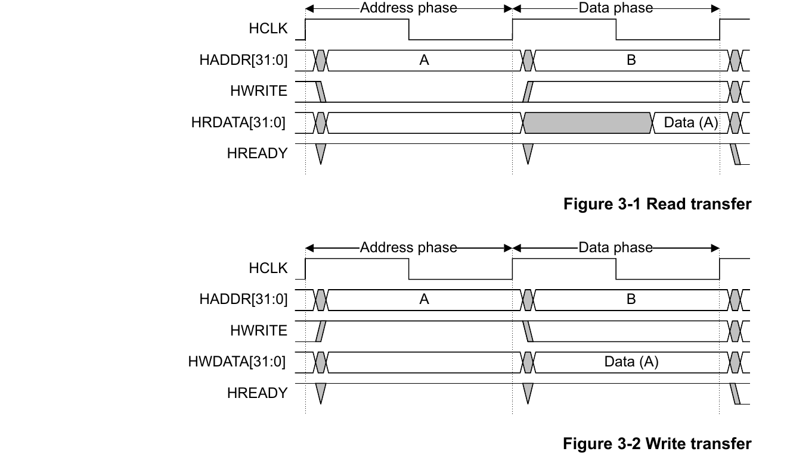

*图 1：原规范 Figure 3-1 和 Figure 3-2，无等待状态的简单读写传输。来源：IHI 0033C，第 3-28 页。Copyright © 2001, 2006, 2010, 2015, 2021 Arm Limited or its affiliates. All rights reserved.*

> **相关问题：** [读等待期间，为什么 `HWRITE` 可以从 0 变成 1？（第 10.2 节）](#question-read-wait-hwrite)

以无等待传输为例：

1. Manager 在一个上升沿之后驱动地址和控制信号。
2. Subordinate 在下一个上升沿采样地址和控制信息，传输进入数据阶段。
3. Subordinate 在数据阶段驱动局部 `HREADYOUT`；Interconnect 选择后形成系统级 `HREADY`，Manager 在再下一个上升沿采样完成状态和返回数据。

### 2.2 流水线重叠

一笔传输的数据阶段通常与下一笔传输的地址阶段同时出现。因此，同一个周期中的 `HADDR` 与 `HWDATA/HRDATA` 往往属于不同传输：

- 当前 `HADDR` 和控制信号：描述新传输 B；
- 当前 `HWDATA`、`HRDATA`、`HRESP`：属于上一笔已经进入数据阶段的传输 A。

> <span style="color:#63d297"><strong>一句话记忆：</strong></span> 同周期看到“地址 B、数据 A”是 AHB 流水线的正常状态。

### 2.3 等待状态

Subordinate 需要更多时间时输出 `HREADYOUT=0`，Interconnect 选中该返回值后形成系统侧 `HREADY=0`，从而延长当前数据阶段。

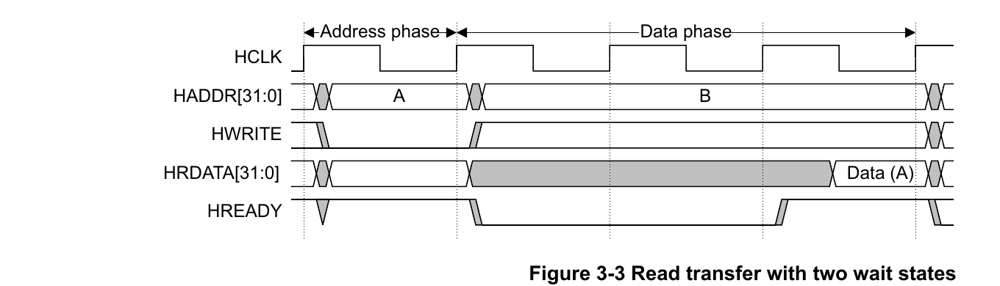

*图 2：原规范 Figure 3-3，读传输包含两个等待状态。读数据只要求在传输即将完成时有效。来源：IHI 0033C，第 3-29 页。Copyright © 2001, 2006, 2010, 2015, 2021 Arm Limited or its affiliates. All rights reserved.*

> **相关问题：** [读等待期间，为什么 `HWRITE` 可以从 0 变成 1？（第 10.2 节）](#question-read-wait-hwrite)

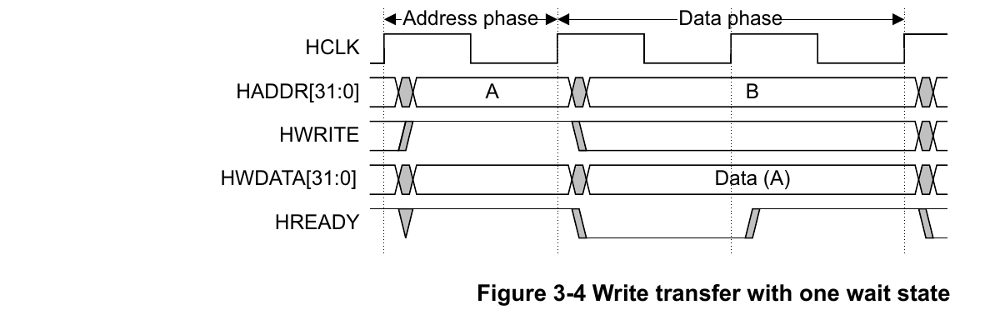

*图 3：原规范 Figure 3-4，写传输包含一个等待状态。Manager 必须在整个扩展数据阶段保持写数据稳定。来源：IHI 0033C，第 3-29 页。Copyright © 2001, 2006, 2010, 2015, 2021 Arm Limited or its affiliates. All rights reserved.*

等待期间的数据规则是：

- 写传输：<span style="color:#ffb454"><strong>Manager 必须在整个扩展周期中保持 `HWDATA` 稳定</strong></span>。
- 读传输：<span style="color:#ffb454">等待周期中不必给出有效 `HRDATA`</span>，但 <span style="color:#63d297"><strong>在 `HREADY=1`、传输完成的采样边沿之前必须给出有效数据</strong></span>。

等待还会产生一个<span style="color:#ffb454"><strong>容易被忽视的副作用</strong></span>：当前数据阶段没有完成，流水线就不能接收下一笔地址，因此<span style="color:#63d297"><strong>下一笔地址阶段被前一笔数据阶段延长</strong></span>。

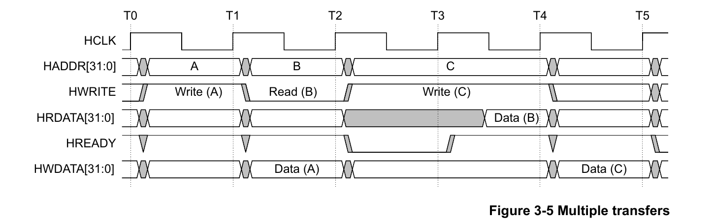

*图 4：原规范 Figure 3-5。B 的数据阶段等待一个周期，使 C 的地址和控制保持到 B 完成。来源：IHI 0033C，第 3-29 页。Copyright © 2001, 2006, 2010, 2015, 2021 Arm Limited or its affiliates. All rights reserved.*

> <span style="color:#ffb454"><strong>重要区别：</strong></span> 不是“地址阶段自己请求了等待”，而是前一笔数据阶段的 `HREADY=0` 阻止流水线推进，因而让当前地址和控制继续保持。

### 2.4 等待期间的地址与控制信号

AHB 没有独立的地址阶段握手信号。`HREADY=0` 直接延长当前传输的数据阶段，同时阻止流水线推进，使下一笔传输的地址和控制信号被动保持。默认稳定性规则及其例外见第 7 节。

需要特别注意：等待中的数据阶段与被保持的下一笔地址阶段属于不同传输，因此下一笔的 `HWRITE` 等控制值可以与当前传输不同。

> **延伸答疑：** [地址阶段能否主动延长？（第 10.1 节）](#question-address-phase-extension)

</details>

<a id="3-htrans四种传输类型"></a>
<details>
<summary><strong>3. HTRANS：四种传输类型</strong></summary>

`HTRANS[1:0]` 把每个地址阶段分成四类（IHI 0033C，3.2 节，第 3-30～3-31 页）：

| `HTRANS` | 类型 | 是否产生有效数据传输 | 核心规则 |
| --- | --- | --- | --- |
| `0b00` | `IDLE` | 否 | Manager 当前不要求数据传输；Subordinate 必须零等待（`HREADYOUT=1`）返回 `OKAY`（`HRESP=0`）并忽略该传输 |
| `0b01` | `BUSY` | 否 | Burst 尚未结束，但 Manager 暂时不能发出下一笔有效传输；在 `BUSY` 期间，Manager 仍提前给出 Burst 恢复后下一笔有效传输的地址和控制信息；Subordinate 看到 `BUSY` 后不执行这些信息，并以零等待（`HREADYOUT=1`）`OKAY`（`HRESP=0`）响应 |
| `0b10` | `NONSEQ` | 是 | 单次传输或 Burst 首拍；地址和控制与上一笔传输无关 |
| `0b11` | `SEQ` | 是 | Burst 后续拍；控制信息与前一拍相同，地址按 `HSIZE` 递增，回绕 Burst 到边界时回绕 |

> **相关问题：** [`IDLE` 时没有有效传输，为什么 `HREADYOUT` 还必须为 1？（第 10.3 节）](#question-idle-hreadyout)

`HTRANS[1]=1` 可以作为“当前地址阶段是有效传输”的快速判断，但实现仍需结合 `HREADY` 确认该地址阶段是否在本周期结束时真正被接受。

### 3.1 `BUSY` 不是等待响应

`BUSY` 是 **Manager 主动插入的空拍**，表示它暂时不能继续 Burst；`HREADY=0` 是 **Subordinate 侧通过完成握手造成的等待**。二者来源和作用完全不同。

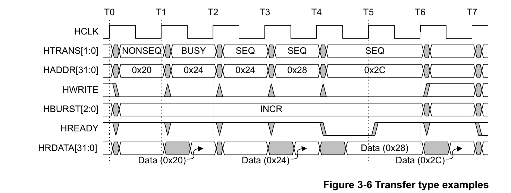

*图 5：原规范 Figure 3-6。INCR Burst 以 `NONSEQ` 开始，中间插入 `BUSY`，之后以 `SEQ` 继续；后续数据阶段又出现一个 Subordinate 等待状态。来源：IHI 0033C，第 3-31 页。Copyright © 2001, 2006, 2010, 2015, 2021 Arm Limited or its affiliates. All rights reserved.*

> **相关问题：** [`BUSY` 时给出地址 `0x24`，恢复时可以切换地址吗？（第 10.4 节）](#question-busy-resume-address)

读图时要把两个事件分开：

- T1-T2：Manager 用 `BUSY` 推迟第二拍，第一拍的读数据仍可在同周期返回。
- T4-T6：Subordinate 拉低 `HREADYOUT`，使地址 `0x2C` 的阶段和前一拍数据阶段一起停住。

### 3.2 Burst 的首拍与后续拍

- 单次传输也视为长度为 1 的 Burst，因此使用 `NONSEQ`。
- 固定长度或未定义长度 Burst 的第一拍使用 `NONSEQ`。
- 同一 Burst 的后续有效拍使用 `SEQ`。
- 一个新的 `NONSEQ` 表示开始了与上一拍无关的新传输或新 Burst。

</details>

<a id="4-锁定传输"></a>
<details>
<summary><strong>4. 锁定传输</strong></summary>

先用一句话理解 `HMASTLOCK`：

> <span style="color:#ffb454"><strong>在我完成这一组访问之前，不允许其他 Manager 插队。</strong></span>

它通常用于必须连续完成的“读—判断—写回”操作。例如，Manager A 想通过一个信号量判断自己能否使用某项资源，信号量初始值为 0。

如果不使用锁定，可能出现下面的交错顺序：

```text
Manager A：读取信号量，得到 0
Manager B：读取信号量，也得到 0    ← 在 A 写回之前插入
Manager A：写入 1
Manager B：也写入 1
```

结果是 A、B 都认为自己成功取得了资源。使用 `HMASTLOCK` 后，A 可以把“读取信号量”和“写回新值”标记为同一个不可分割的访问序列；A 完成并解除锁定后，B 才能获得相应的访问机会。

因此，`HMASTLOCK` **锁定的是一组传输的访问顺序**，不是锁定 Manager 本身，也不是锁住某个数据值或某根信号线。它不表示暂停总线，不等于 `HREADY=0`，并且不会主动产生等待状态。

每笔传输访问哪个 Subordinate，由 Manager 给出的地址经过地址译码后决定；Subordinate 只能响应被选中的传输，不能主动发起传输或插到另一个 Subordinate 前面。因此，在只有一个 Manager、多个普通 Subordinate 的简单系统中，访问顺序本来就完全由这个 Manager 决定，`HMASTLOCK` 通常没有明显作用。（IHI 0033C，3.3 节，第 3-32 页）

锁定状态的边界由完成握手确定：

- 锁定生效：某周期 `HMASTLOCK=1`、存在 `HSELx` 时目标选择有效，并且 `HREADY=1`；
- 锁定解除：某周期 `HMASTLOCK=0` 且 `HREADY=1`。

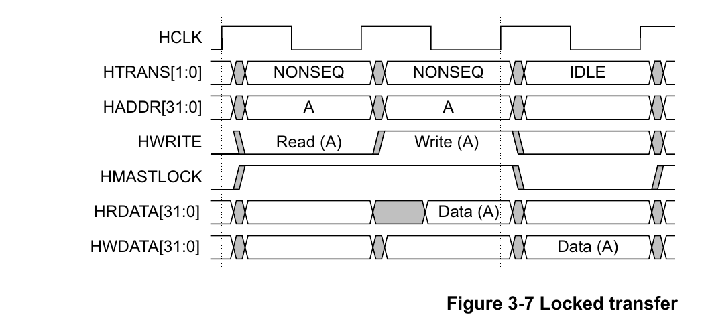

*图 6：原规范 Figure 3-7，使用 `HMASTLOCK` 表示不可分割的读写序列。来源：IHI 0033C，第 3-32 页。Copyright © 2001, 2006, 2010, 2015, 2021 Arm Limited or its affiliates. All rights reserved.*

还必须注意：

- 锁定序列中的所有传输必须落在同一个 Subordinate 地址区域；该要求在 Issue A 中不存在，使用旧组件时要额外验证。

> **相关问题：** [单个 Manager、多个 Subordinate 时，`HMASTLOCK` 能防止不同 Subordinate 插队吗？（第 10.5 节）](#question-lock-single-manager-multiple-subordinates)

- 规范建议锁定传输后插入一个 `IDLE`。
- 锁定序列开始、中间或结束时可以出现锁定的 `IDLE`，但在开始或结束处这样做不推荐，因为可能影响仲裁。
- 只会按接收顺序处理请求的普通 Subordinate 通常不需要实现 `HMASTLOCK`；可被多个 Manager 独立访问并可能重排请求的组件必须处理它。

> <span style="color:#ffb454"><strong>易错点：</strong></span> `HMASTLOCK` 的电平变化本身不立即改变锁定状态；它要在 `HREADY=1` 的完成边沿被接受。

</details>

<a id="5-传输大小"></a>
<details>
<summary><strong>5. 传输大小</strong></summary>

### 5.1 `HSIZE` 与对齐

`HSIZE[2:0]` 表示每一拍传输的数据大小（IHI 0033C，3.4 节，第 3-33 页）：

| `HSIZE` | 位数 | 每拍字节数 | 常用名称 |
| --- | ---: | ---: | --- |
| `000` | 8 | 1 | Byte |
| `001` | 16 | 2 | Halfword |
| `010` | 32 | 4 | Word |
| `011` | 64 | 8 | Doubleword |
| `100` | 128 | 16 | 4-word line |
| `101` | 256 | 32 | 8-word line |
| `110` | 512 | 64 | - |
| `111` | 1024 | 128 | - |

必须同时满足：

- `HSIZE` 指定的大小不能超过数据总线宽度；32 位数据总线只能使用 `000`、`001`、`010`。
- 每笔有效传输必须按自身大小对齐：Word 传输要求 `HADDR[1:0]=0b00`，Halfword 传输要求 `HADDR[0]=0`。
- <span style="color:#ffb454"><strong>`HSIZE` 与地址总线同阶段，并且在整个 Burst 中保持不变。</strong></span>

每拍字节数可以直接计算为：

```text
bytes_per_beat = 2^HSIZE
```

</details>

<a id="6-burst-操作"></a>
<details>
<summary><strong>6. Burst 操作</strong></summary>

### 6.1 `HBURST` 编码

AHB 定义单次、未定义长度以及 4/8/16 拍的递增和回绕 Burst（IHI 0033C，3.6 节，第 3-35～3-39 页）：

| `HBURST` | 类型 | 拍数 | 地址行为 |
| --- | --- | ---: | --- |
| `000` | `SINGLE` | 1 | 单次传输 |
| `001` | `INCR` | 未定义 | 按每拍大小持续递增 |
| `010` | `WRAP4` | 4 | 递增并在 4 拍地址块边界回绕 |
| `011` | `INCR4` | 4 | 连续递增 4 拍 |
| `100` | `WRAP8` | 8 | 递增并在 8 拍地址块边界回绕 |
| `101` | `INCR8` | 8 | 连续递增 8 拍 |
| `110` | `WRAP16` | 16 | 递增并在 16 拍地址块边界回绕 |
| `111` | `INCR16` | 16 | 连续递增 16 拍 |

<span style="color:#ffb454">Burst 长度表示拍数，不表示字节数。</span> Burst 的总字节数为：

```text
burst_bytes = beats × 2^HSIZE
```

### 6.2 递增与回绕地址

递增 Burst 的下一拍地址为：

```text
next_address = current_address + 2^HSIZE
```

回绕 Burst 还需要计算回绕块：

```text
wrap_bytes = beats × 2^HSIZE
wrap_base  = floor(start_address / wrap_bytes) × wrap_bytes
```

以 Word 传输为例，每拍 4 字节：

| 类型与起始地址 | 地址序列 |
| --- | --- |
| `WRAP4`，从 `0x38` 开始 | `0x38 → 0x3C → 0x30 → 0x34` |
| `INCR4`，从 `0x38` 开始 | `0x38 → 0x3C → 0x40 → 0x44` |
| `WRAP8`，从 `0x34` 开始 | `0x34 → 0x38 → 0x3C → 0x20 → 0x24 → 0x28 → 0x2C → 0x30` |

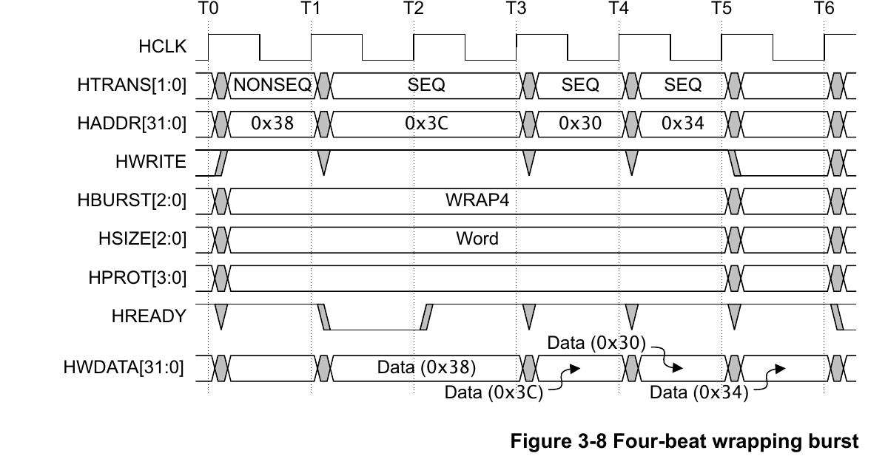

*图 7：原规范 Figure 3-8。Word WRAP4 在 16 字节边界回绕，`0x3C` 的下一拍为 `0x30`；第一拍数据阶段含一个等待状态。来源：IHI 0033C，第 3-37 页。Copyright © 2001, 2006, 2010, 2015, 2021 Arm Limited or its affiliates. All rights reserved.*

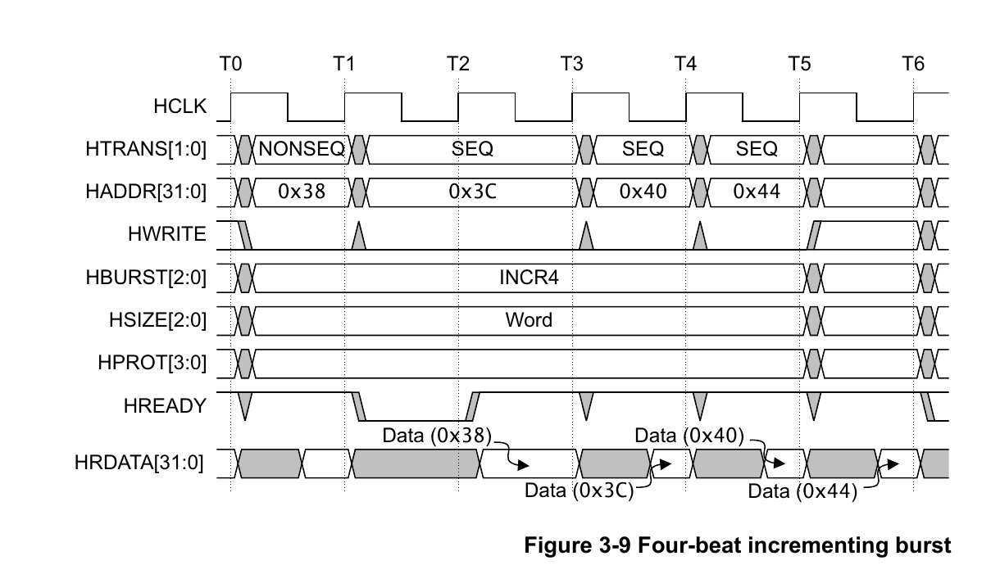

*图 8：原规范 Figure 3-9。Word INCR4 不在 16 字节边界回绕，`0x3C` 的下一拍为 `0x40`。来源：IHI 0033C，第 3-38 页。Copyright © 2001, 2006, 2010, 2015, 2021 Arm Limited or its affiliates. All rights reserved.*

### 6.3 未定义长度 `INCR`

`INCR` 没有预先声明固定拍数，可以在合法位置结束当前 Burst，再以新的 `NONSEQ` 开始另一笔传输。

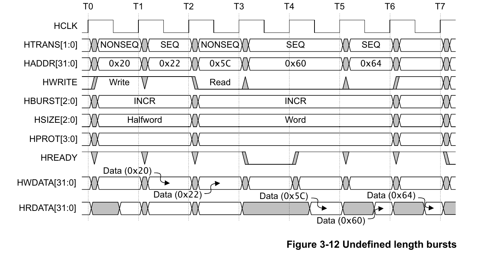

*图 9：原规范 Figure 3-12。第一个 INCR 是两拍 Halfword 写，地址增加 2；第二个 INCR 是三拍 Word 读，地址增加 4。来源：IHI 0033C，第 3-39 页。Copyright © 2001, 2006, 2010, 2015, 2021 Arm Limited or its affiliates. All rights reserved.*

递增 Burst 不能跨越 1KB 地址边界。原因是 AHB 分配给一个 Subordinate 的最小地址译码区域为 1KB，并且区域起止位置必须按 1KB 对齐。把 Burst 限制在同一个 1KB 区域内，可以保证地址译码器不会在 Burst 中途切换 `HSELx`，即同一个 Burst 始终由同一个 Subordinate 接收。（IHI 0033C，4.2 节，第 4-55 页）

> <span style="color:#ffb454"><strong>易错点：</strong></span> 1KB 是协议规定的 Burst 边界，不是由 Subordinate 的实际寄存器容量决定的。即使某个 Subordinate 只有 256B 寄存器，AHB 地址映射仍应为它分配至少 1KB 的译码窗口；即使某个 Subordinate 连续占用了多个 1KB 区域，递增 Burst 仍不能跨越其中的 1KB 边界。如果自定义系统按小于 1KB 的窗口选择不同 Subordinate，它不符合本规范的最小地址空间要求，而且 Manager 还必须在那些更小的译码边界处拆分 Burst。

例如 Word INCR 每拍增加 4 字节，在 `0x400` 边界处必须拆成两个 Burst：

```text
HTRANS    地址      含义
NONSEQ    0x3F8     第一个 Burst 开始
SEQ       0x3FC     第一个 Burst 的后续拍
NONSEQ    0x400     跨过 1KB 边界，开始第二个 Burst
SEQ       0x404     第二个 Burst 的后续拍
```

### 6.4 `BUSY` 后如何结束 Burst

- `INCR`：可以在 `BUSY` 后改为 `SEQ` 继续，也可以改为 `IDLE` 或 `NONSEQ` 结束当前 Burst。
- 固定长度 `INCR4/8/16`、`WRAP4/8/16`：不能以 `BUSY` 结束，最后一拍必须是 `SEQ`。
- `SINGLE`：后面必须是 `IDLE` 或 `NONSEQ`，不能紧接 `BUSY`。

### 6.5 提前终止

Burst 可能因为以下情况提前结束：

- Subordinate 返回 `ERROR`：Manager 可以取消剩余拍，也可以继续；取消时必须在两周期 ERROR 响应期间把 `HTRANS` 改为 `IDLE`。已取消的剩余拍不要求下次访问时补做。
- Multi-layer Interconnect 为其他 Manager 取得访问机会而终止 Burst：即使 Manager 本身不应随意提前终止固定长度请求，Subordinate 仍必须能正确处理没有收齐全部拍的情况。

</details>

<a id="7-等待期间允许改变什么"></a>
<details>
<summary><strong>7. 等待期间允许改变什么</strong></summary>

等待期间的默认规则是：当 `HREADY=0` 时，当前有效地址和控制必须保持。Chapter 3 同时定义了少数例外，不能把“等待时所有信号绝对不变”当成完整规则。（IHI 0033C，3.7 节，第 3-40～3-44 页）

### 7.1 `HTRANS` 变化决策表

| 等待时当前类型 | 允许变化 | 变化后的要求 |
| --- | --- | --- |
| `IDLE` | 可以改为 `NONSEQ` | 一旦改为 `NONSEQ`，必须保持到 `HREADY=1` |
| 固定长度 Burst 中的 `BUSY` | 可以改为 `SEQ` | 一旦改为 `SEQ`，必须保持到 `HREADY=1` |
| 未定义长度 `INCR` 中的 `BUSY` | 可以改为任意类型 | `SEQ` 继续原 Burst；`IDLE` 或 `NONSEQ` 结束原 Burst；选定新类型后按其规则保持 |
| 其他情况 | 不允许改变 | 保持当前 `HTRANS`，直到 `HREADY=1` |

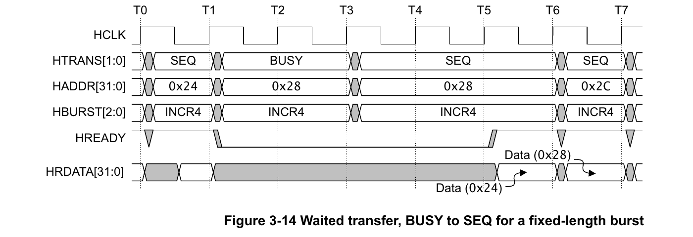

*图 10：原规范 Figure 3-14。固定长度 INCR4 在等待期间可以从 `BUSY` 改为 `SEQ`，随后必须保持该拍地址和类型直到 `HREADY=1`。来源：IHI 0033C，第 3-41 页。Copyright © 2001, 2006, 2010, 2015, 2021 Arm Limited or its affiliates. All rights reserved.*

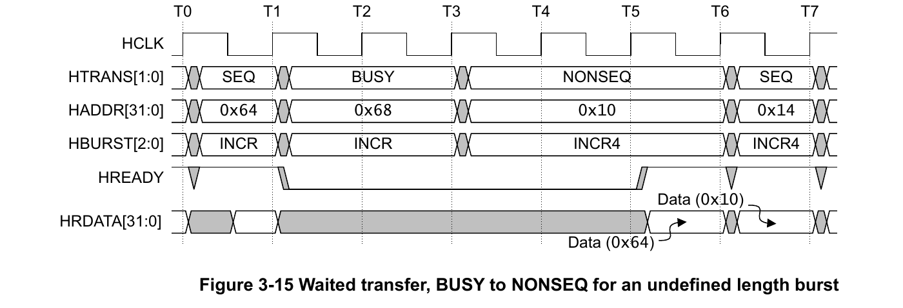

*图 11：原规范 Figure 3-15。未定义长度 INCR 在 `BUSY` 后改为 `NONSEQ`，结束原 Burst，并准备从 `0x10` 开始新的 INCR4。来源：IHI 0033C，第 3-42 页。Copyright © 2001, 2006, 2010, 2015, 2021 Arm Limited or its affiliates. All rights reserved.*

### 7.2 地址变化规则

等待期间，Manager 通常只能为准备中的下一笔传输改变一次地址；有两个重要例外：

1. **当前为 `IDLE`：** 地址可以在连续的 `IDLE` 周期中改变，因为这些地址不会产生数据传输。一旦 `HTRANS` 改为 `NONSEQ`，地址必须保持到 `HREADY=1`。
2. **两周期 `ERROR` 响应：** 在 `HREADY=0` 的第一个 ERROR 周期之后，Manager 可以把 `HTRANS` 改为 `IDLE` 并改变地址；完整 ERROR 时序在 Chapter 5 定义。

> <span style="color:#ffb454"><strong>分析方法：</strong></span> 先找出当前数据阶段是谁，再看同周期地址阶段是有效传输、`IDLE` 还是 `BUSY`。不要只看到 `HREADY=0` 就忽略 `HTRANS` 所定义的例外。

### 7.3 可直接用于验证的检查点

> <span style="color:#ffb454"><strong>工程推断：</strong></span> 根据 3.7 节，可以把等待期检查拆成“稳定性默认规则 + 三类合法豁免”。断言应先排除 `IDLE→NONSEQ`、固定 Burst `BUSY→SEQ`、INCR `BUSY→任意类型`及 ERROR 第二周期，再检查 `HTRANS/HADDR` 稳定，避免把规范允许的变化误报为错误。

</details>

<a id="8-hprot-保护控制"></a>
<details>
<summary><strong>8. HPROT 保护控制</strong></summary>

传统 4 位 `HPROT[3:0]` 为访问提供附加属性，主要供实现保护或内存管理功能的组件使用（IHI 0033C，3.8 节，第 3-45 页）：

| 位 | Issue C 名称 | `0` | `1` |
| --- | --- | --- | --- |
| `HPROT[0]` | Data/Opcode | 指令取值 | 数据访问 |
| `HPROT[1]` | Privileged | 非特权访问 | 特权访问 |
| `HPROT[2]` | Bufferable | Non-bufferable | Bufferable |
| `HPROT[3]` | Modifiable | Non-cacheable | Cacheable |

Issue A 把 `HPROT[3]` 命名为 Cacheable，Issue B 起命名为 Modifiable；规范说明名称改变但定义保持一致。使用旧版组件或资料时要注意术语差异。

`HPROT` 与地址总线同阶段，并且必须在整个 Burst 中保持不变。若 Manager 无法产生准确的保护信息，规范建议：

- Manager 输出 `HPROT=0b0011`，表示 Non-cacheable、Non-bufferable、Privileged、Data access；
- Subordinate 除非确有需要，否则不要依赖不准确的 `HPROT`。

> <span style="color:#ffb454"><strong>易错点：</strong></span> `HPROT[0]` 的“数据/指令”是提示信息，并非所有混合事务都能精确归类；不能据此推导超出规范的安全策略。

</details>

<a id="9-易错点口诀与自测"></a>
<details>
<summary><strong>9. 易错点、口诀与自测</strong></summary>

### 9.1 七个易错点

1. `HREADY=0` 延长当前数据阶段，并连带保持下一笔地址阶段；不能说地址阶段主动插入等待。
2. `BUSY` 是 Manager 的空拍，`HREADY=0` 是 Subordinate 侧等待，二者不能互换。
3. `IDLE` 和 `BUSY` 都不产生数据传输，Subordinate 必须零等待 `OKAY` 并忽略它们。
4. `HBURST` 给出拍数和回绕类型，`HSIZE` 给出每拍大小；两者共同决定总字节数和回绕边界。
5. 固定长度 Burst 不能以 `BUSY` 结束；未定义长度 `INCR` 可以在 `BUSY` 后用 `IDLE/NONSEQ` 终止。
6. 等待时信号默认保持，但 `IDLE`、`BUSY` 和 ERROR 响应存在规范明确的变化例外。
7. `HPROT[3:0]` 是地址阶段的保护属性，并且必须在整个 Burst 中保持不变；不能把它当成数据阶段信号。

### 9.2 记忆口诀

> <span style="color:#63d297">首拍 NONSEQ，后拍 SEQ；</span>  
> <span style="color:#63d297">Manager 忙用 BUSY，无传输用 IDLE；</span>  
> <span style="color:#63d297">SIZE 定步长，BURST 定拍数与回绕；</span>  
> <span style="color:#63d297">READY 低时先保持，再检查三类例外。</span>

<a id="chapter3-self-test"></a>

### 9.3 自测题

<details>
<summary>1. 同一周期看到地址 B 和数据 A，是否说明信号错位？</summary>

> 不是。AHB 的地址阶段和数据阶段采用流水线重叠：当前地址和控制描述新传输 B，当前 `HWDATA/HRDATA` 则属于上一笔已经进入数据阶段的传输 A。

</details>

<details>
<summary>2. <code>HREADY=0</code> 直接延长哪一笔传输，又会间接影响什么？</summary>

> 它直接延长当前传输 A 的数据阶段，并阻止流水线推进，使下一笔传输 B 的地址和控制被动保持。它不是独立的地址等待请求，也不会重新延长 A 已经结束的地址阶段。

</details>

<details>
<summary>3. <code>IDLE</code>、<code>BUSY</code>、<code>NONSEQ</code>、<code>SEQ</code> 分别表示什么？</summary>

> `IDLE` 表示当前没有有效传输；`BUSY` 表示 Burst 仍将继续，但 Manager 暂时不能发出下一拍；`NONSEQ` 用于单次传输或 Burst 首拍；`SEQ` 用于 Burst 后续拍。只有 `NONSEQ` 和 `SEQ` 产生有效数据传输。

</details>

<details>
<summary>4. <code>BUSY</code> 与 <code>HREADY=0</code> 有什么区别？</summary>

> `BUSY` 由 Manager 主动发出，是 Burst 中不产生数据传输的空拍；`HREADY=0` 是系统级完成指示，通常源于目标 Subordinate 的 `HREADYOUT=0`，表示当前数据阶段尚未完成。

</details>

<details>
<summary>5. <code>HSIZE</code> 与 <code>HBURST</code> 如何决定地址？Word WRAP4 从 <code>0x38</code> 开始的四个地址是什么？</summary>

> 每拍字节数为 `2^HSIZE`，`HBURST` 决定拍数以及递增或回绕方式；回绕块大小等于“每拍字节数 × 拍数”。Word WRAP4 每拍 4 字节、回绕块为 16 字节，地址依次为 `0x38 → 0x3C → 0x30 → 0x34`。

</details>

<details>
<summary>6. 为什么固定长度 Burst 不能在 <code>BUSY</code> 后直接结束，而未定义长度 <code>INCR</code> 可以？</summary>

> 固定长度 Burst 已声明必须完成的有效拍数，可以在中间插入 `BUSY`，但随后必须以 `SEQ` 继续直至完成规定拍数。未定义长度 `INCR` 没有预先声明拍数，可以在 `BUSY` 后用 `IDLE` 或 `NONSEQ` 结束当前 Burst。

</details>

<details>
<summary>7. 32 位数据总线能否使用 <code>HSIZE=011</code>？</summary>

> 不能。`HSIZE=011` 表示 64 位传输，超过 32 位数据总线宽度；32 位总线只能使用 Byte、Halfword 和 Word。

</details>

<details>
<summary>8. 等待期间 <code>HTRANS</code> 和 <code>HADDR</code> 是否绝对不能变化？</summary>

> 不是。`HTRANS` 允许 `IDLE→NONSEQ`、固定长度 Burst 的 `BUSY→SEQ`，以及未定义长度 `INCR` 的 `BUSY→任意类型`；地址在 `IDLE` 期间可以变化，ERROR 响应的第一个周期也存在地址变化例外。完成允许的变化后，相关信号必须保持到 `HREADY=1`。

</details>

<details>
<summary>9. <code>HPROT[3:0]</code> 的四个位分别描述什么？</summary>

> `HPROT[0]` 区分指令取值和数据访问，`HPROT[1]` 区分非特权和特权访问，`HPROT[2]` 表示是否 Bufferable，`HPROT[3]` 表示是否 Modifiable。`HPROT` 属于地址阶段，并且必须在整个 Burst 中保持不变。

</details>

</details>

<a id="10-问题记录与解答"></a>

## 10. 问题记录与解答

<a id="question-address-phase-extension"></a>

<details>
<summary><strong>10.1 地址阶段能否主动延长？</strong></summary>

AHB 中可以看到地址和控制保持多个周期，但协议没有专门用于延长地址阶段的握手信号。`HREADY` 表示当前数据阶段是否完成，不是独立的地址接收信号。

假设传输 A 的数据阶段与传输 B 的地址阶段重叠：

| 周期 | 数据阶段 | 地址阶段 | `HREADY` | 结果 |
| --- | --- | --- | --- | --- |
| T1 | 上一笔传输 | A | `1` | 上一笔完成，A 被接受 |
| T2 | A | B | `0` | A 尚未完成，B 不能被接受 |
| T3 | A 继续等待 | B 保持不变 | `0` | A 的数据阶段和 B 的地址阶段继续保持 |
| T4 | A 完成 | B 被接受 | `1` | 下一周期 B 进入数据阶段 |

因此，`HREADY=0` **直接延长的是传输 A 的数据阶段**，只是间接让传输 B 的地址阶段被动保持。它不会延长 A 的地址阶段，也不表示 B 已经进入数据阶段。

Manager 还可以先发出 `IDLE`，或者在 Burst 中插入 `BUSY`，稍后再发出 `NONSEQ/SEQ`。这表示推迟有效传输，不属于延长有效地址阶段。

> <span style="color:#63d297"><strong>结论：</strong></span> AHB 的有效地址阶段不能由 Subordinate 单独延长；只有上一笔数据阶段的等待，才会让下一笔地址阶段被动保持。AHB 也没有类似独立地址通道协议中的地址 `READY` 信号。

</details>

<a id="question-read-wait-hwrite"></a>

<details>
<summary><strong>10.2 读等待期间，为什么 <code>HWRITE</code> 可以从 0 变成 1？</strong></summary>

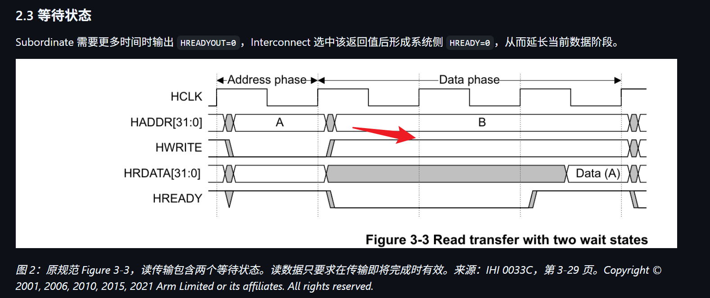

*问题截图：红色箭头指向 Figure 3-3 中读传输 A 等待期间保持为 1 的 `HWRITE`。截图完整保留提问时的图形和上下文。*

这个问题更准确地说是：既然 `HREADY=0` 时地址和控制信号必须保持，为什么 Figure 3-3 中的 `HWRITE` 还能从 0 变成 1？这是否违反等待期间的稳定性要求？

答案是不违反。`HWRITE` 的变化发生在传输 A 的地址阶段已经结束、传输 B 的地址阶段刚开始的边界上：

1. A 的地址阶段给出 `HADDR=A`、`HWRITE=0`。在 `HREADY=1` 的上升沿，A 的地址和控制被接受，因此 A 被确定为读传输。
2. 该上升沿之后，A 进入读数据阶段；Manager 同时放出下一笔 B 的地址和控制。因为 B 是写传输，所以此时给出 `HADDR=B`、`HWRITE=1`。
3. A 的 Subordinate 在数据阶段给出 `HREADYOUT=0`，系统侧形成 `HREADY=0`。A 继续等待，B 尚未被接受。
4. 从 B 出现在地址阶段开始，`HADDR=B`、`HWRITE=1` 必须在整个等待期间保持不变。
5. 当某个上升沿采样到 `HREADY=1` 时，A 的读数据阶段完成，同时 B 的地址和控制被正式接受；B 在下一周期才进入写数据阶段。

因此，同一个周期中可以同时看到：

| 信号 | 所属传输 | 含义 |
| --- | --- | --- |
| `HRDATA`、`HREADY` | A 的数据阶段 | A 仍是正在等待的读传输 |
| `HADDR=B`、`HWRITE=1` | B 的地址阶段 | B 是准备中的下一笔写传输 |

`HWRITE=1` 只描述 B 的传输方向，并不表示 B 的写数据阶段已经开始。等待稳定性规则要求的是：B 的 `HWRITE` 从 0 切换为 1 后，在 `HREADY=0` 的等待周期中不能继续变化。

> <span style="color:#63d297"><strong>结论：</strong></span> A 的 `HWRITE=0` 已经在前一个完成边沿被采样；随后出现并保持的 `HWRITE=1` 属于下一笔 B。图中应检查的是等待期间 `HWRITE` 是否一直保持为 1，而不是要求它继续保持 A 的旧值 0。

</details>

<a id="question-idle-hreadyout"></a>

<details>
<summary><strong>10.3 <code>IDLE</code> 时没有有效传输，为什么 <code>HREADYOUT</code> 还必须为 1？</strong></summary>

#### 原始问题与后续追问

1. `IDLE` 时没有有效传输，为什么这里的 `HREADYOUT` 还要给 1？
2. `IDLE` 不是“空闲”吗？既然空闲了，其他 Subordinate 不是可以进来吗？
3. `IDLE` 时，其实已经通过地址选好了某个 Subordinate，对吗？
4. `HTRANS` 的四个值，是否都是针对已经选好的 Subordinate 的传输操作？

#### 为什么会产生这个疑问？

这个问题的出发点，是把 `IDLE` 的“没有有效传输”理解成了“整个总线已经释放，可以由其他 Subordinate 接管”。但在 AHB 中，Subordinate 只能响应访问，不能主动发起或接管总线；能够发起地址阶段的是 Manager。

> <span style="color:#ffb454"><strong>关键区别：</strong></span> `IDLE` 表示当前地址阶段没有有效传输，不表示把总线使用权交给另一个 Subordinate。

如果系统有多个 Manager，是否更换 Manager 由 Arbiter 决定；这属于总线仲裁，与选择哪个 Subordinate 是两件不同的事。

#### 1. `IDLE` 时是否已经选好了 Subordinate？

地址总线在 `IDLE` 时仍然存在某个值，因此 Decoder 可能根据 `HADDR` 使某个 `HSELx=1`。这只能说明“当前地址译码到了这个 Subordinate”，不能说明存在有效传输。

Subordinate 必须同时检查地址选择和传输类型：

```text
有效地址阶段 = HSELx && HTRANS[1]
正式接受     = HSELx && HTRANS[1] && HREADY
```

所以，`HSELx=1` 且 `HTRANS=IDLE` 的含义是“地址碰巧选择了我，但这一拍不是有效传输”，Subordinate 必须忽略它。

#### 2. `HTRANS` 四个值与所选 Subordinate 是什么关系？

可以用“谁、做什么、是否推进”来区分相关信号：

| 问题 | 对应信号 | 含义 |
| --- | --- | --- |
| 地址指向谁？ | `HADDR`、`HSELx` | Decoder 根据地址选择可能的目标 Subordinate |
| 这一拍是否有效、是什么类型？ | `HTRANS` | `IDLE/BUSY` 无有效数据传输，`NONSEQ/SEQ` 有有效数据传输 |
| 当前流水线能否推进？ | `HREADYOUT`、系统级 `HREADY` | 数据阶段是否完成，下一笔地址是否可以被接受 |

因此，`HTRANS` 确实会被地址选中的 Subordinate 用来判断当前地址阶段，但四种值不全是“传输操作”：

- `IDLE`：没有有效传输，忽略。
- `BUSY`：Burst 暂停一拍，没有有效数据传输，忽略。
- `NONSEQ`：单次传输或 Burst 首拍，是有效传输。
- `SEQ`：Burst 后续拍，是有效传输。

#### 3. 为什么 `IDLE` 对应的 `HREADYOUT` 必须为 1？

`HREADYOUT=1` 在这里不是表示“完成了一笔有效数据传输”，而是表示“没有事情需要处理，不插入等待，不阻塞流水线”。同时给出 `HRESP=0`，表示零等待 `OKAY` 响应。

如果对 `IDLE` 给出 `HREADYOUT=0`，就会为一笔不存在的数据传输插入等待状态。系统级 `HREADY` 随之变为 0 后，下一笔真正有效传输的地址和控制也不能被接受，只能继续保持，造成没有意义的停顿。

> <span style="color:#63d297"><strong>直接答案：</strong></span> 正因为 `IDLE` 没有任何访问需要完成，所以它不需要等待；`HREADYOUT=1` 表示“立即放行”，而不是“执行了某个读写操作”。

#### 4. 还要注意流水线归属

当某个周期同时看到 `HTRANS=IDLE` 和 `HREADYOUT` 时，两者不一定属于同一笔：

| 周期中的信号 | 所属阶段 |
| --- | --- |
| 当前 `HTRANS=IDLE`、`HADDR`、`HSELx` | 当前地址阶段 |
| 当前 `HREADYOUT`、`HRESP` | 上一笔传输的数据阶段 |

因此，不能看到同周期的 `HTRANS=IDLE` 就立即断言同周期 `HREADYOUT` 必须为 1。规范要求的是：当这个 `IDLE` 到达其对应的响应位置时，必须得到零等待 `OKAY`；同周期的 `HREADYOUT` 若属于上一笔有效传输，仍由上一笔传输是否完成决定。

> <span style="color:#63d297"><strong>一句话总结：</strong></span> `IDLE` 是 Manager 发出的“这一拍没有有效命令”，Subordinate 不能趁机接管总线；可能被地址译码选中的 Subordinate 只需忽略该拍，并用零等待 `OKAY` 保证流水线继续前进。

</details>

<a id="question-busy-resume-address"></a>

<details>
<summary><strong>10.4 <code>BUSY</code> 时给出地址 <code>0x24</code>，恢复时可以切换地址吗？</strong></summary>

#### 原始问题

`BUSY` 时 Manager 已经给出地址 `0x24`，当传输从 `BUSY` 恢复时，能不能把地址改成其他值？

#### 直接答案

对于未定义长度 `INCR`，`BUSY` 后可以切换地址，但要看恢复时使用哪一种 `HTRANS`：

- 改为 `NONSEQ`：结束原 `INCR`，从新地址开始另一笔传输，因此地址可以与 `0x24` 无关；
- 改为 `IDLE`：结束原 `INCR`，暂时不发起新的有效传输；
- 改为 `SEQ`：继续原 Burst，不能跳过 `BUSY` 期间展示的下一拍地址，仍应访问 `0x24`。

下面两种写法对未定义长度 `INCR` 都合法，但含义不同：

```text
BUSY  HADDR=0x24   // 提前展示下一笔地址，不执行
SEQ   HADDR=0x24   // 继续原 Burst，正式执行这笔传输

BUSY    HADDR=0x24
NONSEQ  HADDR=0x80 // 结束原 INCR，从新地址开始另一笔传输
```

因此，“恢复后可以切地址”指的是用 `NONSEQ` 结束原 `INCR` 并开始新传输；如果用 `SEQ` 恢复并继续原 Burst，则只有 `0x24` 这笔传输在 `HREADY=1` 的上升沿被接受后，下一笔有效传输才可以按 `HSIZE` 递增到后续地址，例如 `0x28`。

#### 地址序列示例

假设这是 Word 递增 Burst，每笔有效传输递增 4 字节：

| `HTRANS` | `HADDR` | 是否执行 | 含义 |
| --- | --- | --- | --- |
| `NONSEQ` | `0x20` | 是 | Burst 首拍 |
| `BUSY` | `0x24` | 否 | 提前展示下一笔有效传输的地址 |
| `BUSY` | `0x24` | 否 | Manager 仍未准备好，下一笔地址不变 |
| `SEQ` | `0x24` | 是 | 恢复 Burst，正式执行此前展示的地址 |
| `SEQ` | `0x28` | 是 | `0x24` 被接受后，再执行下一拍 |

> <span style="color:#ffb454"><strong>易错点：</strong></span> `BUSY` 不计入 Burst 的有效拍数，也不会消耗 `0x24` 这笔地址。直接从 `BUSY 0x24` 改为 `SEQ 0x28`，相当于跳过了原本声明的下一笔有效传输。

#### 切换地址意味着结束原 `INCR`

未定义长度 `INCR` 可以在 `BUSY` 后结束原 Burst。如果 Manager 不再使用 `SEQ` 继续，而是使用 `NONSEQ` 开始一笔新的传输，那么新地址可以与 `0x24` 无关：

```text
BUSY    HADDR=0x24
NONSEQ  HADDR=0x80   // 结束原 INCR，在 0x80 开始新传输
```

也可以在 `BUSY` 后改为 `IDLE`，表示结束当前未定义长度 `INCR` 且暂时不发起新传输。固定长度 Burst 则不能这样提前结束；其中的 `BUSY` 后必须恢复为 `SEQ` 并完成规定的有效拍数。

如果前一笔数据阶段使系统处于 `HREADY=0`，地址和控制还必须遵守等待期间的稳定性规则。规范允许的 `HTRANS` 变化并不意味着可以在继续同一个 Burst 时跳过本应执行的地址。

> <span style="color:#63d297"><strong>一句话总结：</strong></span> 未定义长度 `INCR` 的 `BUSY` 后可以切地址：`BUSY→NONSEQ` 表示结束原 Burst，并从无关的新地址开始另一笔传输；`BUSY→SEQ` 表示继续原 Burst，地址仍保持为 `BUSY` 已展示的下一笔地址。

</details>

<a id="question-lock-single-manager-multiple-subordinates"></a>

<details>
<summary><strong>10.5 单个 Manager、多个 Subordinate 时，<code>HMASTLOCK</code> 能防止不同 Subordinate 插队吗？</strong></summary>


*问题截图：由“锁定序列中的所有传输必须落在同一个 Subordinate 地址区域”引出的连续追问。截图完整保留提问时的文字和上下文。*

#### 原始问题与后续追问

1. 锁定传输不是针对 Manager 的吗，为什么规范要求整个锁定序列访问同一个 Subordinate？
2. 如果系统只有一个 Manager、多个 Subordinate，锁定期间是不是不能切换 Subordinate？
3. 单个 Manager 使用锁定传输，难道不能防止不同 Subordinate 互相插队吗？

#### 直接答案

`HMASTLOCK` **由 Manager 发出，但不是把 Manager 本身锁住**。它声明的是：“当前这一组传输不可分割，不能在中间插入其他访问。”被保护的是这组传输的连续性和执行顺序。

不同 Subordinate 不会主动“插队”，因为 Subordinate 是被动响应方：

```text
Manager 给出 HADDR 和控制信号
              ↓
Interconnect 根据地址译码产生对应的 HSELx
              ↓
被选中的 Subordinate 响应这笔传输
```

只有 Manager 能决定下一笔地址。假如总线上依次出现“访问 A、访问 B、再次访问 A”，这是 Manager 自己发出了这个顺序，不是 B 主动插到了 A 的传输中间。

#### 为什么必须是同一个 Subordinate 地址区域

假设地址空间如下：

```text
Subordinate A：0x0000～0x0FFF
Subordinate B：0x1000～0x1FFF
```

| 操作顺序 | 是否允许 | 原因 |
| --- | --- | --- |
| 锁定访问 A → 锁定访问 A | 允许 | 整个不可分割序列由同一个 Subordinate 处理 |
| 锁定访问 A → 锁定访问 B | 不允许 | 锁定序列跨越了两个 Subordinate 地址区域 |
| 锁定访问 A → 解除锁定 → 访问 B | 允许 | 原锁定序列已经结束，之后可以选择新的 Subordinate |

同一个 Subordinate 地址区域不一定意味着地址数值完全相同。例如 `0x0100` 和 `0x0104` 可以是两个不同地址，只要它们都译码到 Subordinate A，就仍属于同一个地址区域。

如果锁定读取发生在 A，而锁定写回却切换到 B，那么 A 只看得到读取、B 只看得到写入，没有任何一个 Subordinate 能独立保证整个“读—改—写”序列不可分割。因此，锁定期间不能切换 Subordinate；要访问 B，必须先在 `HREADY=1` 的完成边沿解除锁定。

#### `HREADY=0` 时，其他 Subordinate 能进入吗

不能接管当前传输。A 的数据阶段尚未完成时，A 通过系统级 `HREADY=0` 阻止流水线推进。下一笔访问 B 的地址和 `HSEL` 可能已经出现在地址阶段，但它们只能保持等待，不能在 `HREADY=0` 的边沿被正式接受。这是地址阶段与上一笔数据阶段的正常流水线重叠，不是 B 插队。

#### 单 Manager 系统中什么时候仍可能需要锁定

如果系统只有一个 AHB Manager，并且所有 Subordinate 都只按接收顺序处理来自这条总线的请求，那么没有其他请求源能够插入，通常不需要 `HMASTLOCK`。

但如果目标是多端口存储控制器等组件，即使这条 AHB 总线上只有一个 Manager，该 Subordinate 仍可能从 DMA、另一条总线或其他端口收到请求。此时 `HMASTLOCK` 仍可能用于要求目标组件保持当前访问序列不可分割。

> <span style="color:#63d297"><strong>一句话总结：</strong></span> `HMASTLOCK` 由 Manager 声明，但锁定的是同一 Subordinate 地址区域内一组传输的不可分割性；普通 Subordinate 不会主动插队，锁定期间也不能从 A 切换到 B，必须先解除锁定。

</details>

<a id="11-本章边界与资料来源"></a>
<details>
<summary><strong>11. 本章边界与资料来源</strong></summary>

本章解释 Manager 如何发起不同类型的传输，但不展开以下主题：

- Decoder、Multiplexor、`HREADYOUT` 与系统 `HREADY` 的完整连接：继续阅读 Chapter 4 Bus Interconnection；
- `OKAY`、两周期 `ERROR` 和响应采样时序：继续阅读 Chapter 5 Subordinate Response Signaling；
- 窄传输在不同端序和数据总线宽度上的字节通道映射：继续阅读 Chapter 6 Data Buses；
- 信号在复位、等待及非活动阶段何时必须有效：继续阅读 Chapter 8 Signal validity。

资料来源：

- [AMBA AHB Protocol Specification, Arm IHI 0033C](ARM_AMBA_AHB_Protocol_Specification_IHI0033C.pdf)，Issue C，ID090921，2021 年 9 月 15 日；本文精读 Chapter 3 的基础传输内容，PDF 第 27-45 页（文档页码 3-27～3-45）。
- 信号方向和接口可选性同时参考同一规范 Chapter 2；ERROR 响应说明引用 Chapter 5 的后续定义，但本文不替代这些章节。

</details>

---

本文是对 Arm IHI 0033C 第三章基础传输内容的中文学习整理，不替代官方规范。实现或验证 AHB 兼容设计时，应以原始 PDF 的规范性描述为准。
