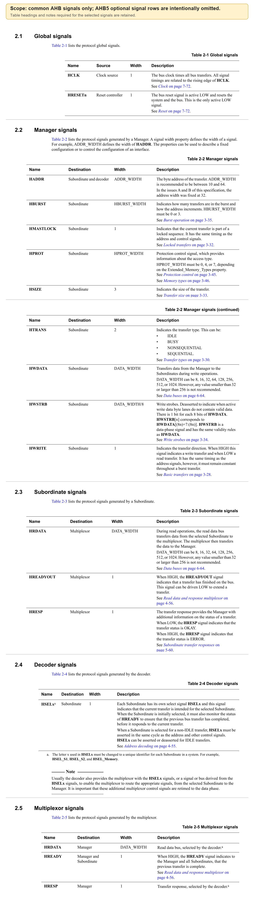
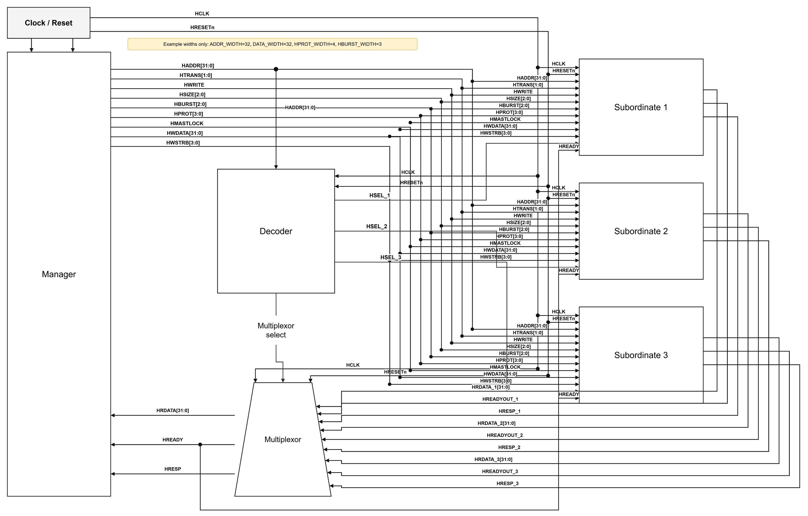

# AMBA AHB Protocol Specification IHI 0033C：第二章信号描述精读

> 原始资料：[ARM_AMBA_AHB_Protocol_Specification_IHI0033C.pdf](ARM_AMBA_AHB_Protocol_Specification_IHI0033C.pdf)  
> 精读范围：Chapter 2 Signal Descriptions，PDF 第 19-26 页（文档页码 2-19～2-26，其中第 2-26 页为空白页）  
> 文档版本：Issue C，ID090921，2021 年 9 月 15 日发布  
> 前置阅读：[第一章 Introduction 精读](ARM_AMBA_AHB_Protocol_Specification_IHI0033C-第一章介绍.md)

本文面向第一次系统学习 AHB 的读者，统一使用 Issue C 的术语 `Manager（原 Master）`、`Subordinate（原 Slave）`、`Decoder（译码器）` 和 `Multiplexor（多路选择器）`。

本文只整理 AHB-Lite 与 AHB5 共用的核心信号。AHB5 可选信号 `HNONSEC`、`HEXCL`、`HMASTER`、`HEXOKAY` 被有意排除；需要这些特性时，应继续阅读 Chapter 3、Chapter 10 和 Appendix A。`HWSTRB` 保留在本文中，但它是由 `Write_Strobes` 属性控制的可选信号。

> **颜色约定：** <span style="color:#4ea1ff">蓝色</span>表示关键协议名和信号，<span style="color:#ffb454">橙色</span>表示限制和易错条件，<span style="color:#63d297">绿色</span>表示正确方向和结论。
>
> **信息标记：** 正文默认是对 Chapter 2 规范原意的中文转述；“理解提示”用于补充阶段关系，“工程推断”用于说明实现或验证层面的结论。超出 Chapter 2 的内容会注明对应章节。

## 目录

- [1. 学习目标](#1-学习目标)
- [2. 原始信号表](#2-原始信号表)
- [3. 通用信号速查](#3-通用信号速查)
- [4. 四个关键规则](#4-四个关键规则)
- [5. 四个易错点](#5-四个易错点)
- [6. 自测与后续阅读](#6-自测与后续阅读)
- [7. 资料来源](#7-资料来源)

<a id="1-学习目标"></a>
<details open>
<summary><strong>1. 学习目标</strong></summary>

读完本章，应当能够回答：

1. 一条通用 AHB 信号由谁驱动、送给谁？
2. 哪些位宽由接口属性决定，哪些信号可能不出现在接口上？
3. 哪些信号属于地址阶段或数据阶段？
4. `HREADYOUT`、`HREADY`、`HRESP` 和 `HSELx` 各解决什么问题？

</details>

<a id="2-原始信号表"></a>
<details open>
<summary><strong>2. 原始信号表</strong></summary>



*图 1：原规范 Table 2-1～Table 2-5 中本文范围内的通用 AHB 信号行。AHB5 可选信号行被有意省略，表头和与所选信号有关的脚注均保留。来源：IHI 0033C，第 2-20～2-25 页。Copyright © 2001, 2006, 2010, 2015, 2021 Arm Limited or its affiliates. All rights reserved.*

读图顺序：Clock source 和 Reset controller 提供全局时钟与复位，Manager 发出请求，Decoder 选择目标，Subordinate 给出局部返回，Multiplexor 选择系统返回。

</details>

<a id="3-通用信号速查"></a>
<details>
<summary><strong>3. 通用信号速查</strong></summary>



*图 2：通用 AHB 核心信号连接示意图。`HREADY` 由 Multiplexor 送给 Manager 和所有 Subordinate。图中采用 `ADDR_WIDTH=32`、`DATA_WIDTH=32`、`HPROT_WIDTH=4`、`HBURST_WIDTH=3` 的示例配置，不代表所有接口固定使用这些位宽；图中不包含本文明确排除的 AHB5 可选信号。*

| 产生者 | 信号 | 接收者 | 位宽 | 阶段与作用 |
| --- | --- | --- | --- | --- |
| Clock source | `HCLK` | 全部组件 | 1 | 所有传输时序都与其上升沿相关 |
| Reset controller | `HRESETn` | 系统与总线组件 | 1 | 低电平有效的复位，也是协议中唯一低有效信号 |
| Manager | `HADDR` | Subordinate、Decoder | `ADDR_WIDTH` | 地址阶段给出传输的字节地址 |
| Manager | `HBURST` | Subordinate | `HBURST_WIDTH` | 地址阶段说明 Burst 长度和地址递增方式 |
| Manager | `HMASTLOCK` | Subordinate | 1 | 地址阶段说明当前传输属于锁定序列 |
| Manager | `HPROT` | Subordinate | `HPROT_WIDTH` | 地址阶段提供访问类型和保护属性 |
| Manager | `HSIZE` | Subordinate | 3 | 地址阶段说明单次传输大小 |
| Manager | `HTRANS` | Subordinate | 2 | 地址阶段说明 `IDLE`、`BUSY`、`NONSEQ` 或 `SEQ` |
| Manager | `HWDATA` | Subordinate | `DATA_WIDTH` | 写数据阶段传送写数据 |
| Manager | `HWSTRB` | Subordinate | `DATA_WIDTH/8` | 可选；写数据阶段逐字节标记有效写数据 |
| Manager | `HWRITE` | Subordinate | 1 | 地址阶段说明读写方向 |
| Subordinate | `HRDATA` | Multiplexor | `DATA_WIDTH` | 读数据阶段给出局部读数据 |
| Subordinate | `HREADYOUT` | Multiplexor | 1 | 给出局部完成状态，LOW 可以延长传输 |
| Subordinate | `HRESP` | Multiplexor | 1 | 给出局部传输结果 |
| Decoder | `HSELx` | 对应 Subordinate | 1 | 地址阶段选择目标 Subordinate |
| Multiplexor | `HRDATA`、`HRESP` | Manager | `DATA_WIDTH`、1 | 选择当前数据阶段对应的系统返回 |
| Multiplexor | `HREADY` | Manager、所有 Subordinate | 1 | 给出系统级传输完成指示 |

> <span style="color:#63d297"><strong>记住方向即可：</strong></span> 请求从 Manager 向前走，返回从 Subordinate 经 Multiplexor 回到 Manager；系统侧 `HREADY` 还要反馈给所有 Subordinate。

</details>

<a id="4-四个关键规则"></a>
<details>
<summary><strong>4. 四个关键规则</strong></summary>

### 4.1 位宽与可选性

| 属性或信号 | 规范约束 |
| --- | --- |
| `ADDR_WIDTH` | 推荐为 10～64；Issue A、Issue B 中地址宽度固定为 32 |
| `HBURST_WIDTH` | 必须为 0 或 3；为 0 时 `HBURST` 不出现在接口上 |
| `HPROT_WIDTH` | 必须为 0、4 或 7；取值与 `Extended_Memory_Types` 属性有关 |
| `DATA_WIDTH` | 可以为 8、16、32、64、128、256、512 或 1024；小于 32 或大于 256 不推荐 |
| `HWSTRB` | 位宽为 `DATA_WIDTH/8`；仅当 `Write_Strobes=True` 时出现在接口上 |

宽度为 0 表示相应信号**不出现在接口上**，不是保留一个被绑为 0 的端口。不要由图 2 中的示例位宽反推接口的固定配置。（IHI 0033C，第 2-19～2-23 页；`HWSTRB` 的启用条件见 3.5 节）

### 4.2 复位与 Burst 内约束

- `HRESETn` 是协议中唯一的低有效信号。
- `HWRITE` 与地址信号具有相同时序，但在整个 Burst 期间必须保持不变。
- `HMASTLOCK` 与地址和控制信号具有相同时序。

### 4.3 地址阶段与数据阶段

> <span style="color:#4ea1ff"><strong>理解提示：</strong></span> 下面的阶段分类结合了 Chapter 2 的信号描述与 Chapter 3 的传输时序。

- 地址阶段：`HADDR`、`HTRANS`、`HWRITE`、`HSIZE`、`HBURST`、`HPROT`、`HMASTLOCK`、`HSELx`。
- 数据阶段：`HWDATA`、`HWSTRB`、`HRDATA`、`HREADYOUT`、`HREADY`、`HRESP`。

写数据可能与下一笔传输的地址同时出现，因此不能用同周期的下一笔 `HADDR` 去解释当前 `HWDATA`。（IHI 0033C，3.1 节，第 3-28～3-29 页）

### 4.4 返回通路的选择必须与数据阶段对齐

`HSELx` 在地址阶段回答“这笔新传输要访问谁”，但 `HRDATA`、`HREADYOUT` 和 `HRESP` 在随后数据阶段才返回。因此，Decoder 给 Multiplexor 的选择控制必须从地址阶段重定时到对应的数据阶段。（IHI 0033C，第 2-24 页）

这里所说的“返回选择跟到数据阶段”，不是人为延迟返回数据，而是把**地址阶段选中了哪个 Subordinate**这一信息保存下来，在该传输的数据阶段选择同一个 Subordinate 的返回信号：

- `addr_sel`：当前地址阶段的目标，由 `HADDR` 译码产生，同时用于生成 `HSELx`；
- `data_sel`：保存后的数据阶段目标，用于选择 `HRDATA`、`HREADYOUT` 和 `HRESP`。

例如，地址 A 访问 RAM，紧接着地址 B 访问 UART，并且 RAM 插入一个等待周期：

| 周期 | 地址阶段 | `addr_sel` | 数据阶段 | `data_sel` | 系统 `HREADY` |
| --- | --- | --- | --- | --- | --- |
| T1 | A → RAM | RAM | 上一笔传输 | 上一笔目标 | HIGH |
| T2 | B → UART | UART | A 等待 | RAM | LOW |
| T3 | B → UART，继续保持 | UART | A 完成 | RAM | HIGH |
| T4 | 下一笔地址 | 下一笔目标 | B 返回 | UART | 取决于 UART |

T2 虽然已经出现 `HSEL_UART=HIGH`，当前数据阶段仍属于地址 A，所以 Multiplexor 必须继续选择 RAM。T2 的 `HREADY=LOW` 表示 A 尚未完成，地址 B 及其控制信号继续保持，`data_sel` 也必须保持为 RAM。到 T3 结束的上升沿，A 完成且 B 被正式接受，`data_sel` 才能更新为 UART，并从 T4 开始选择 UART 的返回值。

> <span style="color:#ffb454"><strong>工程实现：</strong></span> 常见实现使用一个仅在 `HREADY=HIGH` 时更新的数据阶段选择寄存器。下面代码只展示返回选择的核心结构；地址范围、默认 Subordinate 和完整错误响应应由具体系统定义。

```systemverilog
typedef enum logic [1:0] {
    SEL_NONE,
    SEL_RAM,
    SEL_UART
} subordinate_sel_t;

subordinate_sel_t addr_sel;
subordinate_sel_t data_sel;

// 地址阶段：译码地址并生成 HSELx。
always_comb begin
    addr_sel  = SEL_NONE;
    HSEL_RAM  = 1'b0;
    HSEL_UART = 1'b0;

    // HTRANS[1]=1 表示 NONSEQ 或 SEQ，即有效传输。
    if (HTRANS[1]) begin
        if (ram_address_match) begin
            addr_sel = SEL_RAM;
            HSEL_RAM = 1'b1;
        end
        else if (uart_address_match) begin
            addr_sel  = SEL_UART;
            HSEL_UART = 1'b1;
        end
    end
end

// 数据阶段：只有当前数据阶段完成时，才接收新的地址阶段选择。
always_ff @(posedge HCLK or negedge HRESETn) begin
    if (!HRESETn)
        data_sel <= SEL_NONE;
    else if (HREADY)
        data_sel <= addr_sel;
end

// 返回通路必须使用 data_sel，不能直接使用当前 addr_sel 或 HSELx。
always_comb begin
    HRDATA = '0;
    HREADY = 1'b1;
    HRESP  = 1'b0;

    case (data_sel)
        SEL_RAM: begin
            HRDATA = HRDATA_RAM;
            HREADY = HREADYOUT_RAM;
            HRESP  = HRESP_RAM;
        end

        SEL_UART: begin
            HRDATA = HRDATA_UART;
            HREADY = HREADYOUT_UART;
            HRESP  = HRESP_UART;
        end

        default: begin
            HRDATA = '0;
            HREADY = 1'b1;
            HRESP  = 1'b0;
        end
    endcase
end
```

Multiplexor 选择出的系统级 `HREADY` 还要连接到 Manager 和所有 Subordinate。这样，`HREADY=LOW` 时地址阶段、数据阶段和返回选择会一起停住；`HREADY=HIGH` 时，当前数据阶段完成，选择寄存器才能推进到下一笔传输。

> <span style="color:#63d297"><strong>一句话记忆：</strong></span> `HSELx/addr_sel` 选择地址阶段要访问谁，寄存后的 `data_sel` 选择数据阶段从谁接收返回；等待期间 `data_sel` 不能改变。

</details>

<a id="5-四个易错点"></a>
<details>
<summary><strong>5. 四个易错点</strong></summary>

### 5.1 `HREADYOUT` 与 `HREADY`

- `HREADYOUT`：目标 Subordinate 的局部完成输出，只送往 Multiplexor。
- `HREADY`：Multiplexor 选择后的系统级完成指示，送给 Manager 和所有 Subordinate。

`HREADY` 说明当前数据阶段能否完成；从同周期地址阶段观察，它说明前一笔传输是否已经完成。详见：[为什么 Subordinate 也接收 HREADY](为什么Subordinate也接收HREADY.md)。

### 5.2 `HRESP` 与 `HREADY`

- `HREADY` 回答：当前数据阶段完成了吗？
- `HRESP` 回答：传输结果是什么？`HRESP=LOW` 表示 `OKAY`，`HRESP=HIGH` 表示 `ERROR`。

<span style="color:#ffb454">完成状态和传输结果不能互相替代。</span>

### 5.3 `HSELx` 必须结合 `HREADY`

每个 Subordinate 都有独立的 `HSELx`。对于非 `IDLE` 传输，`HSELx` 必须与地址和其他控制信号在同一周期有效；Subordinate 初次被选中时，还必须检查 `HREADY`，确认前一笔传输已经完成后才能响应当前传输。（IHI 0033C，第 2-24 页）

### 5.4 同名返回信号

Subordinate 输出的 `HRDATA`、`HRESP` 是局部返回；Multiplexor 输出的同名信号是选择后的系统返回。名称相同，连接位置不同。

</details>

<a id="6-自测与后续阅读"></a>
<details>
<summary><strong>6. 自测与后续阅读</strong></summary>

<details>
<summary>1. 为什么 Subordinate 输出 <code>HREADYOUT</code>，而 Manager 接收 <code>HREADY</code>？</summary>

> 因为系统可能有多个 Subordinate。每个 Subordinate 给出自己的 `HREADYOUT`，Multiplexor 根据当前数据阶段的目标选择其中一个，形成系统侧 `HREADY`，再送给 Manager 和所有 Subordinate。

</details>

<details>
<summary>2. 哪些 Manager 信号属于数据阶段？</summary>

> `HWDATA`，以及接口启用写选通时的 `HWSTRB`。

</details>

<details>
<summary>3. <code>HBURST_WIDTH=0</code> 表示什么？</summary>

> 表示 `HBURST` 不出现在接口上，不是保留一个常量为 0 的端口。

</details>

<details>
<summary>4. 为什么不能用当前地址阶段的 <code>HSELx</code> 直接选择当前返回值？</summary>

> 因为当前地址阶段可能属于下一笔传输，而当前返回值属于上一笔传输的数据阶段。选择控制必须与对应的数据阶段对齐，并在等待期间保持。详见：[为什么不能用当前地址阶段的 HSELx 直接选择当前返回值](<为什么不能用当前地址阶段的 HSELx 直接选择当前返回值.md>)。

</details>

<details>
<summary>5. <code>HREADY=HIGH</code> 是否表示传输一定成功？</summary>

> 不一定。`HREADY=HIGH` 表示传输可以完成，成功或失败必须结合 `HRESP` 判断。

</details>

本章只建立通用信号地图，不展开编码和完整时序。下一步阅读：

- Chapter 3：`HTRANS`、`HBURST`、`HSIZE`、写选通和基本传输时序；
- Chapter 4：Decoder、Multiplexor、`HREADYOUT` 与 `HREADY` 的连接；
- Chapter 5：`OKAY`、`ERROR` 及错误响应时序；
- Chapter 10 和 Appendix A：本文刻意排除的 AHB5 可选信号与完整接口属性。

</details>

<a id="7-资料来源"></a>
<details>
<summary><strong>7. 资料来源</strong></summary>

- [AMBA AHB Protocol Specification, Arm IHI 0033C](ARM_AMBA_AHB_Protocol_Specification_IHI0033C.pdf)，Issue C，ID090921，2021 年 9 月 15 日；本文精读 Chapter 2，PDF 第 19-26 页（文档页码 2-19～2-26）。
- 阶段关系与等待行为补充参考同一规范 Chapter 3；Decoder 和 Multiplexor 的连接补充参考 Chapter 4。

</details>

---

本文是对 Arm IHI 0033C 第二章中通用 AHB 信号的中文学习整理，不替代官方规范。实现或验证 AHB 兼容设计时，应以原始 PDF 的规范性描述为准。
