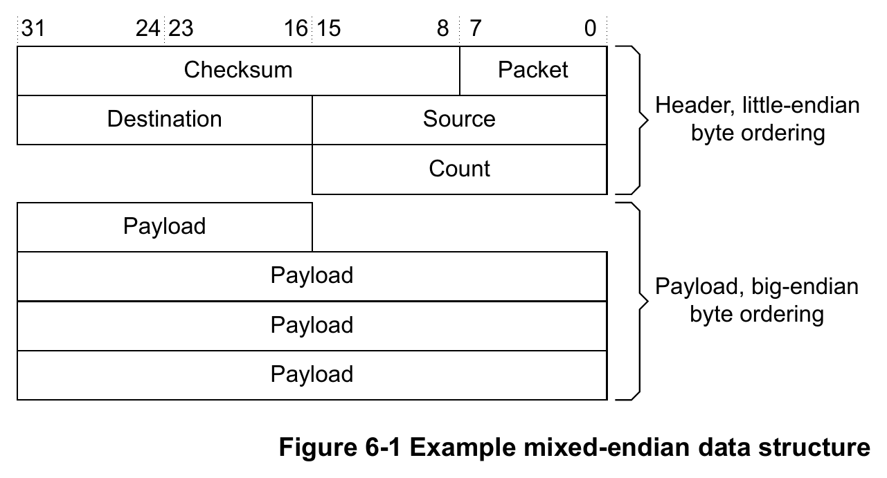
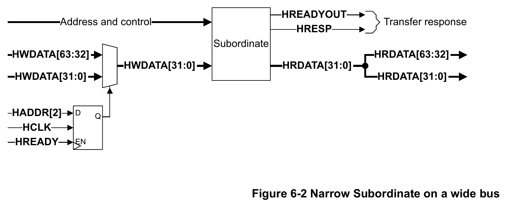
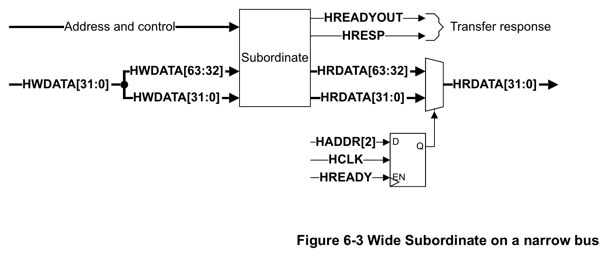

# AMBA AHB Protocol Specification IHI 0033C：第六章 Data Buses 数据总线精读

> 原始资料：[AMBA AHB Protocol Specification IHI 0033C](ARM_AMBA_AHB_Protocol_Specification_IHI0033C.pdf)  
> 精读范围：Chapter 6 Data Buses，PDF 第 63～70 页（文档页码 6-63～6-70）  
> 文档版本：Issue C，ID090921  
> 发布日期：2021 年 9 月 15 日  
> 前置阅读：[第五章 Subordinate Response Signaling 响应信号精读](ARM_AMBA_AHB_Protocol_Specification_IHI0033C-第五章Subordinate响应信号.md)

本文面向第一次系统学习 AHB 的读者，统一使用 Issue C 的术语：`Manager`（原 `Master`）、`Subordinate`（原 `Slave`）和 `Interconnect`（互连）。这一章只需要抓住四件事：数据由谁驱动、什么时候有效、窄传输使用哪个 byte lane，以及宽窄接口如何连接。

> **颜色说明：** 绿色文字表示从波形、表格或连接图中归纳出的本节结论。
>
> **信息类型：** 正文用于解释规范规则；“理解提示”用于补充跨章节背景；“结论”用于给出可直接用于设计与验证的判断。

<details>
<summary><strong>1. <code>HWDATA</code> 和 <code>HRDATA</code> 什么时候有效</strong></summary>

### 写传输：`HWDATA` 什么时候有效


*图 1：原规范 Figure 3-4，包含一个等待状态的写传输；`HREADY=0` 延长数据阶段，图中的 32 位信号宽度仅为示例，不限制协议支持的其他宽度。来源：IHI 0033C，第 3-29 页。Copyright © 2001, 2006, 2010, 2015, 2021 Arm Limited or its affiliates. All rights reserved.*

按时间顺序看这张波形：

1. 地址阶段给出地址 A，`HWRITE=1` 表示这是一笔写传输。
2. 下一周期 A 进入数据阶段，Manager 在 `HWDATA` 上给出 `Data (A)`；与此同时，地址总线已经进入下一笔传输 B。
3. `HREADY=0` 表示 Subordinate 尚未完成接收，因此 A 的数据阶段被延长一个周期，`Data (A)` 不能改变。
4. `HREADY` 恢复为 1 后，Subordinate 在完成边沿接收 `Data (A)`，写传输 A 结束。

> <span style="color:#63d297"><strong>结论：</strong>写数据阶段开始后，<code>HWDATA</code> 必须持续有效并保持稳定，直到 <code>HREADY=1</code> 的完成边沿。</span>

### 读传输：`HRDATA` 什么时候有效


*图 2：原规范 Figure 3-3，包含两个等待状态的读传输；灰色的 `HRDATA` 不要求有效，图中的 32 位信号宽度仅为示例，不限制协议支持的其他宽度。来源：IHI 0033C，第 3-29 页。Copyright © 2001, 2006, 2010, 2015, 2021 Arm Limited or its affiliates. All rights reserved.*

按时间顺序看这张波形：

1. 地址阶段给出地址 A，`HWRITE=0` 表示这是一笔读传输。
2. 下一周期 A 进入数据阶段，但 `HREADY=0`，说明 Subordinate 还没有准备好数据。
3. `HREADY` 连续为 0 的两个等待周期中，灰色的 `HRDATA` 不要求有效；同时，下一笔地址 B 也不能继续推进。
4. `HREADY` 恢复为 1 后，Subordinate 给出 `Data (A)`，Manager 在完成边沿采样读数据。

如果传输最终返回 `ERROR`，Manager 也不能把 `HRDATA` 当作有效结果。

> <span style="color:#63d297"><strong>结论：</strong>成功读传输只要求 <code>HRDATA</code> 在 <code>HREADY=1</code>、<code>HRESP=0</code> 的完成周期有效；等待周期和错误响应中的读数据均不可使用。</span>

</details>

<details>
<summary><strong>2. 数据落在哪个 byte lane</strong></summary>

当传输宽度小于数据总线宽度时，只需要活动 byte lane 上的数据有效，接收方不能依赖其他 lane。

下面是 32 位总线上进行 byte transfer 时的 lane 位置：

| 地址偏移 | Little-endian / BE8 | BE32 |
| ---: | --- | --- |
| 0 | `DATA[7:0]` | `DATA[31:24]` |
| 1 | `DATA[15:8]` | `DATA[23:16]` |
| 2 | `DATA[23:16]` | `DATA[15:8]` |
| 3 | `DATA[31:24]` | `DATA[7:0]` |

这张表可以概括三种端序：

- **Little-endian**：起始地址保存 LS byte；地址增加时，字节有效位次升高。
- **BE8**：byte transfer 使用与 Little-endian 相同的 lane，但起始地址保存 MS byte。
- **BE32**：每个 32 位 word 内，地址偏移与 byte lane 的关系反转。

Little-endian 和 BE8 的 byte lane 都可以写成：

```text
Byte_Lane = Address mod Data_Bus_Bytes
```

二者使用相同 wires，区别是多字节数据中 MS byte 与 LS byte 的排列方向。

对于宽于 32 位的 BE32 传输，不能把整条总线简单反转。应先按 32 位分块：每个 word 内按 Big-endian 排列，各 word 则从 LS word 向更高地址排列。

### BE8 为什么适合混合端序数据



*图 3：原规范 Figure 6-1，Little-endian Header 与 Big-endian Payload 共用同一地址空间；图中的 32 位布局仅为示例，不限制协议支持的其他宽度。来源：IHI 0033C，第 6-68 页。Copyright © 2001, 2006, 2010, 2015, 2021 Arm Limited or its affiliates. All rights reserved.*

按图中的数据结构看：

1. 上半部分 Header 使用 Little-endian，`Packet`、`Checksum`、`Source`、`Destination` 和 `Count` 按小端规则解释。
2. 下半部分 Payload 使用 Big-endian，同一地址空间中的这些字段按大端规则解释。
3. BE8 不改变“字节地址到 byte lane”的连接，所以切换字段的端序解释时，不需要重新布置每个字节所在的物理 lane。
4. 端序仍决定多字节字段中 MS byte 和 LS byte 的排列，硬件或软件必须知道每个字段采用哪种端序。

> <span style="color:#63d297"><strong>结论：</strong>BE8 的 byte invariance 保证同一个字节地址始终连接同一个 byte lane，但不会自动转换多字节数据的端序。</span>

</details>

<details>
<summary><strong>3. 宽窄接口如何连接</strong></summary>

AHB 数据总线可以是 8、16、32、64、128、256、512 或 1024 bit。规范推荐至少使用 32 bit，但不同宽度的组件仍可以通过选择或复制数据进行连接。

> **理解提示：** AHB 的地址阶段早于数据阶段。Figure 6-2 和 Figure 6-3 中的 `HADDR[2]` 必须先寄存并与数据阶段对齐：`HREADY=1` 时更新，`HREADY=0` 时保持。这个流水线依据来自 Chapter 3。

### 32 位 Subordinate 接到 64 位总线



*图 4：原规范 Figure 6-2，32 位 Subordinate 连接到 64 位总线，使用 `HADDR[2]` 选择写数据的上半部或下半部；图中的 32/64 位宽度仅用于说明适配方法，不限制协议支持的其他宽度。来源：IHI 0033C，第 6-69 页。Copyright © 2001, 2006, 2010, 2015, 2021 Arm Limited or its affiliates. All rights reserved.*

沿着图中的数据路径看：

1. 地址和控制信号直接送入 32 位 Subordinate。
2. 寄存后的 `HADDR[2]` 控制写数据 Multiplexor。
3. `HADDR[2]` 的登记值决定从 `HWDATA[31:0]` 或 `HWDATA[63:32]` 中选择哪一半，送入 Subordinate 的 32 位写数据端口。
4. 读方向不需要选择，图中把 Subordinate 输出的 32 位 `HRDATA` 同时复制到 64 位返回总线的上下两半。

> <span style="color:#63d297"><strong>结论：</strong>32 位 Subordinate 接到 64 位总线时，写方向选择正确半部，读方向可以复制到两半；选择信号必须与当前数据阶段对齐。这种连接不能让 32 位 Subordinate 直接接收一笔 64 位传输。</span>

### 64 位 Subordinate 接到 32 位总线



*图 5：原规范 Figure 6-3，64 位 Subordinate 连接到 32 位总线，写数据复制到两半、读数据从正确的一半选出；图中的 32/64 位宽度仅用于说明适配方法，不限制协议支持的其他宽度。来源：IHI 0033C，第 6-70 页。Copyright © 2001, 2006, 2010, 2015, 2021 Arm Limited or its affiliates. All rights reserved.*

沿着图中的数据路径看：

1. 地址和控制信号直接送入 64 位 Subordinate。
2. 32 位 `HWDATA` 同时复制到 Subordinate 写数据端口的上下两半，由 Subordinate 使用当前传输对应的半部。
3. 读方向相反：Subordinate 输出的 `HRDATA[31:0]` 和 `HRDATA[63:32]` 进入 Multiplexor。
4. 寄存后的 `HADDR[2]` 控制 Multiplexor，选择正确的 32 位读数据返回窄总线。

> <span style="color:#63d297"><strong>结论：</strong>64 位 Subordinate 接到 32 位总线时，写方向复制数据，读方向选择数据；宽窄适配不会把一笔超宽传输自动拆成多笔窄传输，Manager 仍不能发出宽于连接总线的传输。</span>

</details>

<details>
<summary><strong>4. 自测题</strong></summary>

<details>
<summary>1. 写传输被 <code>HREADY=0</code> 延长时，Manager 应如何处理 <code>HWDATA</code>？</summary>

> Manager 必须保持 `HWDATA` 有效且稳定，直到 `HREADY=1` 的完成边沿。

</details>

<details>
<summary>2. 读传输等待期间，<code>HRDATA</code> 是否每个周期都必须有效？</summary>

> 不需要。只有传输以 `HREADY=1`、`HRESP=0` 成功完成时，`HRDATA` 才必须有效；错误响应中的读数据也不可使用。

</details>

<details>
<summary>3. 窄传输是否要求所有 byte lane 都有效？</summary>

> 不要求。发送方只需驱动由地址、`HSIZE` 和端序确定的活动 lane，接收方不能依赖其他 lane。

</details>

<details>
<summary>4. 为什么 Little-endian 与 BE8 的 byte transfer 使用相同 lane，但多字节顺序不同？</summary>

> 两者都使用 `Byte_Lane = Address mod Data_Bus_Bytes`，所以同一字节地址连接同一 lane；Little-endian 的起始地址保存 LS byte，BE8 的起始地址保存 MS byte。

</details>

<details>
<summary>5. 在 32 位 BE32 总线上，地址偏移 0 的 byte transfer 使用哪个 lane？</summary>

> 使用 `DATA[31:24]`。偏移 0、1、2、3 分别对应从高到低的四个 byte lane。

</details>

<details>
<summary>6. 宽于 32 位的 BE32 传输应如何组织数据？</summary>

> 先按 32 位 word 分块：LS word 放在传输起始地址，地址增加时 word 的有效位次升高；每个 word 内仍按 Big-endian 排列字节。

</details>

<details>
<summary>7. Figure 6-2 和 Figure 6-3 中的 <code>HADDR[2]</code> 为什么必须寄存？</summary>

> 数据阶段必须使用上一地址阶段已经被接受的地址。`HREADY=1` 时登记新地址，`HREADY=0` 时保持原值，才能让数据选择始终与当前数据阶段对齐。

</details>

<details>
<summary>8. 宽窄适配能否把一笔超宽传输自动拆成多笔窄传输？</summary>

> 不能。宽窄适配只选择或复制数据，不改变 `HSIZE`；Manager 不能在 32 位连接总线上发出 64 位传输。

</details>

</details>

## 5. 问题记录与解答

暂无。

<details>
<summary><strong>6. 本篇边界与资料来源</strong></summary>

本篇只解释数据总线的有效时刻、byte lane 规则和宽窄接口连接，不展开地址阶段、互连选择及响应信号的完整规则。相关内容可继续阅读：

- [第三章 Transfers 传输精读](ARM_AMBA_AHB_Protocol_Specification_IHI0033C-第三章传输.md)
- [第四章 Bus Interconnection 总线互连精读](ARM_AMBA_AHB_Protocol_Specification_IHI0033C-第四章总线互连.md)
- [第五章 Subordinate Response Signaling 响应信号精读](ARM_AMBA_AHB_Protocol_Specification_IHI0033C-第五章Subordinate响应信号.md)

本文以 [AMBA AHB Protocol Specification IHI 0033C](ARM_AMBA_AHB_Protocol_Specification_IHI0033C.pdf) 的 Chapter 6（文档页码 6-63～6-70）为主要资料；为直观说明数据有效时刻，同时引用 Chapter 3 第 3-29 页的 Figure 3-3 和 Figure 3-4。其余图片对应 Chapter 6 的 Figure 6-1～6-3。

图片引自 Arm IHI 0033C 的 Figure 3-3、Figure 3-4 和 Figure 6-1～6-3。Copyright © 2001, 2006, 2010, 2015, 2021 Arm Limited or its affiliates. All rights reserved.

本文是学习整理，不替代官方规范。实现或验证 AHB 兼容设计时，应以原始 PDF 为准。

</details>
