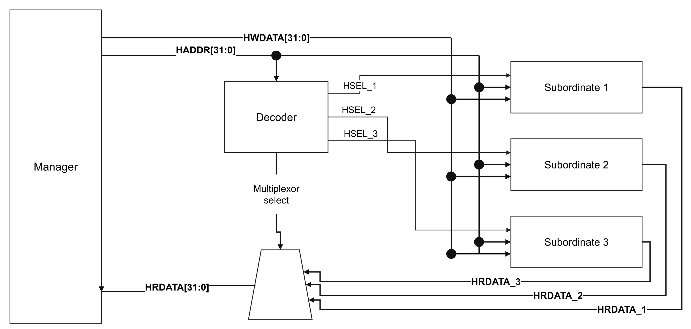
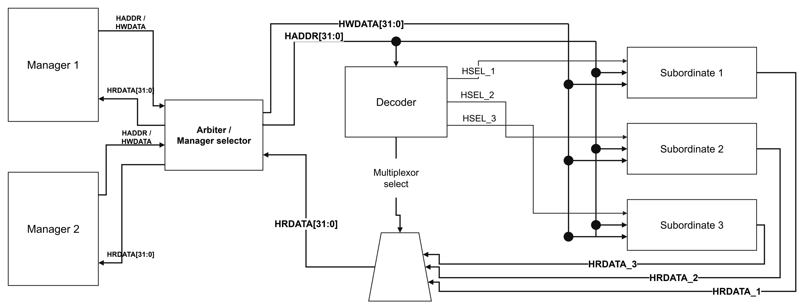
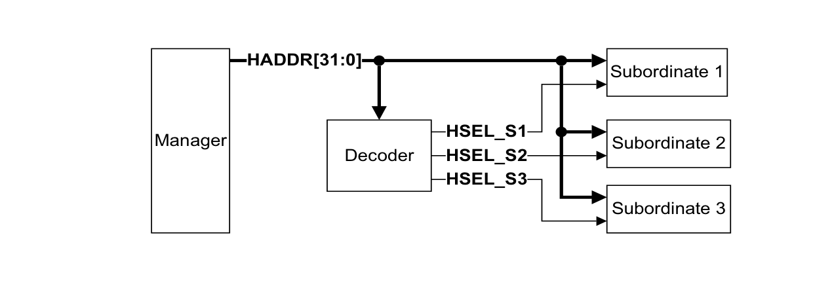
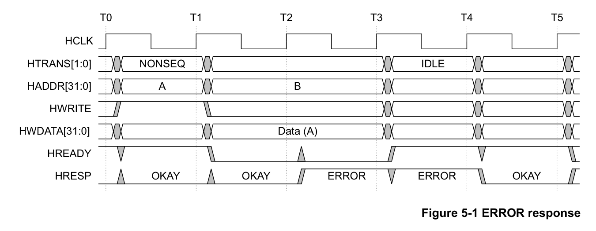
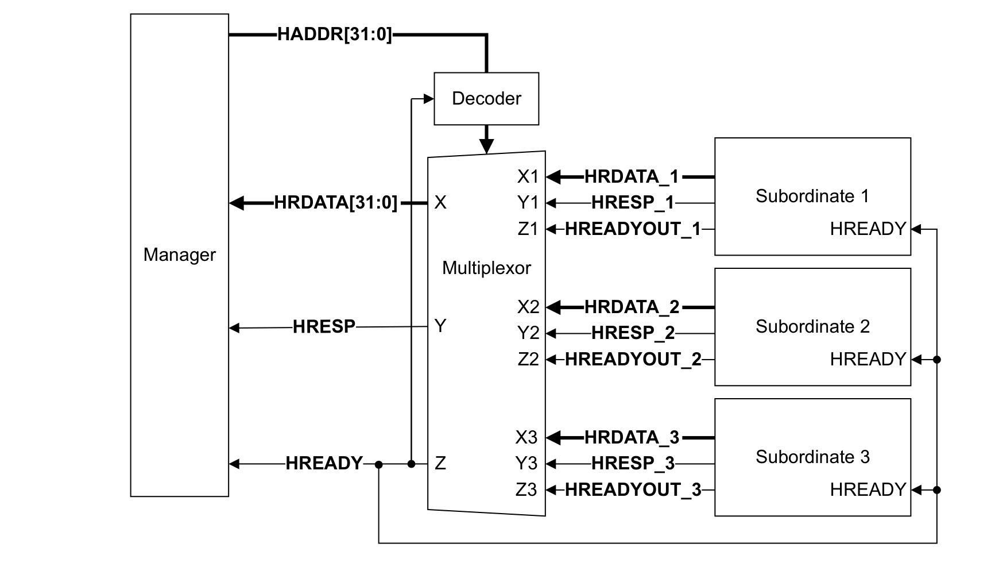
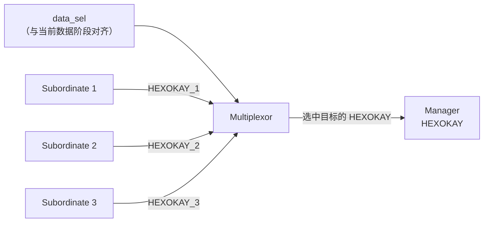
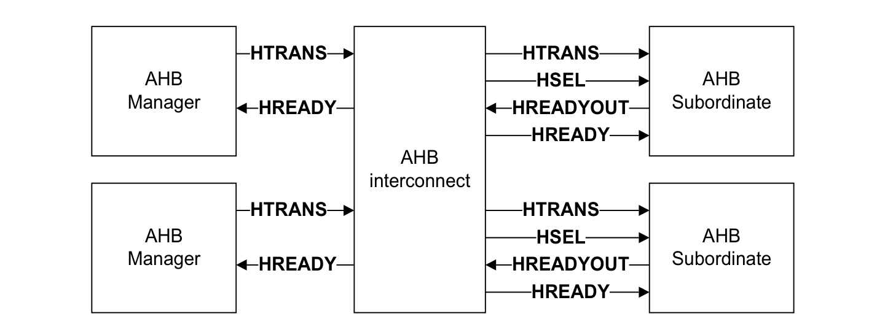

# AMBA AHB Protocol Specification IHI 0033C：第四章 Bus Interconnection 总线互连精读

> 原始资料：[ARM_AMBA_AHB_Protocol_Specification_IHI0033C.pdf](ARM_AMBA_AHB_Protocol_Specification_IHI0033C.pdf)  
> 精读范围：Chapter 4 Bus Interconnection，PDF 第 53-58 页（文档页码 4-53～4-58）  
> 文档版本：Issue C，ID090921，2021 年 9 月 15 日发布  
> 前置阅读：[第三章 Transfers 基础内容精读](ARM_AMBA_AHB_Protocol_Specification_IHI0033C-第三章传输.md)

本文面向第一次系统学习 AHB 的读者，统一使用 Issue C 的术语 `Manager（原 Master）`、`Subordinate（原 Slave）`、`Interconnect（互连）`、`Decoder（译码器）` 和 `Multiplexor（多路选择器）`。本章重点解释：请求如何到达正确的 Subordinate，以及正确的返回值如何在对应的数据阶段送回 Manager。

> **颜色约定：** <span style="color:#4ea1ff">蓝色</span>表示关键协议名和信号，<span style="color:#ffb454">橙色</span>表示限制和易错条件，<span style="color:#63d297">绿色</span>表示正确方向和结论。
>
> **信息标记：** 正文默认是对 Chapter 4 规范原意的中文转述；“理解提示”用于补充流水线直观解释；“工程推断”用于说明实现或验证层面的结论。涉及等待期间的信号变化、`ERROR` 响应时序和 Exclusive Transfers 时，会明确指出对应的其他章节。

## 目录

- 1. Interconnect 的职责与范围
- 2. 地址译码与 HSELx
- 3. Default Subordinate 与多个 HSELx
- 4. 读数据与响应 Multiplexor
- 5. 带 AHB 接口的通用 Interconnect
- 6. 一笔传输如何穿过 Interconnect
- 7. 易错点、口诀与自测
- 8. 问题记录与解答
- 9. 本章边界与资料来源

<a id="1-interconnect-的职责与范围"></a>
<details>
<summary><strong>1. Interconnect 的职责与范围</strong></summary>

Interconnect 连接系统中的 Manager 和 Subordinate（IHI 0033C，4.1 节，第 4-54 页）。系统规模不同，所需功能也不同：



*单 Manager：Manager 直接驱动地址和写数据通路，Decoder 产生 `HSEL_1～3`，三个 Subordinate 的 `HRDATA_1～3` 经 Multiplexor 返回。可编辑源文件：[AHB_interconnect_diagram.drawio](AHB_interconnect_diagram.drawio)。*



*双 Manager：在保留原 Decoder、Multiplexor、Subordinate 和核心信号连接的基础上，仅增加 Manager 2 与 `Arbiter / Manager selector`，用于表示仲裁及请求、返回通路选择。根据 IHI 0033C 4.1～4.3 节整理，非规范原图。可编辑源文件：[AHB_interconnect_two-manager.drawio](AHB_interconnect_two-manager.drawio)。*

单 Manager 系统中只有一个请求源，不需要在多个 Manager 之间竞争总线使用权，但仍需要解决两个问题：

1. 当前地址属于哪个 Subordinate？
2. 当前数据阶段应把哪个 Subordinate 的返回信号送回 Manager？

因此，<span style="color:#ffb454"><strong>“只有一个 Manager”不等于“不需要 Interconnect”</strong></span>。Decoder 和返回 Multiplexor 本身就是最基本的互连逻辑。

多 Manager 系统还必须处理：

- 仲裁哪个 Manager 的请求可以前进；
- 将获准 Manager 的地址、控制和写数据路由到目标 Subordinate；
- 将目标 Subordinate 的返回信号送回正确的 Manager；
- 在 Subordinate 等待或 Manager 尚未获得内部仲裁时，对相应接口施加停顿。

> **本章边界：** IHI 0033C 不规定多 Manager Interconnect 必须采用 single-layer 还是 multi-layer，也不展开具体仲裁算法和内部拓扑。规范仅指出这些功能必须由 Interconnect 提供，并将 multi-layer AHB-Lite 的实现细节引向单独的技术资料。

> **理解提示：** Chapter 1 的单 Manager 框图把 Decoder 和 Multiplexor 分开绘制；本章所说的 Interconnect 是更宽泛的功能组件，可以把这两部分以及必要的连接、寄存和多 Manager 路由逻辑包含在一起。

</details>

<a id="2-地址译码与-hselx"></a>
<details>
<summary><strong>2. 地址译码与 <code>HSELx</code></strong></summary>

### 2.1 Decoder 根据地址产生选择信号

地址 Decoder 为每个 Subordinate 产生独立的选择信号 `HSELx`。Manager 的地址总线通常广播到各 Subordinate，Decoder 根据 `HADDR` 的高位地址范围，只对匹配的目标接口断言相应的 `HSELx`（IHI 0033C，4.2 节，第 4-55 页）。

规范鼓励采用简单的地址译码方案，以避免复杂组合逻辑并支持高速运行。这里的“简单”不是要求所有系统使用同一地址图，而是提醒设计者：地址区域和高位匹配关系应尽量规则，避免把过深的译码路径放到传输关键时序上。



*图 1：原规范 Figure 4-1，Decoder 根据 `HADDR[31:0]` 产生三个 Subordinate 选择信号。图中的 32 位地址宽度是本图示例，不代表所有 AHB 系统固定使用 32 位地址。来源：IHI 0033C，第 4-55 页。Copyright © 2001, 2006, 2010, 2015, 2021 Arm Limited or its affiliates. All rights reserved.*

图中有两类方向不同的连接：

- `HADDR` 从 Manager 发出，并送到 Decoder 和各 Subordinate；
- `HSEL_S1`、`HSEL_S2`、`HSEL_S3` 从 Decoder 发出，各自只选择对应的 Subordinate。

`HSELx` 回答的是<span style="color:#4ea1ff"><strong>“当前地址阶段指向谁”</strong></span>。它不是完成指示，也不是传输结果，不能代替 `HREADY` 或 `HRESP`。

### 2.2 Subordinate 只在 `HREADY=1` 时正式采样

Subordinate 只能在 `HREADY=1` 时采样 `HSELx`、地址和控制信号。此时当前数据阶段正在完成，流水线才允许当前地址阶段被正式接受。

判断一笔有效请求是否被 Subordinate 接受，至少要同时考虑：

```text
HSELx=1
HREADY=1
HTRANS[1]=1    // NONSEQ 或 SEQ
```

其中：

- `HSELx=1`：地址译码命中该 Subordinate；
- `HREADY=1`：总线可以在本次上升沿推进；
- `HTRANS[1]=1`：当前是 `NONSEQ` 或 `SEQ` 有效传输，而不是 `IDLE` 或 `BUSY`。

规范特别提醒：某些等待场景中，`HREADY=0` 时可能暂时看到某个 `HSELx=1`，但到当前传输真正完成时，所选 Subordinate 已经改变。因此，<span style="color:#ffb454"><strong>不能只看到 `HSELx=1` 就立即把地址阶段当作已接受</strong></span>。

> **理解提示：** `HREADY=0` 表示前一笔传输的数据阶段还没有完成，流水线不能在这个边沿前进。地址和选择信号可能处在规范允许的变化或保持过程中，但 Subordinate 此时不能把它们当作一笔新请求提交到内部逻辑。

> **相关专题：** [为什么不能用当前地址阶段的 HSELx 直接选择当前返回值](<为什么不能用当前地址阶段的 HSELx 直接选择当前返回值.md>)。

### 2.3 地址区域与 1KB 边界

规范对地址映射提出两条配套要求：

1. 分配给单个 Subordinate 的最小地址空间是 1KB；
2. 地址区域的起止边界必须位于 1KB 边界上。

以 1KB 为 `0x400` 字节为例，下面是一个满足边界要求的简单映射：

| Subordinate | 地址范围 | 1KB 边界 |
| --- | --- | --- |
| S1 | `0x0000`～`0x03FF` | `[0x0000, 0x0400)` |
| S2 | `0x0400`～`0x07FF` | `[0x0400, 0x0800)` |
| S3 | `0x0800`～`0x0BFF` | `[0x0800, 0x0C00)` |

所有 Manager 都必须设计为不让递增传输跨越 1KB 地址边界。因此，一个 Burst 不会在执行过程中跨过地址译码边界，从一个 Subordinate 的区域进入另一个 Subordinate 的区域。

> <span style="color:#63d297"><strong>为什么这两条规则配套：</strong></span> Subordinate 区域按 1KB 边界划分，Manager 的递增 Burst 又禁止跨 1KB 边界，于是一个 Burst 可以在开始时确定目标区域，并保证后续拍不会因为地址递增而越过最小译码边界。

> **工程推断：** 验证地址映射时，可以检查每个区域的下边界和上边界分界点是否按 `0x400` 对齐；验证 Burst 时，可以检查首地址与每个有效拍地址的 `HADDR` 高位是否始终处于同一个 1KB 窗口。更大的 Subordinate 区域仍可包含多个 1KB 窗口，具体译码粒度由系统地址图决定。

</details>

<a id="3-default-subordinate-与多个-hselx"></a>
<details>
<summary><strong>3. Default Subordinate 与多个 <code>HSELx</code></strong></summary>

### 3.1 未映射地址必须得到确定响应

如果系统地址图没有覆盖全部地址空间，就必须实现额外的 Default Subordinate（默认 Subordinate），对不存在的地址位置提供响应（IHI 0033C，4.2.1 节，第 4-55 页）。

> 相关问题：[如果没有 Default Subordinate 会怎样？](#chapter4-question-no-default-subordinate)

不同 `HTRANS` 类型的要求如下：

| 访问未映射地址时的 `HTRANS` | 是否为有效数据传输 | Default Subordinate 的响应 |
| --- | --- | --- |
| `NONSEQ` | 是 | `ERROR` |
| `SEQ` | 是 | `ERROR` |
| `IDLE` | 否 | 零等待 `OKAY` |
| `BUSY` | 否 | 零等待 `OKAY` |



*图：原规范 Figure 5-1（PDF 第 5-61 页）。该图展示通用 Subordinate 的两周期 `ERROR` 响应，适用于表中未映射 `NONSEQ/SEQ` 访问；`IDLE/BUSY` 的零等待 `OKAY` 不使用此错误时序。*

这组规则同时解决两个问题：

- 对真实访问给出明确错误，避免 Manager 永久等待或误把无效地址当作成功访问；
- 对 `IDLE/BUSY` 这类不产生数据传输的总线状态快速返回，不制造无意义的等待或错误。

> **重要边界：** Chapter 4 只规定未映射有效访问应得到 `ERROR`。`ERROR` 的两周期响应时序、`HRESP` 与 `HREADYOUT/HREADY` 的具体组合由[第五章 Subordinate Response Signaling 响应信号精读](ARM_AMBA_AHB_Protocol_Specification_IHI0033C-第五章Subordinate响应信号.md)说明，本章不提前展开。

> **工程推断：** Default Subordinate 必须覆盖所有未被正常 Decoder 命中的地址。验证环境可随机生成未映射地址，并分别覆盖四种 `HTRANS`，检查有效传输报错、非有效传输零等待返回。

### 3.2 一个物理接口可以有多个逻辑地址入口

一个 Subordinate 接口允许接收多个 `HSELx`。每个 `HSELx` 对应高位地址的一种不同译码，因此同一个物理接口可以在系统地址图中表现为多个逻辑接口（IHI 0033C，4.2.2 节，第 4-55 页）。

典型用途是把同一外设的不同功能窗口放在相距较远的位置：

| 逻辑窗口 | 示例用途 | 译码结果 |
| --- | --- | --- |
| 地址区域 A | 主数据通路 | `HSEL_DATA=1` |
| 地址区域 B | 控制和状态寄存器 | `HSEL_CTRL=1` |

两个窗口最终连接到同一个 Subordinate 接口。由于不同高位地址已经被外部 Decoder 区分，Subordinate 不必再执行完整的高位地址译码；但每个逻辑接口仍必须至少获得 1KB 地址空间。

> **理解提示：** “多个 `HSELx`”不等于同一时刻允许多个 Subordinate 同时响应。这里描述的是<span style="color:#63d297"><strong>多个地址入口映射到同一个物理接口</strong></span>，而不是把一笔普通传输复制给多个独立目标。

</details>

<a id="4-读数据与响应-multiplexor"></a>
<details>
<summary><strong>4. 读数据与响应 Multiplexor</strong></summary>

### 4.1 返回通路为什么需要选择

Manager 把地址和控制信息送往各 Subordinate，Decoder 在请求方向选择目标；目标 Subordinate 在数据阶段产生读数据、完成状态和响应。多个 Subordinate 都有自己的返回输出，因此 Interconnect 必须从中选出当前数据阶段对应的一组，再送回 Manager（IHI 0033C，4.3 节，第 4-56 页）。



*图 2：原规范 Figure 4-2，三组 `HRDATA_x`、`HRESP_x` 和 `HREADYOUT_x` 进入 Multiplexor，选择后形成 Manager 看到的系统级 `HRDATA`、`HRESP` 和 `HREADY`；系统级 `HREADY` 同时反馈给所有 Subordinate。图中的 32 位数据宽度是示例。来源：IHI 0033C，第 4-56 页。Copyright © 2001, 2006, 2010, 2015, 2021 Arm Limited or its affiliates. All rights reserved.*

图中三类返回信息不能混为一谈：

| Subordinate 的局部输出 | Multiplexor 的系统输出 | 作用 |
| --- | --- | --- |
| `HRDATA_x` | `HRDATA` | 返回读数据 |
| `HRESP_x` | `HRESP` | 返回传输结果 |
| `HREADYOUT_x` | `HREADY` | 返回当前数据阶段是否完成 |

<span style="color:#4ea1ff"><strong>`HREADYOUT_x` 是某个 Subordinate 的局部完成输出，`HREADY` 是 Interconnect 选择后的系统级完成指示。</strong></span> 名称不同，所处层次和接收者也不同。

> **相关专题：** [为什么 Subordinate 也接收 HREADY](为什么Subordinate也接收HREADY.md)。

### 4.2 返回选择必须与数据阶段对齐

AHB 是流水线总线。一个周期中经常同时存在：

- 下一笔传输 B 的地址阶段：`HADDR_B`、控制信号和 `HSEL_B`；
- 上一笔传输 A 的数据阶段：`HRDATA_A`、`HRESP_A`、`HREADYOUT_A`。

因此，Multiplexor 当前必须选择 A 的返回，不能直接使用同周期为 B 生成的 `HSEL_B`。可以把两个选择概念写成：

| 选择 | 所属阶段 | 决定什么 |
| --- | --- | --- |
| `addr_sel` | 当前地址阶段 | 哪个 Subordinate 接收新请求，生成相应 `HSELx` |
| `data_sel` | 当前数据阶段 | 哪个 Subordinate 的 `HRDATA/HRESP/HREADYOUT` 返回 Manager |

> **工程推断：** 常见实现会在地址阶段被接受的边沿，即 `HREADY=1` 时，把 `addr_sel` 保存为下一周期的 `data_sel`。如果当前数据阶段等待，`data_sel` 必须保持，以确保系统继续选择同一笔未完成传输的返回信号。

下面先结合规范 Figure 3-5 看实际流水线。图中 A、B、C 是连续的三笔传输：T1～T2 同时存在 A 的数据阶段和 B 的地址阶段；T2～T3 期间 B 的数据阶段插入一个等待，C 的地址和控制信号虽然已经出现在总线上，但尚未被正式接受；T3～T4 B 完成，B 的返回数据才被送回 Manager。


*图：原规范 Figure 3-5（PDF 第 3-29 页）。T1～T2 中，地址线已经是 B，但返回数据仍属于 A；T2～T3 中 `HREADY=0`，B 的数据阶段等待，C 的地址/控制保持不变。该图没有画出 `HSELx`，下面用 `addr_sel`/`data_sel` 补充 Multiplexor 的选择关系。*

按这张图逐拍对应：

| 时段 | 地址阶段看到的内容 | 数据阶段真正进行的传输 | 地址侧选择 `addr_sel` | 返回侧选择 `data_sel` / Multiplexor |
| --- | --- | --- | --- | --- |
| T0～T1 | A | 前一状态 | A | 前一状态对应返回 |
| T1～T2 | B | A | B | **A** 的返回 |
| T2～T3 | C（保持，未接受） | B（等待，`HREADY=0`） | C 可能已译码，但不能更新已生效选择 | **保持 B** 的返回 |
| T3～T4 | 下一地址或保持 | B（完成，`HREADY=1`） | 下一笔地址在边沿被接受 | **B** 的返回 |

因此，`addr_sel` 和 `data_sel` 不是同一个周期的同一个选择：`addr_sel` 面向总线上“正在显示的新地址”，`data_sel` 面向“当前数据阶段正在返回的旧传输”。尤其在 T1～T2，不能因为看到 `HSEL_B` 就切到 B；在 T2～T3，`HREADY=0` 时也不能让 C 的选择覆盖仍在等待的 B。

下面再把两个选择概念抽象成接口定义：

| 周期 | 地址阶段 | 数据阶段 | Multiplexor 应选 |
| --- | --- | --- | --- |
| T1 | 访问 S1 | 前一状态 | 前一状态对应返回 |
| T2 | 访问 S2 | S1 的数据阶段 | S1 返回 |
| T3 | 下一地址或保持 | S2 的数据阶段 | S2 返回 |

> <span style="color:#ffb454"><strong>最常见错误：</strong></span> 在 T2 看到 `HSEL_S2=1`，就让 Multiplexor 立即切到 S2。这样 Manager 会在 S1 的数据阶段收到 S2 的返回，地址和数据归属错位。

完整辨析见：[为什么不能用当前地址阶段的 HSELx 直接选择当前返回值](<为什么不能用当前地址阶段的 HSELx 直接选择当前返回值.md>)。

### 4.3 `HREADY` 为什么还要反馈给所有 Subordinate

Multiplexor 选出的 `HREADY` 不只返回 Manager，也反馈给所有 Subordinate。它代表<span style="color:#63d297"><strong>当前系统传输是否可以在这个边沿完成并推进</strong></span>。

所有 Subordinate 都接收同一个系统级 `HREADY`，可以让它们正确判断：

- 当前地址和控制是否应在本次边沿正式采样；
- 流水线是否仍被前一笔数据阶段阻塞；
- 自己看到的 `HSELx` 是否只是等待期间的暂态，而不是已经接受的新传输。

未被选中的 Subordinate 虽然不决定当前 `HREADY`，仍需要观察它来判断地址阶段是否推进。详细解释见：[为什么 Subordinate 也接收 HREADY](为什么Subordinate也接收HREADY.md)。

### 4.4 支持 Exclusive Transfers 时的额外返回

Figure 4-2 只画出核心返回信号。规范注记指出，如果系统支持 Exclusive Transfers，Multiplexor 还必须把正确 Subordinate 的 `HEXOKAY` 路由给 Manager。



*图：`HEXOKAY` 路由补充示意，基于原规范 Figure 4-2 和 Chapter 10.3（PDF 第 10-84 页）。Multiplexor 必须使用与当前数据阶段对应的选择，不能用下一笔地址阶段的 `HSELx` 直接切换。*

对一笔 Exclusive Transfer，可以按下面的路径理解：

1. 地址阶段由 Decoder 选中目标 Subordinate，并在数据阶段使用对应的 `data_sel`。
2. 目标 Subordinate 产生自己的 `HEXOKAY_x`；其他 Subordinate 的 `HEXOKAY` 不得被送回 Manager。
3. Multiplexor 用同一个 `data_sel` 同时选择 `HRDATA/HRESP/HREADYOUT` 和 `HEXOKAY`，形成系统级返回。
4. `HEXOKAY` 只在 `HREADY=1` 的完成周期有效，且不能与 `HRESP=ERROR` 同周期断言；非 Exclusive Transfer 不应断言 `HEXOKAY`。

> **本章边界：** `HEXOKAY` 的含义和 Exclusive Transfer 规则在 Chapter 10 说明。本章只要求 Interconnect 对这个可选返回信号执行与目标传输一致的选择和路由。

</details>

<a id="5-带-ahb-接口的通用-interconnect"></a>
<details>
<summary><strong>5. 带 AHB 接口的通用 Interconnect</strong></summary>

通用 Interconnect 可能同时提供 AHB、AXI、APB 等不同协议接口。Figure 4-3 用简化连接说明：当 Interconnect 的 Manager 侧和 Subordinate 侧都采用 AHB 接口时，`HTRANS`、`HSEL`、`HREADY` 和 `HREADYOUT` 如何分工（IHI 0033C，4.4 节，第 4-57～4-58 页）。



*图 3：原规范 Figure 4-3，两个 AHB Manager 通过通用 AHB Interconnect 连接两个 AHB Subordinate。此图只突出 `HTRANS`、`HSEL`、`HREADYOUT` 和 `HREADY`，没有画出完整地址、控制、数据和响应信号。来源：IHI 0033C，第 4-57 页。Copyright © 2001, 2006, 2010, 2015, 2021 Arm Limited or its affiliates. All rights reserved.*

### 5.1 Manager 侧接口

Interconnect 面向每个 AHB Manager 时表现为一个 AHB Subordinate：

- Manager 用 `HTRANS` 表示传输类型和有效性；
- Interconnect 向 Manager 返回单个 `HREADY`；
- `HREADY=0` 既可能是目标 Subordinate 插入等待，也可能是该 Manager 正在等待 Interconnect 内部仲裁。

因此，Manager 不需要知道停顿来自外部 Subordinate 还是 Interconnect 内部资源竞争。它只需遵守 AHB 的等待规则，在 `HREADY=0` 时保持规定必须稳定的信号。

### 5.2 Subordinate 侧接口

Interconnect 面向每个 AHB Subordinate 时表现为一个 AHB Manager：

- Interconnect 输出 `HTRANS`，描述发往该接口的传输类型；
- Interconnect 输出 `HSEL`，选择目标 Subordinate；
- Subordinate 输出 `HREADYOUT`，报告自己的数据阶段是否完成；
- Interconnect 输出 `HREADY` 给 Subordinate，使其知道前一笔数据阶段是否阻塞了当前地址阶段。

这解释了 Figure 4-3 中 Subordinate 一侧为什么同时出现两个方向相反的 ready 信号：

| 信号 | 驱动者 | 接收者 | 含义 |
| --- | --- | --- | --- |
| `HREADYOUT` | AHB Subordinate | Interconnect | 本接口对当前数据阶段给出的局部完成状态 |
| `HREADY` | Interconnect | AHB Subordinate | 系统侧传输是否推进；可因前一笔数据阶段停顿而为 0 |

### 5.3 `HSEL` 与强制 `HTRANS=IDLE` 的两种接口方式

Figure 4-3 采用显式 `HSEL`：Interconnect 只对目标 Subordinate 断言选择信号。

规范还允许另一种实现：

1. 在 Subordinate 接口上把 `HSEL` 固定为 1；
2. 对未选中的 Subordinate，由 Interconnect 把 `HTRANS` 改写为 `IDLE`。

两种方式的共同目标是：只有真正的目标接口看到有效的 `NONSEQ/SEQ` 传输，其他接口看到非有效状态。

> **理解提示：** `HSEL=1` 本身不足以说明当前一定有有效访问。Subordinate 仍需结合 `HTRANS` 和 `HREADY` 判断。把 `HSEL` 固定为 1 的方案正好说明了三者不能互相替代。

</details>

<a id="6-一笔传输如何穿过-interconnect"></a>
<details>
<summary><strong>6. 一笔传输如何穿过 Interconnect</strong></summary>

把本章规则串起来，一笔无等待读传输可以分成以下步骤：

1. **Manager 发起地址阶段。** 输出 `HADDR`、`HTRANS=NONSEQ/SEQ` 以及其他控制信息。
2. **Decoder 选择目标。** 根据 `HADDR` 产生对应的 `HSELx`。
3. **目标 Subordinate 接受请求。** 在 `HSELx=1`、`HTRANS[1]=1` 且系统 `HREADY=1` 的上升沿采样地址和控制。
4. **选择信息进入数据阶段。** Interconnect 记录这笔传输的目标，使返回选择与下一周期的数据阶段对齐。
5. **目标 Subordinate 返回结果。** 在数据阶段输出自己的 `HRDATA_x`、`HRESP_x` 和 `HREADYOUT_x`。
6. **Multiplexor 汇总返回。** 根据当前数据阶段的目标，生成系统级 `HRDATA`、`HRESP` 和 `HREADY`。
7. **传输完成并推进。** `HREADY=1` 时 Manager 采样返回，所有接口同时知道流水线可以进入下一状态。

写传输的请求选择过程相同，但数据方向不同：写数据 `HWDATA` 从 Manager 经 Interconnect 路由或广播到目标 Subordinate；返回方向仍需为当前数据阶段选择正确的 `HRESP` 和 `HREADYOUT`。

如果目标 Subordinate 插入等待：

1. 它输出 `HREADYOUT=0`；
2. Interconnect 选择该局部完成状态，形成系统级 `HREADY=0`；
3. 当前数据阶段继续保持，`data_sel` 不能切换；
4. 下一笔地址阶段不能在该边沿被正式接受；
5. 当目标 Subordinate 最终输出 `HREADYOUT=1` 时，Interconnect 形成 `HREADY=1`，当前传输完成，流水线才继续推进。

> <span style="color:#63d297"><strong>完整闭环：</strong></span> 地址决定 `HSELx`，被接受的 `HSELx` 决定下一数据阶段的返回目标；目标 `HREADYOUT` 形成系统 `HREADY`，系统 `HREADY` 又决定所有接口能否采样和推进。

### 6.1 可直接用于实现或验证的检查点

以下内容是依据 Chapter 2～4 规则整理的工程检查项：

- 对每个正常地址，Decoder 应选择且只选择一个目标逻辑接口；未映射地址应由 Default Subordinate 覆盖。
- 有效传输只在 `HREADY=1` 的边沿被接受；`HREADY=0` 时不得重复提交地址阶段请求。
- `data_sel` 只在流水线允许推进时更新；等待期间保持当前目标。
- `HRDATA`、`HRESP`、`HREADY` 必须来自同一个当前数据阶段目标，不能分别选择不同 Subordinate。
- `HREADY` 必须反馈给 Manager 和所有相关 Subordinate 接口。
- 未映射 `NONSEQ/SEQ` 返回 `ERROR`；未映射 `IDLE/BUSY` 返回零等待 `OKAY`。
- 每个逻辑地址区域至少 1KB，区域边界按 1KB 对齐；递增 Burst 不得跨越 1KB 边界。
- 若支持 Exclusive Transfers，`HEXOKAY` 必须按当前数据阶段目标正确路由。

</details>

<a id="7-易错点口诀与自测"></a>
<details>
<summary><strong>7. 易错点、口诀与自测</strong></summary>

### 7.1 易错点

1. **把 `HSELx` 当成传输已接受。** `HSELx` 只表示地址译码命中；Subordinate 还要在 `HREADY=1` 时采样，并结合 `HTRANS` 判断是否为有效传输。
2. **用当前 `HSELx` 直接选择当前返回值。** 当前 `HSELx` 属于地址阶段，而当前返回属于上一笔传输的数据阶段，必须用与数据阶段对齐的选择信息。
3. **把 `HREADYOUT` 和 `HREADY` 当成同一个节点。** 前者是某个 Subordinate 的局部输出，后者是 Interconnect 选择后的系统级完成指示。
4. **认为未选中的 Subordinate 不需要 `HREADY`。** 所有 Subordinate 都要用系统 `HREADY` 判断地址阶段何时可以被正式采样。
5. **未映射地址一律返回 `ERROR`。** 只有 `NONSEQ/SEQ` 有效访问返回 `ERROR`；`IDLE/BUSY` 必须零等待返回 `OKAY`。
6. **把多个 `HSELx` 理解为同时访问多个目标。** Chapter 4.2.2 描述的是同一物理接口拥有多个逻辑地址入口。
7. **认为 Burst 只要不跨 Subordinate 区域就能跨 1KB。** 规范直接要求 Manager 的递增传输不跨 1KB 边界，即使更大的 Subordinate 区域横跨多个 1KB 窗口也一样。
8. **认为 Manager 侧 `HREADY=0` 只能来自 Subordinate。** 在通用 Interconnect 中，内部仲裁等待也可以让某个 Manager 侧接口停顿。
9. **看到 `HSEL` 固定为 1 就认为接口始终执行传输。** 规范允许对未选中接口强制 `HTRANS=IDLE`，所以有效性仍由信号组合决定。

### 7.2 记忆口诀

> <span style="color:#63d297"><strong>地址译码选入口，数据阶段选出口；局部 Ready 进互连，系统 Ready 管推进。</strong></span>

<a id="chapter4-self-test"></a>

### 7.3 自测题

<details>
<summary>1. 单 Manager 系统为什么仍然需要 Interconnect？</summary>

> 单 Manager 系统虽然不需要在多个请求源之间仲裁，但仍需 Decoder 根据地址选择目标 Subordinate，并需 Multiplexor 从多个 Subordinate 中选择当前数据阶段的 `HRDATA`、`HRESP` 和 `HREADYOUT`，形成返回给 Manager 的系统信号。

</details>

<details>
<summary>2. Subordinate 看到 <code>HSELx=1</code> 后，能否立即接受请求？</summary>

> 不能只检查 `HSELx`。Subordinate 只在 `HREADY=1` 时正式采样 `HSELx`、地址和控制；还需结合 `HTRANS[1]=1` 确认当前是 `NONSEQ` 或 `SEQ` 有效传输。

</details>

<details>
<summary>3. 为什么不能用当前地址阶段的 <code>HSELx</code> 直接控制返回 Multiplexor？</summary>

> 因为 AHB 地址阶段和数据阶段流水线重叠。当前 `HSELx` 通常属于下一笔传输，而当前 `HRDATA/HRESP/HREADYOUT` 属于上一笔传输。返回选择必须与对应的数据阶段对齐，并在等待期间保持。

</details>

<details>
<summary>4. <code>HREADYOUT</code> 与 <code>HREADY</code> 的区别是什么？</summary>

> `HREADYOUT` 是某个 Subordinate 给 Interconnect 的局部完成输出；`HREADY` 是 Interconnect 为当前数据阶段选择并汇总后的系统级完成指示，送给 Manager 和所有相关 Subordinate。

</details>

<details>
<summary>5. Default Subordinate 对四种 <code>HTRANS</code> 应如何响应？</summary>

> 对未映射地址的 `NONSEQ/SEQ` 有效传输返回 `ERROR`；对 `IDLE/BUSY` 返回零等待 `OKAY`。`ERROR` 的具体两周期时序由[第五章 Subordinate Response Signaling 响应信号精读](ARM_AMBA_AHB_Protocol_Specification_IHI0033C-第五章Subordinate响应信号.md)规定。

</details>

<details>
<summary>6. 为什么地址区域和 Burst 都强调 1KB 边界？</summary>

> 单个逻辑地址区域最小为 1KB，并按 1KB 边界划分；Manager 的递增传输又不能跨 1KB 边界。两者配合保证 Burst 不会在执行过程中跨过最小地址译码边界。

</details>

<details>
<summary>7. 为什么通用 Interconnect 可以因为内部仲裁而向 Manager 给出 <code>HREADY=0</code>？</summary>

> 对 Manager 而言，Interconnect 的接口表现为 AHB Subordinate。只要请求尚未获得内部路由或目标资源，Interconnect 就可以通过 `HREADY=0` 停顿该传输；Manager 按普通 AHB 等待规则保持相关信号即可。

</details>

<details>
<summary>8. 如果 Subordinate 侧把 <code>HSEL</code> 固定为 1，Interconnect 如何表示该接口未被选中？</summary>

> Interconnect 可以把发往未选中 Subordinate 的 `HTRANS` 强制为 `IDLE`。因此 Subordinate 必须结合 `HSEL`、`HTRANS` 和 `HREADY` 判断有效请求，不能只看 `HSEL`。

</details>

</details>

<a id="8-问题记录与解答"></a>

## 8. 问题记录与解答

本章已记录的独立问题如下。与本章直接相关的已有专题如下：

- [为什么不能用当前地址阶段的 HSELx 直接选择当前返回值](<为什么不能用当前地址阶段的 HSELx 直接选择当前返回值.md>)
- [为什么 Subordinate 也接收 HREADY](为什么Subordinate也接收HREADY.md)
- [没有 Default Subordinate 会怎样？](#chapter4-question-no-default-subordinate)

<a id="chapter4-question-no-default-subordinate"></a>
<details>
<summary>没有 Default Subordinate 会怎样？</summary>

如果 Manager 访问了没有映射到任何真实 Subordinate 的地址，互连仍必须提供确定的响应，不能让这笔传输无人处理。

如果系统没有单独实例化名为 `Default Subordinate` 的模块，也必须在 Interconnect 内提供等效的默认响应逻辑。通常应当在没有任何真实 Subordinate 被选中时：

- 返回 `HRESP=ERROR`，明确告知 Manager 这次访问无效；
- 保证 `HREADY` 最终有效，使传输能够结束并让总线继续运行；
- 为读数据提供确定值（例如 `HRDATA=0`，具体取值由实现约定）。

否则可能出现以下问题：

- `HREADY` 一直为低，导致总线死锁；
- `HREADY`、`HRESP` 或 `HRDATA` 出现未知值 `X`；
- 互连默认输出被当作 `OKAY`，使 Manager 误以为未映射访问成功。

因此，关键不是必须存在一个独立的 Default Subordinate 模块，而是未映射地址必须有等效的默认错误响应路径。

</details>

后续如在阅读 Figure 4-1～4-3、地址映射或返回选择规则时产生具体问题，应在实际引发问题的位置添加入口，并在本节为每个问题建立独立锚点和折叠答案。

<a id="9-本章边界与资料来源"></a>
<details>
<summary><strong>9. 本章边界与资料来源</strong></summary>

本章解释 AHB 系统所需的基本互连功能，但不展开以下主题：

- Manager 发起传输、Burst 和等待期间信号变化的完整规则：参见 [第三章 Transfers 基础内容精读](ARM_AMBA_AHB_Protocol_Specification_IHI0033C-第三章传输.md)；
- `OKAY`、两周期 `ERROR` 和响应采样时序：继续阅读[第五章 Subordinate Response Signaling 响应信号精读](ARM_AMBA_AHB_Protocol_Specification_IHI0033C-第五章Subordinate响应信号.md)；
- 不同数据总线宽度、窄传输和端序：继续阅读[第六章 Data Buses 数据总线精读](ARM_AMBA_AHB_Protocol_Specification_IHI0033C-第六章数据总线.md)；
- 复位、等待和非活动状态下的信号有效性：继续阅读 Chapter 8 Signal validity；
- Exclusive Transfers 与 `HEXOKAY` 的语义：继续阅读 Chapter 10 Exclusive Transfers；
- single-layer、multi-layer Interconnect 的具体结构、仲裁策略、性能和公平性：不在 IHI 0033C 的详细规定范围内。

资料来源：

- [AMBA AHB Protocol Specification, Arm IHI 0033C](ARM_AMBA_AHB_Protocol_Specification_IHI0033C.pdf)，Issue C，ID090921，2021 年 9 月 15 日；本文精读 Chapter 4，PDF 第 53-58 页（文档页码 4-53～4-58）。
- 地址阶段、数据阶段和等待期间信号变化同时参考同一规范 Chapter 2 与 Chapter 3；Default Subordinate 的 `ERROR` 细节应结合[第五章 Subordinate Response Signaling 响应信号精读](ARM_AMBA_AHB_Protocol_Specification_IHI0033C-第五章Subordinate响应信号.md)阅读。
- 规范在 4.1 节引用 *Multi-layer AHB Technical Overview*（Arm DVI 0045），用于进一步了解 multi-layer AHB-Lite Interconnect；本文未使用该资料扩展规范性要求。

</details>

---

本文是对 Arm IHI 0033C 第四章 Bus Interconnection 的中文学习整理，不替代官方规范。实现或验证 AHB 兼容设计时，应以原始 PDF 的规范性描述为准。
