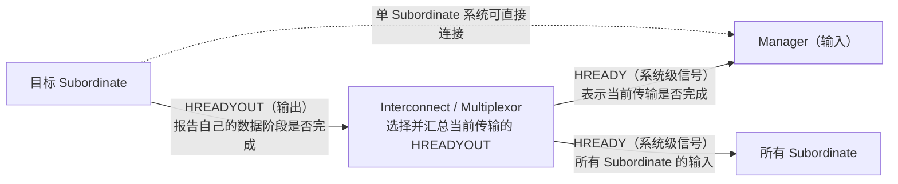
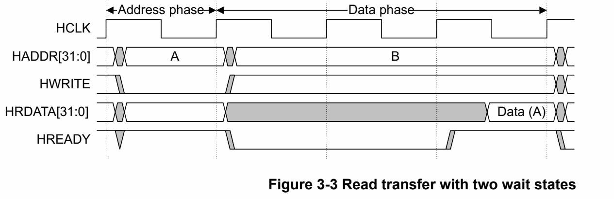

# 为什么 Subordinate 也接收 `HREADY`

*图 1：原规范 Figure 1-3，Subordinate 接口。来源：IHI 0033C，第 1-15 页。图中未包含 AHB5 新增信号。Copyright © 2001, 2006, 2010, 2015, 2021 Arm Limited or its affiliates. All rights reserved.*

在 Figure 1-3 中，Subordinate 除了接收地址、控制和 `HWDATA`，还接收一个输入信号 <code>HREADY</code>。这并不表示 Subordinate 接收了“自己的准备信号”，而是因为 <code>HREADY</code> 是 AHB 的全局传输完成指示。

## 1. 先区分 `HREADYOUT` 和 `HREADY`

- <code>HREADYOUT</code>：某个 Subordinate 告诉系统“我的数据阶段是否完成”。
- <code>HREADY</code>：Interconnect 根据当前传输选出的 `HREADYOUT` 汇总后的系统级信号，送给 Manager 和 Subordinate。

在只有一个 Subordinate 的简单系统中，`HREADYOUT` 可能直接连接到 `HREADY`，这也是很多入门资料把二者混写的原因。

## 2. Subordinate 为什么需要知道 `HREADY`

AHB 采用地址阶段和数据阶段重叠的流水线结构。当前传输可能还在数据阶段等待，但下一笔传输的地址和控制信号已经出现在总线上。

因此，Subordinate 必须根据 <code>HREADY</code> 判断当前地址和控制信号能不能采样：

- <code>HREADY = 1</code>：前一笔传输完成，当前地址和控制信号可以被采样。
- <code>HREADY = 0</code>：前一笔传输仍在等待，当前传输不能推进，地址和控制信号必须保持稳定。

如果 Subordinate 不看 <code>HREADY</code>，就可能在前一笔传输尚未完成时提前采样下一笔地址，导致地址、片选和数据阶段错位。

## 3. 一个简化的等待示例

假设传输 A 访问 Subordinate 1，但 Subordinate 1 需要额外两个周期：

*图 2：原规范 Figure 3-3，带两个等待周期的读传输。来源：IHI 0033C，第 3-29 页。该图展示 Manager 看到的 `HREADY`；对应 Subordinate 的 `HREADYOUT` 由 Interconnect 汇总后形成系统侧 `HREADY`。Copyright © 2001, 2006, 2010, 2015, 2021 Arm Limited or its affiliates. All rights reserved.*

按图从左到右看：

1. **地址阶段：** Manager 给出地址 A，随后进入 A 的数据阶段。
2. **等待阶段：** A 的数据还没准备好，`HREADY` 被拉 LOW，数据阶段延长两个周期。此时总线上已经出现下一笔地址 B，但它不能被当成已经完成采样的新传输。
3. **完成阶段：** `HREADY` 回到 HIGH，读数据 `Data (A)` 有效，传输 A 完成，流水线才继续推进。

在 `T1` 和 `T2`，虽然总线上可能已经出现传输 B 的地址和控制信号，但 <code>HREADY</code> 为 LOW，Subordinate 不能把 B 当作已经完成采样的新传输。直到 `T3` <code>HREADY</code> 回到 HIGH，传输 A 才完成，流水线才可以继续推进。

## 4. 为什么地址阶段不能由 Subordinate 单独暂停

AHB 要求地址阶段固定为一个周期，Subordinate 不能单独把地址阶段拉长。因此，Subordinate 必须具备在规定时刻采样地址和控制信号的能力。

Subordinate 能做的是在数据阶段通过 <code>HREADYOUT</code> 插入等待周期。Interconnect 把这个结果汇总成 <code>HREADY</code>，让 Manager 和所有 Subordinate 都知道当前传输还没有完成。

## 5. 最容易记住的方式

用一句话区分：

- <code>HREADYOUT</code>：我这个 Subordinate 做完了吗？
- <code>HREADY</code>：系统当前这笔传输做完了吗？

所以，Subordinate：

- 输出 <code>HREADYOUT</code>，报告自己的完成状态；
- 输入 <code>HREADY</code>，确认系统当前传输是否完成，以及何时可以采样新的地址和控制信息。

更精确的连接和流水线规则见 ARM AMBA AHB Protocol Specification IHI 0033C 的 Chapter 3 和 Chapter 4。
