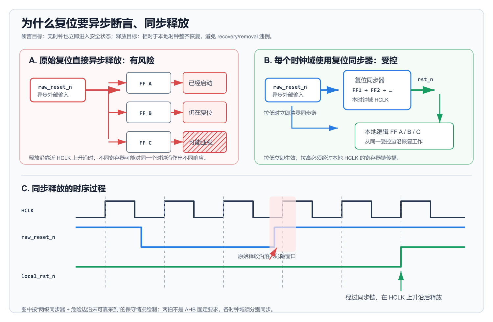

# 为什么复位要“异步断言、同步释放”

> 文档类型：时钟与复位专题 README  
> 协议上下文：AMBA AHB `HRESETn`，同时适用于常见 ASIC/FPGA 同步时钟域  
> 规范依据：[AMBA AHB Protocol Specification IHI 0033C](ARM_AMBA_AHB_Protocol_Specification_IHI0033C.pdf)，Chapter 7  
> 相关章节：[第七章 Clock and Reset 时钟与复位精读](ARM_AMBA_AHB_Protocol_Specification_IHI0033C-第七章时钟与复位.md)

> <span style="color:#63d297"><strong>直接结论：</strong>异步断言保证时钟缺失或停止时，电路仍能立即进入复位；同步释放保证每个时钟域只在受控的本地时钟边沿恢复，避免 recovery/removal 违例、亚稳态和寄存器分批启动。</span>

这里的标准说法是“**异步断言、同步去断言**”（asynchronous assertion, synchronous deassertion）。日常所说的“异步复位、同步释放”指的是同一种结构。

## 1. 这句话具体表示什么

以低有效复位为例：

- **异步断言：** 原始复位 `raw_reset_n` 从 `1` 变为 `0` 时，无须等待时钟边沿，复位可以立即生效。
- **同步释放：** `raw_reset_n` 从 `0` 变回 `1` 后，本时钟域使用的 `local_reset_n` 不立即变为 `1`，而要经过由本地时钟驱动的同步器，在某个上升沿之后释放。

“同步释放”不是要求外部复位源只能在时钟边沿变高。外部 `raw_reset_n` 仍然可以在任意时刻变高，真正送给本时钟域逻辑的 `local_reset_n` 才必须同步释放。

```text
外部 raw_reset_n：可以在任意时刻拉低或拉高
本地 local_reset_n：拉低立即生效，拉高经过本地时钟同步
```

## 2. 为什么断言要能够异步发生

复位断言的目标是让电路进入安全状态。如果复位只能在时钟上升沿生效，那么以下场景可能无法复位：

- PLL 尚未锁定，系统时钟还没有建立；
- 时钟被门控，当前时钟域没有跳变；
- 时钟源故障或已经停止；
- 上电期间需要立即关闭输出驱动，避免接口或总线争用。

Digilent 仓库中的 Xilinx MIG 生成代码明确采用异步断言，给出的工程理由是：即使没有时钟，也必须能够复位，例如及时把输出置为三态以避免总线争用。参见 [Xilinx MIG reset synchronization](https://github.com/Digilent/Arty-S7-25-base/blob/master/src/bd/system/ip/system_mig_7series_0_0/system_mig_7series_0_0/user_design/rtl/clocking/mig_7series_v4_0_infrastructure.v#L645-L661)。

> <span style="color:#63d297"><strong>结论：</strong>异步断言的关键不是“比同步复位快半个周期”，而是复位动作不能依赖一个可能尚未存在、已经停止或不可靠的时钟。</span>

## 3. 为什么释放不能直接异步发生

复位释放表示寄存器重新参加正常工作。异步复位端除了最小脉宽要求，还存在相对于时钟边沿的 recovery 和 removal 时序要求：

- **Recovery：** 复位必须在有效时钟边沿到来之前提前足够时间释放。
- **Removal：** 复位释放不能过于靠近前一个有效时钟边沿。

它们可以类比数据输入的 setup/hold 要求：如果异步复位的释放沿落在时钟边沿附近，触发器可能无法确定自己是否应该在这个边沿恢复工作。

当一条原始异步复位直接扇出到很多寄存器时，复位树存在路径延迟和偏斜。同一个释放沿可能导致：

- 寄存器 A 已经解除复位并开始更新；
- 寄存器 B 在同一周期仍保持复位值；
- 寄存器 C 发生亚稳态；
- one-hot 状态机出现零个或多个状态位同时有效；
- 总线控制信号在恢复周期互相不一致。

开源 CDC/RDC 检查工具 rtl-buddy 的 `RDC-008` 规则把这种问题描述为：顶层异步复位未经本时钟域同步就直接释放，可能违反 recovery/removal，并使一部分寄存器与另一部分寄存器处于不同复位状态。参见 [rtl-buddy-cdc reset-domain rule](https://github.com/rtl-buddy/rtl-buddy-cdc)。

> <span style="color:#63d297"><strong>结论：</strong>同步释放不是为了延迟启动，而是为了把不可预测的异步释放沿转换成相对于本地时钟可控的释放事件。</span>

## 4. 直接异步释放与同步释放的区别



*图 1：学习示意图，不是 Arm 或 GitHub 项目的原图。左侧表示原始异步复位直接连接多个寄存器时，释放沿接近时钟边沿可能造成不同响应；右侧表示通过本地复位同步器释放。底部波形只说明先后关系，不代表固定同步级数或固定延迟。*

> **为什么图中看起来延迟了两拍？** 图中按“两级同步器，并且原始释放沿落入危险窗口、该边沿没有被可靠采到”的保守情况绘制：危险边沿后同步链仍可能是 `00`，下一个安全上升沿变为 `01`，再下一个上升沿变为 `11`，此时 `local_reset_n` 才释放。如果原始释放沿在第一个上升沿前已经满足时序，同一个两级同步器可以更早一拍释放。因此，这两拍不是 AHB 规定的固定延迟；从原始释放沿到本地释放沿的名义时间通常为 1～2 个完整周期，发生亚稳态或增加同步级数时还可能更长。

按图中的路径看：

1. 复位断言时，`raw_reset_n=0` 异步清零同步器，因此 `local_reset_n` 可以立即拉低，不依赖本地时钟。
2. `raw_reset_n` 释放时，只有同步器第一级直接面对异步释放沿，后级逻辑不会立即看到复位解除。
3. 同步器中的 `1` 随本地时钟逐级传播，为第一级可能出现的亚稳态提供恢复时间。
4. 最后一级输出变为 `1` 后，本时钟域才解除复位，下游状态机和控制逻辑从受控的时钟边沿恢复。

> <span style="color:#63d297"><strong>结论：</strong>原始复位负责“立即停下”，本地复位同步器负责“整齐启动”。</span>

## 5. 一个典型的两级复位同步器

下面是低有效复位的简化实现：

```systemverilog
module reset_sync (
    input  logic clk,
    input  logic raw_reset_n,
    output logic local_reset_n
);
    (* ASYNC_REG = "TRUE" *) logic [1:0] sync_ff;

    always_ff @(posedge clk or negedge raw_reset_n) begin
        if (!raw_reset_n)
            sync_ff <= 2'b00;                 // 异步断言
        else
            sync_ff <= {sync_ff[0], 1'b1};    // 逐级同步释放
    end

    assign local_reset_n = sync_ff[1];
endmodule
```

正常行为如下：

| 事件 | `sync_ff` | `local_reset_n` | 含义 |
| --- | --- | --- | --- |
| `raw_reset_n` 拉低 | 立即变为 `00` | 立即变为 `0` | 无须时钟即可进入复位 |
| 原始复位释放后的第一个上升沿 | 名义上变为 `01` | 仍为 `0` | 第一级采样释放状态 |
| 后续上升沿 | 名义上变为 `11` | 变为 `1` | 本时钟域同步解除复位 |

表中的 `01 → 11` 是数字仿真中的名义过程。真实器件中，如果第一级在释放沿附近进入亚稳态，最终释放时间可能多一个或更多周期，因此外部逻辑不能依赖精确的固定周期数，只能等待同步后的复位真正释放。

两级只是常见示例，不是所有工艺和频率下的固定答案。ETH Zurich 和 University of Bologna 的 `common_cells` 提供了参数化复位同步器，默认使用四级寄存器链：异步断言时整条链清零，释放时逐级移入 `1`。参见 [PULP `cc_rstgen_bypass.sv`](https://github.com/pulp-platform/common_cells/blob/master/src/cc_rstgen_bypass.sv#L10-L54)。同步级数应根据工艺库、时钟频率、可靠性目标及验证约束确定。

## 6. 多时钟域必须分别同步释放

“同步”总是相对于某个具体时钟而言。假设系统中存在：

```text
HCLK
APB_CLK
DEBUG_CLK
```

就应分别生成：

```text
HRESETn_hclk
RESETn_apb
RESETn_debug
```

不能用相对于 `HCLK` 同步后的复位直接驱动 `APB_CLK` 或 `DEBUG_CLK` 域。每个异步时钟域都必须使用自己的本地同步器。

NVDLA 有两个互相异步的时钟域。其集成文档说明，外部复位进入设计后分别同步到各自时钟域，而且只同步释放沿，断言沿直接通过。参见 [NVDLA Integration Guide](https://github.com/nvdla/doc/blob/master/doc/hw/v1/integration_guide.rst)。

Caliptra 集成规范也把 `cptra_rst_b` 定义为异步断言、相对于 `clk` 同步释放，并要求集成方为相应时钟域添加复位同步器；JTAG 复位则必须相对于 `jtag_clk` 单独同步释放。参见 [Caliptra Integration Specification](https://github.com/chipsalliance/caliptra-rtl/blob/main/docs/CaliptraIntegrationSpecification.md)。

> <span style="color:#63d297"><strong>结论：</strong>多时钟域系统不是“全芯片在同一个物理时刻释放”，而是“每个时钟域相对于自己的时钟安全释放”。</span>

## 7. 异步断言并非无条件安全

“异步断言、同步释放”不能简化成“断言随便拉低都没问题”。实现时仍需满足：

- 原始复位脉冲宽度必须达到器件或组件规定的最小值；
- 复位树必须控制偏斜、扇出和毛刺；
- 只复位部分模块时，要处理 Reset Domain Crossing（RDC）；
- 被复位模块与未复位模块之间应隔离、静默或完成握手；
- 输出驱动、总线请求和跨域状态应在断言过程中进入安全值；
- 复位释放顺序必须满足电源、PLL、存储器和互连的依赖关系。

Caliptra 的集成规范就是一个实际例子：在部分复位场景中，它要求门控相关时钟、让 AHB 请求静默，并对复位域交叉施加约束。这说明“异步断言”解决的是无时钟复位能力，并不会自动解决所有 RDC 和系统级复位顺序问题。

## 8. 它与 AHB `HRESETn` 的关系

AMBA AHB Chapter 7 的准确要求是：

- `HRESETn` **可以**异步断言，规范没有强制所有实现都必须采用异步断言；
- `HRESETn` 必须相对于 `HCLK` 同步释放；
- 组件必须定义保证完全复位所需的最小断言周期；
- 复位期间 Manager 必须令 `HTRANS=IDLE`，地址和控制信号为确定的合法值；
- 复位期间 Subordinate 必须令 `HREADYOUT=1`。

因此，对 AHB 系统最常见的集成方式是：

```text
芯片级原始复位
      │
      ▼
HCLK 域复位同步器
      │
      ▼
符合 Chapter 7 要求的 HRESETn
```

`HRESETn` 释放之后，Manager 和 Subordinate 才从复位输出状态进入正常协议工作。

## 9. 常见误解

| 误解 | 正确理解 |
| --- | --- |
| 异步断言只是为了快半个周期 | 主要目的是在时钟不存在或停止时仍能复位 |
| 外部复位必须在时钟沿变高 | 外部复位可以任意时刻变化；本地复位输出经过同步器释放 |
| 两级同步器保证固定两周期释放 | 两级是名义延迟；亚稳态可能使实际释放增加周期 |
| 一个同步后的复位可供所有时钟域共用 | 每个异步时钟域必须分别同步释放 |
| 异步断言天然没有风险 | 仍要检查最小脉宽、复位树、RDC、隔离和释放顺序 |
| AHB 强制复位必须异步断言 | AHB 允许异步断言，但明确要求同步释放 |

## 10. GitHub 工程依据

| 项目 | 可以直接看到的工程实践 |
| --- | --- |
| [Xilinx MIG / Digilent](https://github.com/Digilent/Arty-S7-25-base/blob/master/src/bd/system/ip/system_mig_7series_0_0/system_mig_7series_0_0/user_design/rtl/clocking/mig_7series_v4_0_infrastructure.v#L645-L661) | 无时钟时仍要异步断言复位；不同域分别同步释放 |
| [PULP common_cells](https://github.com/pulp-platform/common_cells/blob/master/src/cc_rstgen_bypass.sv#L10-L54) | 参数化寄存器链实现异步清零、逐级同步释放 |
| [NVDLA](https://github.com/nvdla/doc/blob/master/doc/hw/v1/integration_guide.rst) | 两个异步时钟域分别同步复位释放，只让断言沿直接通过 |
| [Caliptra](https://github.com/chipsalliance/caliptra-rtl/blob/main/docs/CaliptraIntegrationSpecification.md) | 接口明确要求异步断言、同步释放，并规定每个相关时钟域的同步责任 |
| [rtl-buddy-cdc](https://github.com/rtl-buddy/rtl-buddy-cdc) | RDC 规则检查未经同步的释放沿，以及 recovery/removal 和寄存器状态分裂风险 |

---

本文解释的是复位结构背后的工程原因，不替代芯片工艺库、FPGA 器件手册、CDC/RDC 工具规则或 AMBA 规范。具体项目应按目标器件、时钟域和可靠性要求确定同步级数、复位树与释放顺序。
